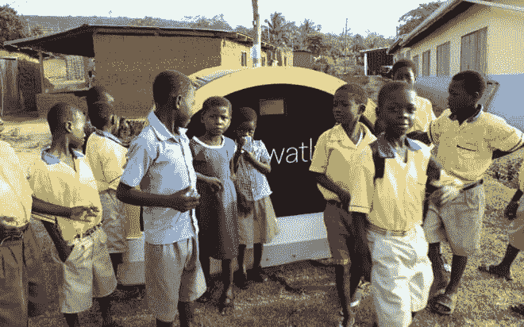
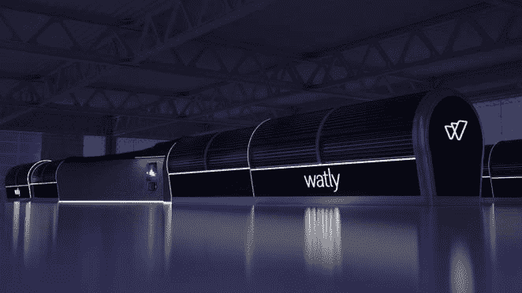

# 太阳能电池为贫困地区带来了水、电和无线网络

> 原文：<https://thenewstack.io/solar-powered-watly-brings-water-power-wifi-impoverished-regions/>

这是我们这个现代时代的悖论:世界大部分地区似乎充斥着科技产品，但许多人仍然用不上干净的水和电，更不用说互联网连接了。如果你看看这些数字，你会发现这是一个令人震惊的问题:根据联合国的数据，全球有 7.83 亿人无法获得清洁的水，12 亿人没有电，42 亿人仍然没有接入互联网。

这些看起来像是无法克服的问题，但这可能会随着 Watly T1 的出现而改变，Watly T1 是世界上最大的太阳能计算机，它还可以净化水、发电，并为一公里半径内的 3000 人提供无线互联网连接。

[https://www.youtube.com/embed/D3AZY53Qfi0?feature=oembed](https://www.youtube.com/embed/D3AZY53Qfi0?feature=oembed)

视频

## 水、能源和无线网络

Watly 的意大利发明者 Marco Attisani 表示，该机器的目标是解决发展中国家的三大问题:缺乏清洁水、可再生能源和互联网接入。这位 44 岁的企业家告诉[每日电讯报](http://www.telegraph.co.uk/technology/2016/04/23/the-water-purifier-that-also-generates-electricity-and-creates-w/)“它唯一需要运转的就是脏水和大量的阳光”。该项目的第二次迭代已经于去年在加纳测试成功，该公司现在计划建造一个更大更好的版本。

最新的原型 Watly 3.0 长 131 英尺(40 米)，重 15 吨，每天可以过滤或淡化 1320 加仑(5000 升)的水。它使用蒸汽压缩蒸馏过程来消除任何病原体或污染物，比反渗透等其他方法需要更少的维护。

此外，Watly 原型将使用太阳能光伏发电，并将存储在 140 千瓦时的内部电池中，然后可以用于脱离电网免费运行机器，并为手机和笔记本电脑等外部设备充电。它的 H 形形状旨在最大限度地增加全天的阳光照射。有一个内置的 3G/4G 路由器，可以让住在附近的人上网。据该公司称，在最初花费 452，000 美元建造之后，自给自足的 Watly 预计寿命至少为 15 年，只需要最低限度的维护，同时抵消相当于 5，000 桶石油的碳排放。

该公司现在正在寻求 75，000 美元的[众筹](https://www.indiegogo.com/projects/the-biggest-solar-powered-computer-in-the-world#)来建造这个下一个原型；除此之外，之前还从 T2 地平线 2020 和欧洲先锋等支持者那里获得了 220 万美元的资金。该公司解释说，Watly 是一种“技术范式”，这是一种思维的转变，在这种思维中，水处理、太阳能和 WiFi 这些看似不同的解决方案在更大的图景中联系在一起。

该公司在他们的 [Indiegogo](https://www.indiegogo.com/projects/the-biggest-solar-powered-computer-in-the-world#/) 活动中断言:“我们不能设计一个现代的解决方案而不考虑将这三个元素整合在一起。”。“美妙之处在于，这些服务可以通过专门收集太阳能来提供。我们通过利用太阳辐射的热效应来提供清洁的水。通过光电技术，我们可以发电。有了电，我们可以为内部电信设备供电(用于卫星或 4G 连接)。Watly 提供多种服务，因为每种服务都是另一种服务的结果。”

## 预制构件

为了便于在偏远地区安装 Watly 装置，机器由预制部件制成，可在四至八天内在现场组装。该公司表示，一个完全可运行的 Watly 配备了 3000 个水箱和 1000 个电池供电的 LED 灯，可以运送到世界上几乎任何地方，只需要使用五个 40 英尺的集装箱，可以通过常规卡车运输。为了确保公平分享水资源，该公司正在开发一种供个人使用的 5 升塑料水箱，它有一个内部 RFID 芯片来跟踪使用情况，当它插入机器时，它的所有者可以自动重新装满水箱。未来，Watly 可能会集成无人机着陆端口、3D 打印机、紫外线消毒器、太阳能冷却器和网络摄像头。

到目前为止，Watly 的目标是政府和公司，作为农村地区欠发达基础设施的潜在解决方案，可以扩大规模，为更大的社区提供离网服务和急需的电信枢纽。但这不仅仅是对发展中国家:Watly 也可能对日益缺水的地方产生重大影响，如加利福尼亚和澳大利亚，在那里净化和再利用水可能有助于极大地缓解危机。

最终，该项目承诺提供我们在未来可能都需要更多的三样东西:清洁的水、能源和与世界其他地方的即时联系。更多在[沃特利](https://watly.co/)和 [Indiegogo](https://www.indiegogo.com/projects/the-biggest-solar-powered-computer-in-the-world#/) 。

图片:Watly

<svg xmlns:xlink="http://www.w3.org/1999/xlink" viewBox="0 0 68 31" version="1.1"><title>Group</title> <desc>Created with Sketch.</desc></svg>