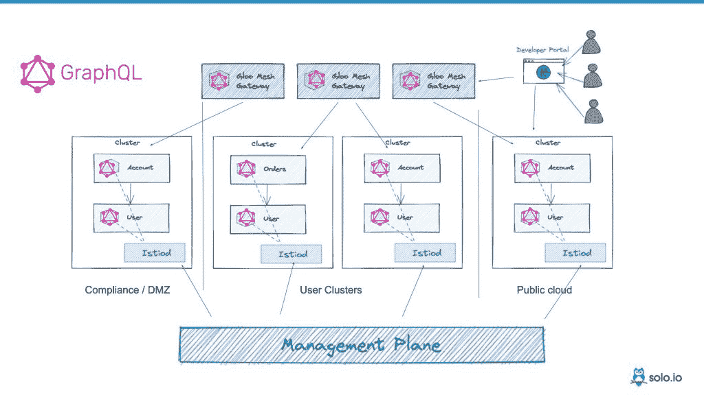

# Solo.io 将 GraphQL 加入 Gloo Mesh 和 Gloo Edge

> 原文：<https://thenewstack.io/solo-io-adds-graphql-to-gloo-mesh-and-gloo-edge/>

服务网格集成软件提供商 [Solo.io](https://solo.io?utm_content=inline-mention) 在其 [Gloo Mesh](https://www.solo.io/products/gloo-mesh/) 和 [Gloo Edge](https://www.solo.io/products/gloo-edge/) 产品中增加了对 [GraphQL](https://graphql.org/) 的支持，为其基于 Istio 的服务网格和基于 Envoy 的 API 网关带来了流行的 API 查询语言。总之，该公司将在其产品中添加“一个 GraphQL 服务器、解析器、一个 GraphQL 模式生成器和 GraphQL 的模式拼接——所有这些都由声明式配置驱动”，它在一份声明中说。

今年早些时候，该公司[增加了一个遗留的 SOAP 集成](https://thenewstack.io/solo-io-adds-legacy-soap-integration-for-gloo-edge-1-8-release/)，为几十年前的 XML 消息传递协议提供了支持，现在该公司朝着相反的方向发展，将 GraphQL 支持带入了 GraphQL 传统上看不到的领域:微服务和 Istio 服务网格。

与其他类型的 API 查询(如 REST)相比，GraphQL 的优势在于，它允许最终用户指定一个特定的请求，并只获取他们所请求的数据，而不是未指定的负载，否则它会以该负载进行响应。GraphQL 不仅在使用方面对开发人员更加友好，而且在响应方面也节省了带宽。

据 Solo.io 首席执行官兼创始人 [Idit Levine](https://www.linkedin.com/in/iditlevine) 称，引入 GraphQL 的想法从一开始就存在了。

“当我们创办公司时，我认识到 GraphQL 试图做的事情和 API gateway 试图做的事情之间有很大的联系，”她说。“我觉得，你知道，API gateway 的特别之处在于它试图以某种方式粘合——这就是为什么该平台的名称是‘Gloo’——但它没有在这些服务之间创建任何关系。这通常是 UI 团队的责任。UI 团队将访问一个服务，请求数据，然后访问第二个服务，他们基本上将数据绘制在一起。这正是 GraphQL 正在努力做的事情。”

虽然这个想法可能从一开始就有了，但 solo . io CMO[Erik frie Berg](https://www.linkedin.com/in/efrieberg)解释说，它直到现在才出现，因为它“非常复杂，很难”实现。

“你需要对 GraphQL、Envoy 和 Istio 有扎实的了解。不是在用户层面，而是在源代码层面，”弗里伯格说。“然后，您需要为 Envoy 过滤器链以及其他增强功能编写 C++代码。最后，这需要时间。我们在这方面已经努力了一年多，创建它的时间和复杂性超出了大多数组织的能力。”

与其他 GraphQL 实现不同，Solo.io 提供 GraphQL 不需要单独的 GraphQL 服务器。相反，所有的 GraphQL 功能都直接内置在 Envoy 代理中，这构成了 Gloo Edge API 网关和位于 Gloo mesh 中心的 Istio 服务 Mesh 的基础。

Levine 说，市场上只有一种其他的实现方式，要求用户本质上构建一个 GraphQL 服务器，而 Solo.io 通过一个简单的标志打开 GraphQL 功能，其最终效果是能够使用 GraphQL 查询微服务。

Frieberg 说:“Solo.io 的 GraphQL 模块将 GraphQL 服务器原生嵌入 Gloo Mesh 和 Gloo Edge，支持对 API 进行联合 GraphQL 查询。“这将面向 API 的开发人员友好的 GraphQL 查询语言与 Istio 跨微服务保护、管理和观察应用流量的能力相结合。”

在这种情况下，使用 Envoy 作为 GraphQL 服务器的部分好处是，用户还可以利用 Solo 的其他功能，如路由、速率限制、负载平衡和全局故障转移，以及基于角色的访问控制(RBAC)等安全功能。

Frieberg 解释说，GraphQL 和其他 API 协议一样，应该被看作是“工具箱中的另一个工具”，它有优点也有缺点。

Frieberg 说:“它公开了一个端点，准确地响应客户请求的数据，并确保 API 随时间变化的兼容性。”“但是这些好处伴随着轻微的性能损失。对于东西向流量，这不是一个大问题，因为减少了查询和获取数据的往返调用。”

然而，该公司表示，这一初始版本将于今年晚些时候作为 Gloo Edge 和 Gloo Mesh 的单独许可模块上市，这只是一个开始。Frieberg 解释说，对 GraphQL 查询的访问是第一个障碍，但管理复杂性是接下来要关注的事情。

“尽管我们发布了这个 1.0，但我们还可以在很多其他领域进行创新，为我们的客户增加价值，因为很多都与范围有关，”Frieberg 说。“你可以从小处着手，一切都很容易理解，但当你开始接触数万或数十万个 API 时，现在信息、理解、共享和交互就成了大问题。你无法消化这么大的一个完整的 GraphQL API，那么你如何分解它们呢？”

<svg xmlns:xlink="http://www.w3.org/1999/xlink" viewBox="0 0 68 31" version="1.1"><title>Group</title> <desc>Created with Sketch.</desc></svg>