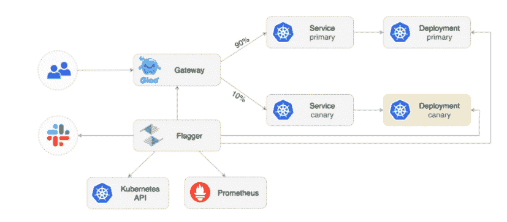

# Solo.io 为 Gloo Edge 1.8 版本增加了遗留 SOAP 集成

> 原文：<https://thenewstack.io/solo-io-adds-legacy-soap-integration-for-gloo-edge-1-8-release/>

服务网格集成软件提供商 [Solo.io](https://solo.io?utm_content=inline-mention) 已经发布了其 Gloo Edge Kubernetes-原生入口控制器和 API 网关的 1.8 版本。版本 1.8 提供了对传统 SOAP(简单对象访问协议)web 服务和其他功能的集成，因为 Solo 寻求改进以 API 为中心的支持，以满足跨云原生环境的扩展需求。

基于服务网格架构的[特使代理](https://envoyproxy.io/)流量代理， [Gloo Edge](https://docs.solo.io/gloo-edge/latest/introduction/) 现在帮助 DevOps 团队通过单一 API 集成几十年的 SOAP。

Gloo Edge 1.8 对 SOAP 的支持是该版本的“最大突破性特征”，Solo.io 产品管理总监 Chris Gaun 告诉新堆栈。

在一篇博客文章[中，Gaun 描述了 SOAP，一种来自世纪之交的 XML 消息协议，是如何“在包括金融服务和医疗保健在内的许多行业的企业 web 服务中保持流行的。”](https://www.solo.io/blog/back-to-the-future-soap-and-xslt-with-gloo-edge-1-8/)

然而，“不幸的是，SOAP(以及相关的遗留中间件应用程序)阻碍了大规模的现代化努力，因为市场上还没有可行的迁移方法，”Gaun 写道。“随着时间的推移，组织一直无法轻松应对 SOAP web 服务的日益减少。”

Gaun 写道，Gloo Edge Enterprise 1.8 增加了 [XSLT 3.0(可扩展样式表语言转换)](https://www.w3.org/TR/xslt-30/)支持，旨在“在不完全消除 web 服务组合中的 SOAP 的情况下，实现 SOAP/XML 客户端和端点的现代化”。

Gaun 指出，对于努力淘汰其 SOAP web 服务的组织来说，使用 Gloo Edge Enterprise 1.8 可以让开发团队在采用现代协议(如 Kubernetes)并并行运行它们的同时保持向后兼容性。

对 SOAP 支持的需求也是一个例子，说明了组织如何努力将大量的遗留基础设施与更现代的环境相集成。例如，随着公司转向微服务架构，他们“将更多的旧系统作为服务公开”，Solo.io 的首席营销官 Erik Frieberg 告诉新堆栈。由于许多系统使用 SOAP/XSLT 作为消息协议，Gloo Edge 1.8 现在也支持传统的消息协议，“所以你可以将使用 REST 和 gRPC 的服务与使用 SOAP 的服务结合起来，”Frieberg 说。

“这使组织能够将 Gloo Mesh 作为其微服务架构的 API 网关进行标准化，因为它支持更新的云原生 API 和传统的 SOAP 协议，”Frieberg 说。

Flagger 与 Gloo Edge API gateway 合作推出金丝雀版本。(来源:Solo.io)

此外，Gloo Edge 1.8 旨在改善对 CI/CD 管道的支持，因为 DevOps 团队采用了利用 A/B 测试、蓝/绿镜像和更安全的 canary 测试版本的流程，以帮助提高生产版本的可靠性。“这些过程允许组织将软件发布给小的样本组，以确保新功能在发布给每个人之前都能按预期执行，”Frieberg 说。

Frieberg 解释说，Solo.io 还与 GitOps 平台提供商[weaver works](https://www.weave.works/?utm_content=inline-mention)合作，将用于自动化金丝雀部署的 Flagger 添加到上游开源特使代理，并使 Flagger 支持 Gloo Edge 的原生部分。

“由于对这些应用程序的请求是通过 API 网关发出的，因此将网关整合到这些流程中以有效和高效地部署应用程序非常重要，”Frieberg 说。

Gloo Edge 1.8 的其他功能包括:

*   Helm 可用性改进:Gloo Edge 1.8 旨在简化在 Helm 中展示组织自身的价值观，Helm 用于定义、安装和升级 Kubernetes 应用程序。
*   Gloo Edge CRDs 中的模式:Gloo Edge 允许使用模式来验证 CRD 函数，以帮助“避免无意中破坏任何东西”
*   改进安全性的访问日志修订:能够修订某些字段，同时仍然提供可读的活动报告。

<svg xmlns:xlink="http://www.w3.org/1999/xlink" viewBox="0 0 68 31" version="1.1"><title>Group</title> <desc>Created with Sketch.</desc></svg>