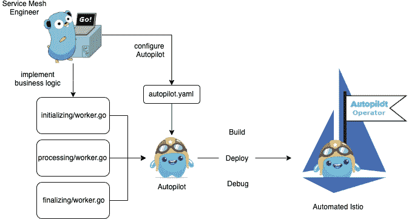

# Solo.io 的自动驾驶仪:自动化服务网格操作的框架

> 原文：<https://thenewstack.io/solo-ios-autopilot-a-framework-for-automating-service-mesh-operations/>

[Portworx](https://portworx.com/) 赞助了 New Stack 对 KubeCon + CloudNativeCon 北美 2019 的报道。

来自服务网格提供商 [Solo.io](https://www.solo.io/) 的一个新项目展示了使用服务网格自身创建的遥测技术来自动化服务网格操作的可能性。

项目 [Autopilot](https://github.com/solo-io/autopilot) 是一个创建一系列自动化操作[的框架，这些操作可以由管理员设置的条件触发](https://medium.com/solo-io/autopilot-an-operator-framework-for-building-workflows-on-top-of-service-mesh-bd4a2fb3e742)。它不仅可以用来维护一个活跃运行的服务网格，还可以通过一组不需要用户干预的声明性步骤来自动执行任务，如金丝雀部署、自适应安全和混沌测试。

Solo.io 的创始人兼首席执行官兼 Autopilot 的合著者 [Idit Levine](https://www.linkedin.com/in/iditlevine/) 在接受新堆栈采访时指出，虽然服务网格在不同微服务之间路由消息方面提供了宝贵的帮助，但它们仍然主要由手动配置和管理。

莱文称之为“适应性网格”，可以根据外部需求“改变其配置”。就像飞机的自动驾驶仪一样，这种自动驾驶仪可以监视服务网格的当前状态，并可以调整设置以保持所需的状态，甚至可以运行自动化操作。指导操作的一组工作流规则在配置控制器的自定义资源定义(CRD)中定义，控制器反过来监视服务网格的当前状态。

该公司在 ServiceMeshCon 上首次亮相该项目，获得了很大程度上的好评，ServiceMeshCon 是一个为期一天的云原生计算基金会活动，与 KubeCon + CloudNativeCon 北美 2019 共同举办，于本周在圣地亚哥举行。

## 仍然手动

在组织开始采用 Kubernetes 容器编排引擎和一般的微服务架构后，服务网格很快成为一种必需。应用程序被分解成更小的容器化服务，这些服务必须安全可靠地相互通信，并与外部世界通信。服务网格将所有这些组件抽象成侧柜，这些侧柜可以连接到应用程序或微服务，并可以与网络上的所有其他侧柜通信，从而建立跨所有微服务的路由网络。它们的使用产生了大量关于交通模式和系统负载的有用操作数据。

基于可编程基础设施的概念，Autopilot 采取了下一步措施，利用服务网格的遥测技术，因此它可以在不需要管理员输入的情况下实际驱动操作，超出了初始条件的设置。Webhooks 可以用来引入额外的数据。

该技术使用 Kubernetes [操作符](/databases-operators-bring-stateful-workloads-to-kubernetes/)，这是一种模板模式，最初是为了简化复杂应用程序的部署而创建的，用于自动化操作。通过搭建，Autopilot 构建并部署针对安装了服务网格的 Kubernetes 集群运行的操作符。它提供/生成原语、生成的代码和助手函数来控制服务网格。为网格的每个期望状态创建基于 YAML 的文件，该文件不断地与其当前状态相协调。

根据该项目的 GitHub 页面，“Autopilot 通过一个生成的调度程序提供了一个更加自以为是的控制循环，该调度程序实现了控制器-运行时协调器接口，用户为其顶级[自定义资源定义]的各种状态编写无状态的工作函数。状态信息存储在 CRD 的状态上，促进了自动驾驶操作员的无状态设计。”

【T2

最初，AutoPilot 与 [Istio](https://istio.io/) 服务网格一起工作，尽管随着时间的推移，它将与所有响应[服务网格接口](/how-service-mesh-transforms-cloud-native-app-development/) (SMI)标准的服务网格一起工作。目前，自动驾驶将需要 Kubernetes 运行，尽管这可能不是未来的依赖，Levine 说。软件是用 Go 写的。

云原生计算基金会和 KubeCon+CloudNativeCon 是新堆栈的赞助商。

<svg xmlns:xlink="http://www.w3.org/1999/xlink" viewBox="0 0 68 31" version="1.1"><title>Group</title> <desc>Created with Sketch.</desc></svg>