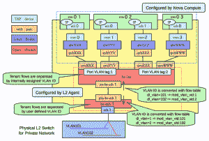

# 解决初学者在从 OpenStack 实例执行 ping 操作时的常见问题

> 原文：<https://thenewstack.io/solving-a-common-beginners-problem-when-pinging-from-an-openstack-instance/>

从 OpenStack 实例 using 外部世界的问题是初学使用开放云平台的人的常见问题。

下面是我为什么以及如何在 OpenStack 中找到与实例通信的方法。

作为 CentOS 的粉丝，我开始了进入 OpenStack 领域的旅程，就像任何其他开发人员一样，首先禁用 SELinux 和 iptables。根据我的经验，这些往往会产生问题。

然而，经过几天对 OpenStack 网络架构的研究，我意识到 OpenStack 需要 iptables 才能运行。我还发现我需要将 SELinux 设置为许可模式，而不是完全禁用它。

原来，OpenStack 在 vnet0 等 TAP 设备上使用 iptables 规则来实现安全组，而 Open vSwitch 与直接应用于连接到 Open vSwitch 端口的 TAP 设备上的 iptables 规则不兼容。我将向你详细介绍这意味着什么。

下图显示了 OpenStack 如何使用 iptables。这是一个繁忙的图表——不要害怕！

来源

首先，请关注左侧图例，其中有四个虚拟网络设备:

1.  **TAP 设备**，如 vnet0，是 KVM 和 Xen 等虚拟机管理程序实现虚拟网络接口(VIF，即 vNIC)卡的方式。发送到 TAP 设备的以太网帧由客户操作系统接收。
2.  **Veth 对**就像是它们所连接的虚拟网络设备的虚拟网络/以太网电缆。发送到 veth 对一端的以太网帧由 veth 对的另一端接收。
3.  **Linux 桥**，由图底部的蓝框表示，像集线器一样工作。网桥是连接两种不同类型网络的网络设备。这里，我们将虚拟网络连接到物理网络，因此需要一个桥。您可以将多个(物理或虚拟)网络接口设备连接到一个 Linux 网桥。从连接到网桥的一个接口传入的任何以太网帧都会被传输到所有其它设备。
4.  **开放式虚拟交换机桥**表现得像虚拟交换机:网络接口设备连接到开放式虚拟交换机桥的端口，这些端口可以像物理交换机的端口一样进行配置，包括 VLAN 配置。

理解什么是 libvirt 也很重要。维基百科将其定义为“用于管理平台虚拟化的开源 API、守护程序和管理工具。这是用于管理 KVM、Xen、VMware ESX、QEMU 和其他虚拟化技术的工具。”

对我来说，将 vnet0 连接到 br-int(使用 Open vSwtich 实现的集成桥)是非常简单的。然而，我需要带一个 Linux 桥，原因如下。

Libvirt 支持开放式 vSwitch 桥。我们在 OpenStack 中也有安全组，在这里我们指示哪些端口应该打开或关闭，以及谁可以访问它们。安全组操作 iptables，由于安全组在 Open vSwitch 中的实现方式，iptables 不能在 Open v switch 上工作。因此，Neutron 使用 Linux 桥或 Open vSwitch 混合桥将虚拟机连接到 br-in 或集成桥。

从图中可以看出，vnet0 不是连接到一个开放的 vSwitch 桥，而是连接到一个 Linux 桥 qbrXXX。该电桥通过(qvbXXX，qvoXXX) veth 对连接到积分电桥 br-int。

这是用于在计算节点上的实例之间转发数据包、转发浮动 IP 流量以及管理安全组规则的内容。

离开实例的 VIF 的数据包通过九个虚拟设备到达外部网络。使用 tcpdump，您可以监控网络上的 ARP 请求。然而，一个被忽视的最重要的事情是，数据包如何返回到虚拟机或实例？

目前，让我们忽略所有其他虚拟网络设备，只假设来自虚拟机的数据包被发送到计算节点(让我们称之为内部网络)，它们从计算节点离开到您的办公室或家庭局域网。让我们称之为外部网络。

现在假设内部网络位于 192.168.1.0/24，外部网络位于 10.1.0.0/16。Openstack 中的 dnsmasq 为实例分配了 IP 192.168.1.5，因此当数据包离开虚拟机时，此类数据包的源 IP 将是 192 . 168 . 1 . 5。在几个虚拟网络设备的帮助下，这个数据包到达外部网络。如果此数据包有回复，并且返回到 192.168.1.5，它将永远不会返回，因为外部网络不知道 192 的范围。

这就是 IP 伪装来拯救我们的地方。IP 伪装在过去被那些有几台机器连接到互联网但只有一个网关的人使用。我们要做的是找到离开网络的数据包，用主机或网关的 IP 地址来传送。这是在最后发送出去之前，在后路由链中完成的。正确完成后，对数据包的回复将有一个有效的源 IP，并能够返回到网关，从那里被路由到适当的机器。

同样，在 OpenStack 环境中，离开虚拟机的数据包被伪装成来自计算主机。通过在计算节点上设置以下两个设置，数据包被转发到 Linux 名称空间。

编辑/etc/sysctl.conf 以包含以下内容:

net.ipv4.ip_forward=1
#控制源路由验证
net . IP v4 . conf . default . RP _ filter = 0
net . IP v4 . conf . all . RP _ filter = 0

OpenStack 中的虚拟路由器或交换机将转发此数据包，并且能够将其通过 NAT 传输到虚拟机。iptables 中的伪装示例如下

-邮政路由-s -j 假面舞会

iptables-t NAT-A post routing-o eth 0-j 伪装

有了这些，ping 新的 OpenStack 实例以及从它们 ping 外部世界应该不会再有问题了。

Venu 在 ThoughtWorks 工作，负责构建关键的云应用。他使用自己热爱的语言 Python，通过自动化大多数流程来管理和监控云应用程序！

<svg xmlns:xlink="http://www.w3.org/1999/xlink" viewBox="0 0 68 31" version="1.1"><title>Group</title> <desc>Created with Sketch.</desc></svg>