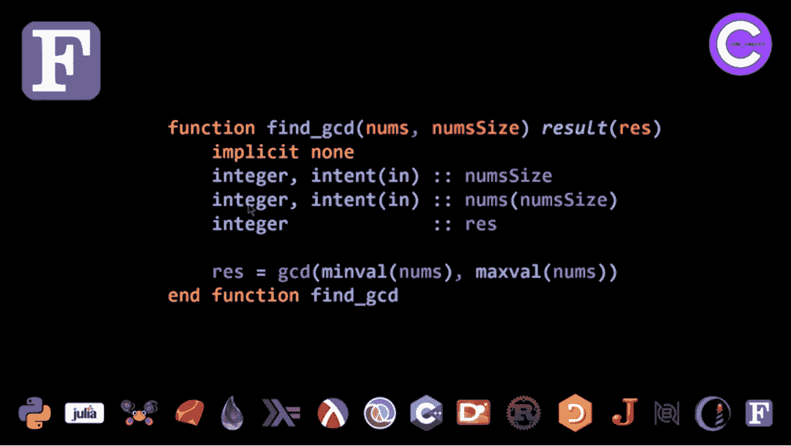

# 在 YouTube 上用 16 种编程语言解决一个问题

> 原文：<https://thenewstack.io/solving-one-problem-with-16-programming-languages-on-youtube/>

一位视频博主最近使用 16 种不同的语言解决了同样的编程问题，让观众有机会看到各种各样的结果，分享他们自己的建议，并在此过程中学习编程语言。

这是一个有趣的演示，展示了在当今复杂的编程语言世界中有多少选择。但至少对其中一种语言来说，它也变成了一个社区力量的展示。

大事件发生在 code_report 上，这是一个 YouTube 频道[“致力于竞争性编程”](https://youtu.be/X0ObmT6FtWc)。这是 [Conor Hoekstra](https://ca.linkedin.com/in/conorhoekstra) 的工作，他是 NVIDIA 的高级图书馆软件工程师(正在为数据科学和分析管道开发其 RAPIDS 套件)，他也在亚马逊[和穆迪分析公司担任职务。Hoekstra 还共同主持了一个关于面向数组编程语言的播客](https://aws.amazon.com/?utm_content=inline-mention)[和另一个关于编程相关主题的播客](https://www.arraycast.com/)[，比如算法和数据结构](https://adspthepodcast.com/)。

但对于这个 YouTube 频道，他回顾了 LeetCode、HackerRank、Topcoder 和 Codeforces 等编码竞赛的解决方案，还制作了有关数据结构、算法和复杂性等相关编程主题的视频(这些可能在这些竞赛中被证明是有用的)。

[https://www.youtube.com/embed/UVUjnzpQKUo?feature=oembed](https://www.youtube.com/embed/UVUjnzpQKUo?feature=oembed)

视频

## Fortran 有粉丝

为了探索 16 种编程语言，Hoekstra 从 LeetCode 编码竞赛中选择了一个相对简单的问题:给定一个数字列表，找出最小和最大的数字——然后找到可以被这两个数字相除的最大数字(没有余数)。

为解决方案选择的语言:

*   C++
*   锈
*   D
*   Clojure
*   红宝石
*   长生不老药
*   樱庭落[Perl 6]
*   哈斯克尔
*   球拍
*   朱莉娅
*   计算机编程语言
*   APL 语言
*   J
*   BQN
*   Pharo Smalltalk
*   FORTRAN 语言

(视频解释说，最后两种语言是霍克斯特拉的观众在网上选择的最后一分钟添加的。“我在推特上发布了这条消息，并询问了我的粉丝，”霍克斯特拉说，Fortran 在一条推特上收到了“多达 27 个‘心’！”)

## 巨大的差异

Hoekstra 称之为“一个非常简单的问题，但是你很快就会看到，特别是当我们谈到数组语言时，你可以用一种与 Python 或 Ruby 等语言完全不同的方式来解决这些问题。”

微小的差异很快变得明显。Python 已经为所有必要的操作提供了内置函数——查找最小的数字、最大的数字，然后是它们共有的“最大公约数”。

但是当 Hoekstra 使用函数语言 Haskell 时，事情开始变得不同了。它的 *liftM2* 函数基本上将来自*最小值*和*最大值*的值映射到 *gcd* 函数的输入中——全部在一行中。

最棒的是，由于 Haskell 使用了所谓的默认或[无点式编程](https://en.wikipedia.org/wiki/Tacit_programming)，它不在其函数定义中指定参数，Haskell 解决方案甚至不需要提及数字数组…

低级的 D 编程语言要求导入函数——但至少这种语言使用通用的函数调用语法，允许使用面向对象编程中熟悉的“方法”风格调用函数。主持人说，“在我看来，这真的非常非常好。”

对于 Rust，Hoekstra 抱怨说，像 C++一样，“这里有很多仪式”——在这种情况下，因为 *min* 和 *max* 函数需要 *iter()* 方法来实际迭代数字列表中的每个值，还需要 *unwrap()* 方法来从 Rust 更复杂的枚举 [*结果*类型](https://doc.rust-lang.org/std/result/)中提取值(其中包括错误处理信息)。

而且，Hoekstra 指出:“为了访问 *gcd* 函数，在 *num::integer::* 命名空间中也有很多干扰。但除此之外，这仍然是一个非常好的解决方案。”

但是还有更显著的不同，主要是因为 Hoekstra 是数组编程语言的爱好者。对于 APL，解决方案的要点(粉色箭头的右侧)只有五个字符。(前两个字符求最大值，后两个字符求最小值，中间绿色的 *v* 求它们的最大公约数。)

在 J 编程语言中也有类似的结构——也是一种数组编程语言——但是“J 是 APL 的进化版本，使用 ASCII 图而不是 Unicode 符号，”Hoekstra 指出。所以最大值查找函数用>表示。而最小寻找功能是<./>

解决方案变得越来越奇特。BQN 语言在 APL 家族中仍然是一种数组驱动的语言(根据 APL Wiki )但是 BQN 使用它自己独特的字符集。因为没有用于寻找最大公约数的预建函数，所以必须在单独的代码行中定义该函数。

霍克斯特拉承认他只是从网上复制了代码。(“我其实也不懂，因为我是 BQN 新手。”)但是一旦在第一行中定义了它，它就可以在第二行中作为解决方案的一部分被调用。

## 与观众竞争

从观众的反应来看，看起来互联网很喜欢一起分享这种体验。

该视频最终吸引了 135 条评论，Hoekstra 的观众分享了他们对编程语言的看法(“Haskell 解决方案非常优雅，APL 对我来说有点太神秘了。”)以及对会议的其他评论。(“请求 Fortran 的人想看你受苦。”)

霍克斯特拉在第二个视频中宣布:“我已经收到了近 100 条评论，其中很多都是对我在那个视频中展示的解决方案的改进。”

[https://www.youtube.com/embed/LWgcukcpo9A?feature=oembed](https://www.youtube.com/embed/LWgcukcpo9A?feature=oembed)

视频

Julia 的解决方案看起来与 Python 的类似——尽管使用了 Julia 的“splat”操作符(用三点省略号表示)来表示将测试多个值。

但是观众建议了一个更简单的语法。Julia 还有两个内置的最小和最大查找函数，不需要省略号。还有一个返回两个值的函数，名为*极值*。然后，当 Hoekstra 使用 Julia 的复合操作符产生一个无点解决方案时，解决方案变得更加简单(使用 *collect* 函数将两个值转换成一个列表格式，以便可以将它输入到 *gcd* )。

“在我看来，这是所有解决方案中最漂亮的，”Hoekstra 补充道——部分是因为它展示了无点解决方案的优雅。

观众还建议对 Hoekstra 在樱庭落写的解决方案(该语言以前被称为 Perl 6)进行一些优雅的改进。在樱庭落，gcd 是一个“中缀”函数，可以放在两个值之间，就像数学运算符一样(像加号或减号)。然后它所操作的两个值可能是对数字数组调用对象样式方法的结果。(因为，正如 Perl 的创造者拉里·沃尔曾经说过的，在樱庭落中"[一切都是对象](https://thenewstack.io/perl-6-fun-with-objects/)。但前提是你希望如此。”)

具有讽刺意味的是，Pharo Smalltalk 解决方案最终也类似于樱庭落解决方案(它自己的 *gcd:* 函数也作为两个最小和最大返回函数之间的“中缀”运算符出现)。

但是 Hoekstra 的观众指出，樱庭落也有一个专用的 *minmax* 函数，可以一次返回两个值——这导致了另一个单行解决方案，其中该结果成为樱庭落的 *gcd* 函数的输入。

“我确实更喜欢这个，”霍克斯特拉说。“任何时候，你都可以使用一个算法来完成一次传递，而不是两次传递……我认为这更可取。”

## Fortran 的乐趣

在第一个视频中，Hoekstra 将 Fortran 的解决方案列为最差的，称其为充斥着“仪式”的语言之一。但是他的解决方案附有免责声明。“请注意，这是我一生中编写的第一段 Fortran 代码，所以很可能有更好的方法来完成它……在运行了 40 分钟后，我结束了这一天的工作。”

但是在随后的视频中，Hoekstra 承认“我从 Fortran 社区得到的回应是如此惊人。”

受访者包括雅各布·威廉姆斯，他是美国宇航局约翰逊航天中心的 Fortran 程序员和轨道机械师。

霍克斯特拉的视频也引起了长期 Fortran 程序员、《现代 Fortran》一书的作者米兰·库尔契克的回应在 Twitter 上，Curic 感谢 Hoekstra 包含 Fortran，并建议了一个替代实现(其中包括 3 月份为该语言提出的最大公分母函数)。

Hoekstra 了解到临时 res 变量是不必要的，因为结果不需要单独赋值就可以返回。Fortran 中一些新的语法糖现在允许用冒号来表示列表的长度——而不是 Hoekstra 的笨拙的变量 numsize——这样就不需要一整行代码将它分配给一个专用的变量。

Hoekstra 说:“我们从以前的功能体发展到基本上只有两行。“所以，我认为，这是绝对令人敬畏的！”

他很兴奋，GitHub 上的一个新评论甚至特别提到了他的视频。

“Fortran 语言的 Twitter 账户甚至转发了我最初的视频推文，说他们将在未来努力改进他们的教程，但只是感谢报道它——我认为这太棒了，”他补充道。

霍克斯特拉称这种反应是“如果一个社区试图让人们对他们的语言更感兴趣，他们应该如何行动的一种模式。”

他总结道，“我希望你能从这个视频中学到一些东西，就像我肯定从评论中学到的一样。”

* * *

## WebReduce

<svg xmlns:xlink="http://www.w3.org/1999/xlink" viewBox="0 0 68 31" version="1.1"><title>Group</title> <desc>Created with Sketch.</desc></svg>