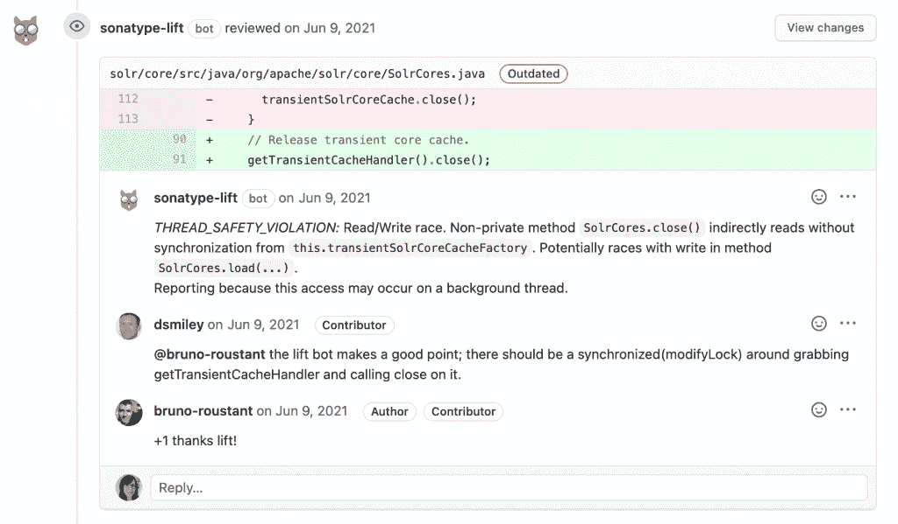

# Sonatype Lift，一个深度代码分析平台

> 原文：<https://thenewstack.io/sonatype-lift-a-deep-code-analysis-platform/>

软件供应链管理和安全工具公司 [Sonatype](https://www.sonatype.com/?utm_content=inline-mention) 发布了 Sonatype Lift，这是一个深度代码分析平台，让开发人员能够扫描各种错误类型和代码问题。

今年早些时候，该公司[收购了代码分析平台 MuseDev](https://thenewstack.io/sonatype-expands-focus-to-code-analysis-with-musedev-addition/) ，前 MuseDev 首席执行官、现 Sonatype 产品创新副总裁 [Stephen Magill](https://www.linkedin.com/in/stephen-magill-2070a096) 表示，Lift 是 MuseDev 最初开发的技术与 Sonatype 已经在开发的软件组合分析功能的结合。

“这些真的在这个电梯产品中融合在一起，”Magill 说。“从技术角度来看，以及从工程和文化角度来看，一旦我们进入那里并开始一起工作，就会有很大的一致性。这真的使我们能够非常快速地结合这些技术基础，并提供这种产品。”

这种一致性部分来自 Magill 的专业领域。Magill 的背景是静态分析，他解释说，对于希望分析代码的开发人员来说，仅仅是启动和运行一些工具可能是第一个问题。Lift 带来了各种各样的分析器，包括来自脸书的[推断器](https://fbinfer.com/)和来自谷歌的[易错分析器](https://errorprone.info/)，它们可以跨 11 种不同的语言工作——Java、C、C++、JavaScript、Python、Golang、Ruby、Kotlin、Shell、Haskell 和 Markdown——在几分钟内直接进入他们现有的工作流程。

“我在该领域获得了博士学位，对于其中的一些功能，您需要一些专业知识来真正充分利用该工具，并以最佳方式启动和运行它。因此，我们提供了专业知识，将其打包，围绕这些工具的部署建立了许多自动化，因此以一种按下按钮的方式启动并运行它们真的很容易，”Magill 说。

Lift 支持 GitHub、GitLab 和 Bitbucket，在这些工具中，该工具分析代码并将结果集成为代码审查过程的一部分，这取自脸书的一个页面，该页面在其 Infer 分析器的测试中注意到，代码审查集成将错误修复率提高了 70%。

“我认为这是一个很好的例子，说明了正确集成、正确开发人员体验的重要性，如果你能做到这一点，你就可以让它达到这样一个点，即在那一刻修复 bug 实际上比讨论是否应该修复或何时修复更容易，”Magill 说。

Lift 不仅扫描有问题的代码库，还分析依赖性，从 Sonatype 的 OSS 索引中引入软件组合分析(SCA)数据来报告易受攻击的开源库。除了安全问题，Lift 还寻找可能影响性能的样式问题和代码质量问题。Magill 提供了一个在 Java 中使用 override 注释的例子，当你显式地从一个超类中重写一个方法时，Lift 会在代码审查中出现一些东西。

“这是一种最佳实践。你可以不这么做，编译器会抱怨，但是代码会编译的很好。但这确实是你与之交谈过的大多数 Java 团队都希望拥有的东西，并强制执行，”Magill 解释道。

此外，Magill 表示，Lift 超越了其他工具，为用户带来了“深度代码质量扫描器”,它可以发现否则会被忽视的问题。

“有一些工具可以寻找非常本地化的模式，比如说，空指针异常——你是在一个方法的开始赋值 null，然后在同一个方法中取消对它的引用。我们超越了这一点，放眼整个代码库，”Magill 说。“我们甚至会标记这样的事情，‘哦，你使用这个库函数的方式可能会导致空指针异常’，你可能从来没有看过这个库函数的源代码，所以如果你不知道，在某些情况下，它会返回 null。我们会提出来的。”

Lift 对 Sonatype 用户既有 SaaS 版本，也有本地版本，Magill 说 Lift 的下一步是确保它能很好地为 Sonatype 的企业用户工作。Magill 说，Sonatype 已经开发了“许多围绕我们如何配置这些工具的自动化”，但要向前发展，需要达到企业用户所需的规模。

“在大型企业中大规模部署这样的功能也非常重要，因为如果您认为，‘好吧，我将使用这个工具并在 2，000 个存储库中推广它’，您不会希望为这 2000 个存储库手动配置它。那会很糟糕。因此，这种自动化对于大规模应用 it 和解决企业用例非常重要，”Magill 说。

<svg xmlns:xlink="http://www.w3.org/1999/xlink" viewBox="0 0 68 31" version="1.1"><title>Group</title> <desc>Created with Sketch.</desc></svg>