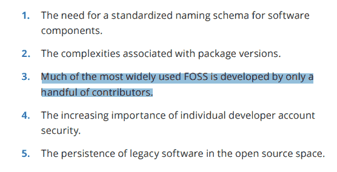

# SOS:可持续开源

> 原文：<https://thenewstack.io/sos-sustainable-open-source/>

自由和开源软件正在吞噬世界，但同时也是自身成功的受害者。大型企业依赖于由一个人维护的库，或者更糟:由一个供应商维护。

个人或组织可能会限制使用其技术或其软件的 EOL 版本，这对依赖该技术的组织和客户构成了真正的挑战。我们如何为开源的可行性和可持续性做出贡献？

## 开源中的问题

 [地板抹布

Floor Drees 是 Aiven 的开发人员倡导者。她之前在 Grafana 实验室和微软工作。Floor 运营每月一次的虚拟 meetup contributing.today，讨论开源主题。她也是阿姆斯特丹和埃因霍温志愿者日的组织者之一。](https://www.linkedin.com/in/floordrees) 

一个问题是项目重新许可，以避免“搭便车”，避免坏人利用我们的工作做更多的坏事或减轻责任。

另一个问题是由内布拉斯加州众所周知的个人维护的项目(对臭名昭著的 XKCD 卡通大声喊出来)。丹尼尔·斯滕伯格成功地保持了卷曲大部分是在他孤独的时候。但是对于每一个卷曲，都有一个左垫。

资源的缺乏阻止了维护者花费时间去考虑项目如何支持全球商业。而维护者可以根据情绪做出决定。我们已经看到维护者撤回他们的代码，以避免被美国移民和海关执法局(ICE)等机构使用，或者最近被[用来抗议俄国对乌克兰的攻击](https://www.bleepingcomputer.com/news/security/big-sabotage-famous-npm-package-deletes-files-to-protest-ukraine-war/)。

重新授权和缺乏维护人员的资源是困扰开源的唯一两个顶级问题吗？不。我很乐意看到开源成为一个更加包容和公平的地方，但是在这篇文章中，让我们看看最近的许可变化，以及是什么导致了维护者的流失。

## 关于重新许可

近年来，我们已经看到了“有点开源”许可证的增加，如[旨在限制商业免费使用开源代码的公共条款](https://www.google.com/url?q=https://commonsclause.com&sa=D&source=docs&ust=1650614210366152&usg=AOvVaw104fwTz-eKkIr1INvjBfY3)，特别是那些不向自由/开源软件社区“回馈”的云服务提供商。

commons 条款与 [FSD](https://directory.fsf.org/wiki/Free_Software_Directory:Requirements) (以及“出于任何目的使用软件的权利”)和[开源定义](https://opensource.org/osd)相冲突(因为许可证不得限制任何一方出售或赠送软件)。公地条款包含了一堆模糊的措辞，比如“价值完全或实质上产生”…因为什么被认为是实质？

Mongo 用了一段时间，T4 的 Redis 实验室也用了一段时间。 [MongoDB](https://www.mongodb.com/cloud/atlas/?utm_content=inline-mention) 于 2018 年迁移到 SSPL，这并没有得到 OSD 的管理者[开源倡议](https://opensource.org/)的批准。SSPL 对云基础设施施加广泛的左版权影响。它的正当性？大型云供应商获取了所有价值，但却没有为社区做出任何贡献。

[Redis Source Available License](https://redis.com/legal/licenses/)(RSAL)适用于 Redis 创建的某些 Redis 模块。除非您的应用程序是“分布式的”或“可作为数据库产品使用”，否则它是一个可以进行所有常规操作(使用、修改、分发、复制、再许可……)的许可证

那就弹性 2.0。同样，您会发现一些条款阻止托管或托管服务提供商使用该项目。这是一种左风格的复制，但是有直接的禁止，因为它:

*   防止将弹性作为提供弹性功能访问的托管或管理服务的一部分
*   防止第三方模糊商标声明和品牌
*   可以嵌入许可证密钥以防止规避

[Elasticsearch](https://www.elastic.co/subscriptions) 从 Azure 和 [Amazon Web Services](https://aws.amazon.com/?utm_content=inline-mention) 等托管服务基础设施中移除。

还有其他新的限制性许可证，如:

*   许可证:基本上说没有“时标即服务”
*   [合流社区许可](https://www.confluent.io/confluent-community-license-faq/):你可以使用、修改、分发，除非与[合流](https://www.confluent.io/?utm_content=inline-mention)的业务竞争，这可能是一个潜在的移动目标。
*   [蟑螂实验室](https://www.cockroachlabs.com/?utm_content=inline-mention)在 Apache 2.0 许可核心 CockroachDB 的基础上，引入了业务源许可(BSL)和蟑螂社区许可(CCL)下的特性。

有人认为 MongoDB 和 Elastic 从一开始就不是真正的开源，但我不同意。我认为他们给社区带来了巨大的价值，但随后混淆了开源的商业模式，并且无法与从他们的产品中赚钱的云供应商和解。

作为免责声明，我为一家积极推动 OpenSearch 向前发展的公司工作，作为 Elasticsearch 的开源分支。当 Elastic 改变了它的许可，冲击波通过社区。包括 AWS 在内的几个玩家最终决定合作并推出 Elasticsearch。

事实上，AWS 似乎主导了这个项目，也许是因为他们比任何人都更能负担得起为一个给定项目工作的许多工程师。速度优先于治理决策，业务依赖于类似弹性的功能，我们是否真的这样更好还有待观察。

Apache Kafka 开发——Kafka 也是 Aiven 投资组合中的一个项目——或者更确切地说，什么样的更改进入项目的决定主要掌握在 Confluent 的手中。单一供应商的问题在开源领域很普遍:Databricks 在 Sparks 上有一个据点，Google 和 BEAM 也是类似的情况。

Grafana、Loki 和 Tempo 从 Apache2 重新许可到 GNU AGPLv3，这是一个“传染性”的左版权许可。[云本地计算基金会](https://cncf.io/?utm_content=inline-mention) (CNCF)，作为对 AGPL 第三方依赖性许可变更的回应，鼓励“切换到替代组件，将组件冻结在许可变更前的版本，和/或向管理委员会寻求例外。”

## 维护人员流失

开源库可以让你走得更快，但是如果它们维护得不好，如果它们不健康，它们就会成为单点故障。

2016 年的例子是 left-pad。left-pad 所做的只是用零或空格填充字符串的左边。尽管如此，包括 Node 和 Babel 在内的数千个项目都依赖于它。Left-pad 的维护者感到被即时通讯应用 Kik 的律师们推到了角落，而不是他在 NPM 的另一个图书馆，也叫 Kik。当 NPM 从开发人员手中拿走这个库时，他非常愤怒，并取消了他所有的 NPM 管理的模块。

为了修复互联网——我希望这是夸张的说法——[首席技术官和 NPM 的联合创始人劳里·沃斯](https://www.linkedin.com/in/seldo/)，采取了“前所未有”的措施来修复这个未公开的图书馆。也许左垫维护者可以通过一个基金会获得代表权，左垫事件就可以避免了。

Seth Vargo 在发现软件自动化公司 Chef 和 ICE 之间的合同后，删除了他的代码，这样做或多或少中断了 Chef 的服务。即使他在 Seth 是 Chef 的雇员时编写了代码，他们也生活在个人存储库中，没有 OSI 许可或雇佣协议要求 Seth 继续维护他的个人帐户的代码。Vargo 补充说，他甚至在遗嘱中详细说明了他死后如何处理他拥有的代码，要求删除他所有的代码帐户。

另一个例子。colors.js 项目在其整个生命周期中获得了超过 33 亿次下载，并且有超过 19，000 个项目依赖于它。同一作者的 Faker.js 已从 NPM 资料库被检索 2.72 亿次，有 2500 多名受抚养人。

被劫持的颜色版本将应用程序困在一个无限循环中，打印“LIBERTY 'LIBERTY LIBERTY ”,随后是一系列胡言乱语。开发人员自己破坏了它的功能，并在 6.6.6 版中清除了“faker”包中的所有功能代码。

这个噱头很有可能与这位开发者在 2020 年分享的情绪有关，即不再用他的“免费工作”支持大公司。

## 依赖图

开源是我们基础设施的一部分，我们需要像对待我们自己的项目一样关心它。没有一家公司会让他们内部开发的技术栈的关键部分无人维护，为什么我们愿意为开源的技术栈这样做呢？

记录许可和监控变更应该是公司 SBOM 软件材料清单的一部分。我希望你们问自己以下问题:

*   贵公司中谁负责识别和减轻许可证变更的影响？
*   你认为你的堆栈中有哪些项目可能会面临像 Elastic 一样的挑战？
*   谁在关注你所依赖的软件的健康状况？
*   谁来领导对替代方案的尽职调查，以便当你需要改变时，不会是下意识的反应？

Log4j 漏洞(CVE-2021-44228)在 CVSS(通用漏洞评分系统)上的得分为 10/10。但是 Log4j 是由 Apache 软件基金会开发的——这无疑是健康的信号，对吗？然而这还是发生了。

我们谈论开源本质上是安全的——代码是公开的，如果有什么东西坏了，人们会发现并修复它。但是你怎么解释 Log4j，Heartbleed，Struts vuln？“许多眼睛”的论点是站不住脚的，它需要合适的人在合适的地方寻找。安全是很难的，开发者正在寻找开源的解决方案，而不是问题。

与哈佛创新科学实验室(LISH)和开放源码安全基金会合作制作的 [Census II](https://linuxfoundation.org/tools/census-ii-of-free-and-open-source-software-application-libraries/) 是对自由/开源软件广泛使用的第二次调查。它汇集了对成千上万家公司生产应用中使用的自由和开放源码软件库的 50 多万次观察的数据，旨在阐明应用程序库一级最常用的软件包，以便对资源进行优先排序，解决这一广泛使用的软件中的安全问题。请注意第三点。没错。

开源项目关键程度评分(Beta)是一个有趣的项目，由 OpenSSF 安全关键项目工作组的成员维护，目的是为每个开源项目生成关键程度评分，从而创建一个开源社区所依赖的关键项目列表，并使用该数据主动改善这些项目的安全状况。

## 缓解和支持

如果你是一家严重依赖开源组件的公司的雇员(剧透:你是),我鼓励你在内部倡导自由/开源软件。通过遵守真正参与的[原则，建议并帮助引导您的组织参与开源，这些原则放大了开源环境中的企业责任。](https://authentic-participation.readthedocs.io/principles/01-starts-early/)

您的组织可以使用 GitHub 赞助商或 Open Collective 来赞助项目。像 ASP 和 CNCF 这样的基金会充当了他们所管理的开源项目的管家。支持这些组织做更多伟大的工作绝对是一种将开源留在一个比你发现的更好的地方的方法。

开源项目办公室的概念已经存在了一段时间，但直到最近才真正被采用，因为人们普遍认为自由和开源软件是支撑几乎所有技术的供应链。弄清楚你的组织是否有这方面的计划。

当你的公司考虑雇佣维护人员时，确保他们有能力平衡内部和外部的功能需求，并且他们的范围和策略不会随着每个新的财政年度而改变。

围绕开源的可持续性的讨论是艰难的，但却是必要的。自由/开源软件无处不在，无所不在，然而我们仍然在努力以一种健康、安全和高效的方式与开源共存。了解风险然后帮助开源，嗯，帮助开源。

<svg xmlns:xlink="http://www.w3.org/1999/xlink" viewBox="0 0 68 31" version="1.1"><title>Group</title> <desc>Created with Sketch.</desc></svg>