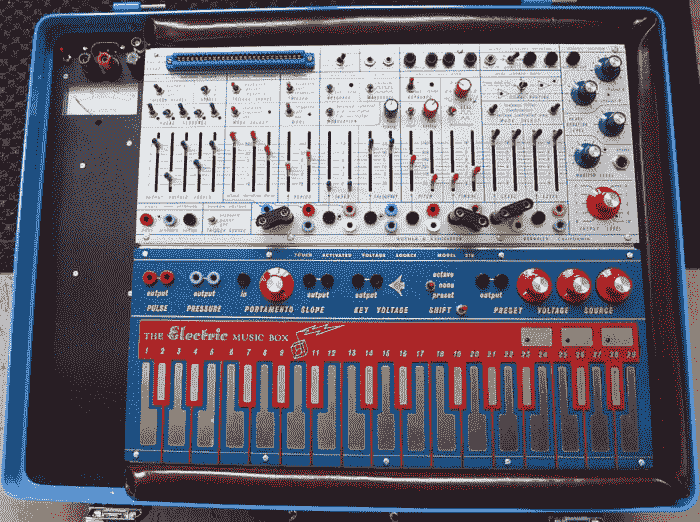
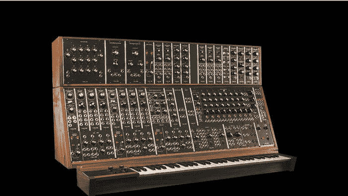

# 声音极客正在复兴模拟合成器

> 原文：<https://thenewstack.io/sound-geeks-resurrecting-analog-synthesizer/>

在数字时代，模块化模拟合成器出人意料地卷土重来。

一段时间以来，数字软件一直在大举进军现代电子音乐领域。除了其他易于使用、即插即用的控制器之外，制作人和其他声音艺术家通常还拥有一台运行一套专门软件程序的计算机。但有些人正在以模块化合成器的形式为他们的设备添加复古元素，不久前，这种合成器以其单片高耸的支架，布满旋钮，当转动时，会产生实验音乐家渴望的新的、闻所未闻的声音，成为尖端音乐的未来缩影。

早期的模拟、基于晶体管的模块化合成器，如由先驱[鲍勃·穆格](https://en.wikipedia.org/wiki/Robert_Moog)和[唐纳德·布赫拉](https://en.wikipedia.org/wiki/Don_Buchla)以及罗兰和雅马哈等公司开发的合成器，在音乐家转向更新、更紧凑和用户友好的固定架构合成器之前，其全盛时期可以追溯到六十年代末、七十年代和八十年代，艺术家有[基思·爱默生](https://en.wikipedia.org/wiki/Keith_Emerson)、[波林·奥利韦罗斯](https://en.wikipedia.org/wiki/Pauline_Oliveros)、[发电厂乐团](https://en.wikipedia.org/wiki/Kraftwerk)和[德佩什模式](https://en.wikipedia.org/wiki/Depeche_Mode)。

## 近乎无限的可能性

但是模块化合成器并没有死——事实上，它还活着，甚至在过去几年里有所复兴。20 世纪 90 年代，随着一些制造商如 [Modcan](http://www.modcan.com/) 和 [Doepfer](http://www.doepfer.de/home_e.htm) 推出新的模块化系统来满足需求，人们对复古合成器的兴趣开始增长。一些人把它比作对所有模拟事物的兴趣同时复苏，从打字机、黑胶唱片、唱盘和扬声器。

其他人说，模块化合成器上近乎无限的各种声音吸引了人们——即使是音频不完美或调音不稳定也可以转化为厚重、有机的声音，这与数字工具完全可预测的输出形成了对比。与基于计算机的音乐制作所需的挑战性较低的鼠标点击相比，使用现代模块化合成器，在控制产生何种声音方面有更直接的触觉联系，这是一种人机之间的超凡炼金术。

“这完全是关于温暖、平滑、不完美、运动和互动，”[英国电子工程师丹·威尔逊(Dan Wilson)在新电子网站上解释道。“模拟合成器、信号处理和记录媒体具有许多在数字领域难以模仿的特性。模拟合成器通常可以产生非常平滑、有力和集中的低音:在当今音乐中非常重要。”](http://www.newelectronics.co.uk/electronics-technology/analogue-electronics-sees-a-revival-in-the-music-industry/53593/)

威尔逊告诉《新电子》杂志，还有一个精确控制和增加与乐器亲和力的元素:“他们经常展示鼓励音色流畅变化的用户界面，这是进步音乐风格的理想选择。他们的调音稳定性和八度音程之间的跟踪从来都不是完美的，这就像铜管乐器合奏一样，增加了声音的移动和深度，使声音更加迷人。”

布赫拉音乐画架，约 1973 年。

## 合成器热潮

这种独特的合成将音乐家和自称“声音极客”的人带回了模拟合成器，此前它已经销声匿迹多年。这种对模拟声音的新兴趣也反映在行业大会上，如[全国音乐商人协会](https://www.namm.org/)(NAMM)年度活动，该活动汇集了音乐产品行业的 95，000 多名成员。[据](https://www.namm.org/news/press-releases/synthesizer-brands-storm-2015-namm-show)NAMM 报道，2015 年展会上展示的成熟和精品合成器品牌数量较上年翻了一番，使得合成器成为展会上增长最快的部分之一。合成器的销售在过去十年中增长了 32 %,行业观察家预测合成器的繁荣只会继续增长。

定制是模块化合成器的主要吸引力之一。“流行文化正在转向那些知道如何真正沉浸在这种模拟设备中的书呆子和极客，这种设备是有触觉的、可定制的、有创意的，最重要的是完全鼓舞人心的，”[在 NAMM 的一篇博客文章中说。](https://www.namm.org/news/press-releases/synthesizer-brands-storm-2015-namm-show)

穆格带回了系统 55，这里看到的可选键盘。

像 Moog 这样的老牌 synth 公司并没有错过这种新兴的复兴，它现在正在[复兴](http://djtechtools.com/2015/01/20/moog-bringing-back-modular-synthesizers/)像 System 35 和 System 55 这样受人喜爱的传奇型号，用当代的零件手工制造，但使用原始的原理图。像[多普弗](http://www.doepfer.de/home.htm)、[制造噪音](http://www.makenoisemusic.com)和[智能公司](https://intellijel.com/)这样的数十家公司正在推进新的、创新的设计，这些设计与“模块化主流”不同

例如，小格式且相对便宜的 Eurorack 的[古怪和神秘的世界](https://www.soundonsound.com/sos/apr13/articles/modular-synths.htm)是一种令人兴奋的方式，声音鉴赏家正在利用过去的经典声音技术，同时利用新的替代模块，这些模块挤满了从未见过的功能。

“我认为这是它开始变得真正有趣的时候，因为它不再完全是关于复古的娱乐——有这些，但其他一切也已经被抛入——数字、模拟、阀门、采样、复杂的序列、模块化和计算机 DAW ( [数字音频工作站](https://en.wikipedia.org/wiki/Digital_audio_workstation))环境之间的接口，几乎是你能想到的任何东西，”[Jason Amm 说，他在《攻击》杂志上以 Solvent 这个绰号制作音乐。Amm 最近还与电影制作人 Robert Fantinatto 合作了一部名为](https://www.attackmagazine.com/features/dreaming-of-wires-the-return-of-modular-synths/)*[我梦见电线](http://www.idreamofwires.org/)* 的纪录片，追溯合成器的迷人历史和复兴。

“模块化活动的增加实际上是模块化合成器制造商和用户之间互惠关系的结果，”Amm 补充道。“用户渴望越来越多的创新声音和合成方法，似乎不缺乏新的制造商，他们在挑战中茁壮成长，为锅贡献独特的东西。因此，我认为模块化复兴的一个重要因素是互联网允许思想和信息的交流。”

## 新的 Synth 社区

除了众多的在线论坛、网站和视频之外，致力于探索合成器和模拟音乐的面对面聚会正在纽约市、洛杉矶和柏林等城市中心涌现——将电子音乐制作人、音乐爱好者和声音极客聚集在一起，围绕合成器分享、学习和建立社区。传播模块化 synth 福音似乎也是故事的一部分。最近在西雅图举行的一次合成器聚会吸引了 100 多人，音乐家辛迪·德玛莱斯和汤姆·布彻[描述了他们创立一家新的本地合成器公司](http://www.thestranger.com/blogs/slog/2016/01/20/23448202/part-museum-part-clubhouse-part-vintage-gear-orgy-inside-the-first-patchwerks-synth-meetup-and-petting-zoo) [Patchwerks](http://patchwerks.com/) 的原因。

“有多个方面，”布彻解释道。“你有音乐家使用这种设备来表达自己。也许他们在乐队或者在家表演。有电子方面，电气工程师或修补匠或制造商，他们只是想用自己的聪明才智做点什么。这也是另一个方面:你不一定要成为音乐家。你只需要对电子和声音感兴趣。我们也想迎合这一点。”

当然，这不一定是模拟和数字之间的一个既定二分法；现在可以使用混合系统或插件来合成这两个世界，这些系统或插件将模拟硬件与最新的基于软件的控制相结合，在合成器设置和数字音频工作站之间提供更好的集成。像专家 Sleepers 的 [Silent Way](http://www.expert-sleepers.co.uk/silentway.html) 和 MOTU 的 [Volta](http://www.motu.com/products/software/volta) 这样的产品只是许多插件中的一部分，这些插件可以让用户将他们的系统连接在一起。

随着每年越来越多的创新设计进入市场，越来越多的创意投入到模块化合成器提供的声音设计的永无止境的可能性中，模拟音乐运动正在从它被数字时代过早侵占之前停止的地方重新开始。毫无疑问，像纳米材料、[机器学习](https://thenewstack.io/whats-store-machine-learning-2016/)、[量子](https://thenewstack.io/newly-discovered-particles-could-push-quantum-computing-further/)和[分布式计算](https://thenewstack.io/distributed-computing-driving-next-generation-mini-particle-accelerators/)这样的新技术将在未来进一步推动这些机器和混合系统配置的发展，有可能演变成我们还无法预见的东西。不管明天会发生什么，模块化模拟频率合成器似乎又一次变得重要起来，而且还会继续存在。

[https://www.youtube.com/embed/GCyiDaM3boc?feature=oembed](https://www.youtube.com/embed/GCyiDaM3boc?feature=oembed)

视频

图片:CC BY-SA 2.0 [乔治·p·麦克林](https://www.flickr.com/photos/gmacklin/ "Go to George P. Macklin's photostream") / CC BY-SA 3.0 卡朋特/穆格

<svg xmlns:xlink="http://www.w3.org/1999/xlink" viewBox="0 0 68 31" version="1.1"><title>Group</title> <desc>Created with Sketch.</desc></svg>