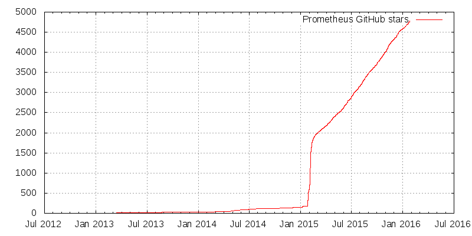

# SoundCloud 的 Prometheus 微服务监视器庆祝开源成功一年

> 原文：<https://thenewstack.io/soundcloud-relies-open-source-prometheus-monitoring/>

当 [SoundCloud](https://developers.soundcloud.com) 将其系统迁移到微服务架构时，它发现其当时的监控工具集(主要基于 [StatsD](https://github.com/etsy/statsd) 和 [Graphite](http://graphite.wikidot.com/) )无法充分监控数百项服务和数千个生产流程。

因此，SoundCloud 开发了自己的监听应用程序，普罗米修斯[就这样诞生了。](http://prometheus.io/)

一年前的今天，SoundCloud 发布了开源的普罗米修斯代码库。“这是事情开始向好的方向稍微疯狂的时候。我们看到贡献者、邮件列表问题、GitHub 问题、IRC 访客、会议和 meetup 会谈请求的急剧增加，以及网络上普遍增加的嗡嗡声，”普罗米修斯开发者朱利叶斯·沃尔茨在庆祝周年纪念日的博客文章[中写道。](http://prometheus.io/blog/2016/01/26/one-year-of-open-prometheus-development/)

今天，Prometheus 已经成长为一个成熟的开源项目，拥有蓬勃发展的支持生态系统。沃尔茨分享了该软件成功的一些数据:

*   200 多名贡献者
*   2300 多个拉取请求(60 多个开放请求)
*   1100 多期(300 多期开放)
*   我们的 IRC 频道中有 150 多人(`#prometheus` on [FreeNode](http://freenode.net/) )
*   邮件列表上有 250 多人创建了 300 多个主题
*   20 多场与普罗米修斯相关的讲座和研讨会
*   100 多篇文章和博客文章

自从开源以来，贡献者已经为 Kubernetes，Marathon 和 AWS 的弹性云计算(EC2)服务添加了服务发现机制。谷歌现在使用 Prometheus 来检测 Kubernetes，CoreOS 也在用同样的方法来监控 Etcd。DigitalOcean、Docker、《金融时报》和毕马威(KPMG)也都在使用该软件。

图形仪表盘 [Grafana](http://grafana.org/features/) 现在为普罗米修斯提供视觉支持。至少有一家公司， [Robust Perception](http://www.robustperception.io/) ，围绕该软件提供商业支持和咨询服务。

三年前，当 SoundCloud 最初开发 Prometheus 时，开源监控处于相当糟糕的状态。传统的监控解决方案无法跟上分布式系统上运行的微服务的动态特性。

外部托管的商业解决方案被视为更好的选择，尽管它们的价格相当昂贵。Rabenstein 指出，许多公司使用外部解决方案是因为他们的自托管选择非常有限，而不是因为外部解决方案对他们来说是正确的。

Prometheus 既是一个监测系统，也是一个警报系统，其时间序列数据库(TSDB)专门用于其特定的使用案例。随着时间的推移，开源和通过私有企业解决方案提供的时间序列数据库的数量不断增加。但是当普罗米修斯被开发出来时，选择是有限的。

SoundCloud 的 PromDash 事件测试仪表板

基于时间的数据存储可能很难处理，这取决于公司如何使用和访问他们存储的信息以及如何响应用户的查询。Prometheus 通过使用多维数据模型将自己与 Graphite 等更传统的方法区分开来。

与传统的分层数据结构相比，这种数据模型具有更大的灵活性。许多数据库正在使用灵活的查询语言，而不是将自己局限于严格的 SQL 要求，Prometheus 也不例外。

“时间序列收集通过 HTTP 上的拉模型进行。SoundCloud 的工程师 bjrn raben stein 说:“与普遍的看法相反，这更容易扩展，并且比推送模式更符合微服务架构的现实。

在 DreamHack 期间工作的普罗米修斯仪表盘提示

使用时序数据库可能充满挑战和陷阱。理解 Prometheus 中可用的数据模型和利用它的语言对于按预期使用它是至关重要的。充分利用普罗米修斯的另一个关键因素是花时间了解度量值的来龙去脉。Rabenstein 提供了 Prometheus 开发人员 Brian Brazil 关于[日志和指标](https://blog.raintank.io/logs-and-metrics-and-graphs-oh-my/)的参考，作为学习如何使用该技术的坚实起点。

Prometheus 的核心组件是用 Go 编写的，特点是静态二进制，缺乏外部依赖性。“一台普罗米修斯服务器每秒钟可以摄取数十万个样本，属于数百万个时间序列，并以高度优化的方式将它们保存在本地磁盘上，”Rabenstein 说。

用 Prometheus 监控一个人的软件可以通过使用一个现成的带有代码的客户机库来完成。如果该选项不可用，开发人员可以使用各种第三方集成将数据从 Prometheus 中导出。Rabenstein 指出，有些人比其他人更幸运，他们的软件已经安装了 Google 的 cAdvisor、CoreOS 的 Etcd 或部分 Kubernetes。

普罗米修斯火箭筒聚类图

随着 TSDB 技术为新一轮数据存储、分析和警报铺平道路，传统监控已迅速转变为传统技术。

“无论是从个人角度还是从技术角度来说，我们都对去年在普罗米修斯之地发生的事情感到兴奋，”沃尔茨写道。“我们很高兴有机会为世界提供一种强大的新监控方法，特别是一种比传统解决方案更适合基于云和容器的现代基础设施的方法。”

新的 Stack 执行编辑 Joab Jackson 促成了这个故事。

通过 Pixabay 的特征图像

<svg xmlns:xlink="http://www.w3.org/1999/xlink" viewBox="0 0 68 31" version="1.1"><title>Group</title> <desc>Created with Sketch.</desc></svg>