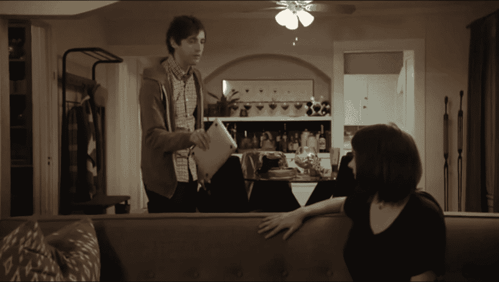

# 空格与制表符:由谷歌 Golang 重新点燃的 20 年争论

> 原文：<https://thenewstack.io/spaces-vs-tabs-a-20-year-debate-and-now-this-what-the-hell-is-wrong-with-go/>

过去 16 年来，极客们一直在选择立场——程序员应该使用空格或制表符缩进代码吗？但是现在，谷歌的一项研究给这场臭名昭著的琐碎火焰战争带来了新的关注——可能是受 HBO《硅谷》最近一集的对话的启发。

说实话，我确实有点偏爱标签。但那只是因为我爱唠叨，因为我更喜欢精确。”

“好吧，我不是在这里挑事，但如果你真的关心精度，你不会用空格吗？但不管怎样，一旦通过编译器，都是一样的，对吧…？”

"如果都一样，为什么不用制表符呢？"

“因为它在其他人的电脑上可能看起来不一样。”

“制表符会创建更小的文件，好吗？我的意思是，为什么不用 Vim 而不用 Emacs 呢？”

"我确实使用 Vim 而不是 Emacs . "

“哦，上帝帮助我们！”

[https://www.youtube.com/embed/SsoOG6ZeyUI?feature=oembed](https://www.youtube.com/embed/SsoOG6ZeyUI?feature=oembed)

视频

终于在今年——就在劳动节周末之前——谷歌的开发者代言人决定加入进来。“我们将[解析 14 种编程语言中的 10 亿个文件](https://medium.com/@hoffa/400-000-github-repositories-1-billion-files-14-terabytes-of-code-spaces-or-tabs-7cfe0b5dd7fd#.fswbmzt2l)，以决定哪一种语言处于领先地位。”他们分析了来自 40 万个 GitHub 知识库的文件，只查看用顶级语言编写的代码文件——他们的图表显示，空格是迄今为止最流行的缩进方法，在每种语言中都是如此。除了 Go 和 c。

Reddit 上的一位评论者开玩笑说:“确定，围棋是未来的语言。”。

“它还会自动格式化你的源代码，”另一个程序员反驳道。"我用空格，它吐出制表符！"

在 Twitter 上，一名开发者开玩笑说这篇文章只是制造了另一场争议。“现在新的讨论是’[围棋到底怎么了？](https://twitter.com/gbhorwood/status/774259621645029376)’”

至少有一名加拿大工程师对谷歌解决这个问题的努力表示赞赏。

但最终，谷歌没能给开发者世界带来和平。

https://twitter.com/ibc_tw/status/776052508007555076

当有人让卡斯蒂略参考谷歌的分析时，他只是简单地补充道:“我知道。是的，他们都 100%错了。”

“这是什么疯狂，”[云工程师埃德·摩根在推特上写道。](https://twitter.com/mcbride_ruairi/status/771395672759267329)

"疯狂每个人都知道标签更好！"一位伦敦的 NetApp 维护人员回答道。

“这太恶心了，”[英国一名自由网页设计师在推特上写道](https://twitter.com/tomslominski/status/771364567310041089)

事情并没有就此结束。谷歌的帖子很快就像病毒一样传播开来，在 Reddit 上吸引了 1620 条评论，还出现在 [Gizmodo](https://gizmodo.com/google-coder-analyzes-a-billion-files-to-find-a-winner-1786016648) 、 [Slashdot](https://developers.slashdot.org/story/16/09/01/151201/400000-github-repositories-1-billion-files-14tb-of-code-spaces-or-tabs) 和[黑客新闻](https://news.ycombinator.com/item?id=12397246)上。“听了 20 多年关于制表符和空格的争论，并考虑了双方的所有合理观点后，许多人做出了以下观察，这是最能引起我共鸣的[，](https://news.ycombinator.com/item?id=12397651)，”一名程序员在黑客新闻上写道。

“在理想的完美世界中，所有的程序员和所有的文本编辑器工具都将使用制表符专门用于缩进，使用空格专门用于对齐。但是，我们并不是生活在那个完美协调的世界里，所以 spaces 保持了最大的保真度——代价是程序员无法立即定制 2、4、6、8 宽度的缩进。”

极客们真的已经为此争论了 20 多年了吗？看起来是这样。早在 2000 年，早期 Netscape Navigator 浏览器的编码员之一 Jamie Zawinski 就已经把它描述为“无休止的争论”。他的文章解释了如何配置两个 Linux 文本编辑器(Emacs 和 Vi)来改变标签的宽度。(“所以向前冲，不要犹豫！”)

我们愉快地进行着，2004 年，微软开发者网络上的一个帖子提出了完全相同的问题，指出有些人[将空格和制表符](https://blogs.msdn.microsoft.com/cyrusn/2004/09/14/tabs-vs-spaces/)结合在一起，并认为他们实际上已经表明了第四种立场:编码工具应该是可配置的，以显示每个用户的偏好视图，而*根据一组商定的规则保存*代码。但并不是每个人都如此开明。2009 年，Stack Overflow 的联合创始人之一杰夫·阿特伍德(Jeff Atwood)写了一篇名为[太空异教徒去死吧！](https://blog.codinghorror.com/death-to-the-space-infidels/)。他引用受人喜爱的 1984 年的书《代码全集》为自己的立场进行游说。

我们的研究支持这样一种说法，即编程计划的知识和编程话语的规则对程序理解有重大影响……程序应该以特定的风格编写不仅仅是一个美学问题……程序员强烈期望其他程序员会遵循这些话语规则。如果违反了这些规则，那么程序员随着时间的推移而建立起来的期望所带来的效用实际上就化为乌有了。”

阿特伍德引用了更多的实验——一个来自 20 世纪 70 年代初的实验——这些实验发现，当信息以有意义的顺序排列时，会被更好地保留。“是的，”阿特伍德总结道，“虽然听起来很荒谬，但为空白字符和其他看似琐碎的代码布局问题而争论实际上是合理的。当然是在合理的范围内——公开进行，以公平和建立共识的方式进行，并且不要在过程中刺伤你的队友。”

四年后，这个问题出现在极客国家的中心——在[一场关于堆栈溢出的讨论中。](http://programmers.stackexchange.com/questions/57/tabs-versus-spaces-what-is-the-proper-indentation-character-for-everything-in-e)

一个论点是“空格”。根据您的环境，选项卡可以是不同数量的列，但空格始终是一列

“制表符，”反驳者说道。“它们是专门用于缩进的字符。它们允许对缩进大小有不同偏好的开发人员在不改变代码的情况下改变代码的外观”

就这样！

但是页面的标签部分最终给人一种和解的感觉。"当然，一致性比任何一个都重要，一个好的 IDE 可以忽略这些差异."但是为什么要破坏一场精彩的辩论呢？“也就是说，这条线索的重点是成为一场圣战，所以…”

杰夫·阿特伍德本人似乎也同意——在某种程度上。早在 2009 年，他写道“你选择哪种编码风格并不重要。*重要的是，你和你团队中的其他人坚持这些惯例，并始终如一地使用它们。”但他忍不住又加了一句。*

"也就是说，只有白痴才会使用制表符来格式化他们的代码."

## WebReduce

<svg xmlns:xlink="http://www.w3.org/1999/xlink" viewBox="0 0 68 31" version="1.1"><title>Group</title> <desc>Created with Sketch.</desc></svg>