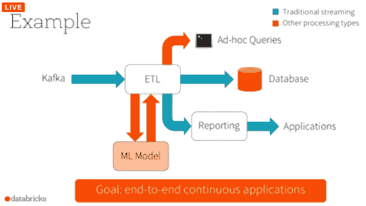

# Spark 2.0 将提供实时数据的交互式查询

> 原文：<https://thenewstack.io/spark-2-0-will-offer-interactive-querying-live-data/>

Apache Spark 的下一个版本将扩展数据处理平台的实时数据分析功能，为用户提供对实时数据执行交互式查询的能力。

在本周于纽约举行的 [Spark Summit East](https://spark-summit.org/east-2016/schedule/) 大会上，Spark 创始人兼 [Databricks](https://databricks.com/) 首席技术官 Matei Zaharia 解释说，这项名为“结构化流”的新功能将“将 Spark 推向一个新的应用类别，它可以实时做其他事情，而不仅仅是分析一个流并输出另一个流”。“这是流媒体和互动的结合，目前的流媒体引擎并没有真正处理它。”

这项功能的出现是为了响应那些迫切需要更复杂的方法来处理流媒体数据的用户。Spark 提供了创建分析数据流的能力，该数据流是通过原始实时数据流以数学方式得出的。Zaharia 解释说，Spark 用户想要的是将直播与其他类型的数据分析结合起来的能力。

特别是，他们希望对实时数据应用批处理作业和交互式查询。像这样的工作。为了享受这些功能，用户必须通过 ETL(提取、转换和加载)过程建立一个单独的数据库或数据仓库，这是一个复杂的设置。

“有了结构化流媒体，就没有必要把它放在其他奇怪的存储器里，也没有必要担心一致性，”他说。

例如，结构化流可以真正推动网络分析。用户可以针对 Web 访问者的当前会话运行交互式查询。

结构化流也可以用于将机器学习算法应用于实时数据。这些算法可以在旧数据的基础上进行训练，然后在新数据进入内存时，对其进行重定向，以合并甚至学习新数据。

Zaharia 解释说，结构化流可以通过“声明式 API”访问。用户可以将数据聚合到一个流中，然后通过一个 JDBC (Java Database Connectivity，Java 数据库连接)插件公开它，允许用户查询最新状态的数据。查询可以在运行时更改。

结构化流构建在 [Spark SQL 引擎](http://spark.apache.org/sql/)之上，并利用了核心 [Spark 流](http://spark.apache.org/streaming/)功能的许多特性，包括重组无序到达的面向时间的数据的能力，以及创建预设长度的数据窗口。为了提高性能，它利用了[项目钨](https://databricks.com/blog/2015/04/28/project-tungsten-bringing-spark-closer-to-bare-metal.html)所做的工作，该项目寻找优化 CPU 和内存使用的方法来处理结构化数据。

“我们不只是想做流媒体，我们想做连续的应用程序，端到端的应用程序，读取流并提供查询服务，”Zaharia 说。

Apache Spark 的 2.0 版本将在 4 月或 5 月左右推出，将具有许多结构化流功能，并且在未来的版本中会添加更多的库和操作符。

Apache Spark 项目经理 Reynold Xin 将在周四的峰会上更详细地解释结构化流，届时将进行现场直播。

<svg xmlns:xlink="http://www.w3.org/1999/xlink" viewBox="0 0 68 31" version="1.1"><title>Group</title> <desc>Created with Sketch.</desc></svg>