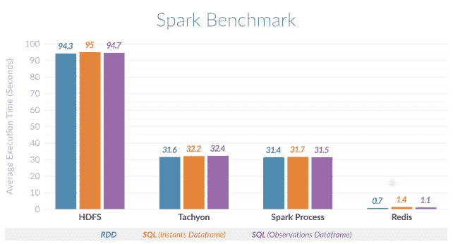

# Spark 接近 Redis 配对的实时处理

> 原文：<https://thenewstack.io/spark-closes-real-time-processing-redis-pairing/>

Redis 实验室发布了一个连接器，允许 [Spark](http://spark.apache.org/) 数据处理平台使用 Redis 内存数据存储。

Redis Labs 的联合创始人兼首席技术官 Yiftach Shoolman 解释说，使用 Redis for Spark 将允许用户“存储大量数据，而无需为基础设施支付大量资金”，他指出，Redis 可以成为成熟的内存数据库系统的低成本替代品。“如今，我们希望大数据性能尽可能接近实时。这就是我们努力要做的。”

具体来说，开源的 [Spark-Redis 连接器包](http://spark-packages.org/package/RedisLabs/spark-redis)提供了一种简单的方法来对 Redis 上存储的数据运行 SparkSQL 查询。

根据 Redis 实验室的[基准测试](https://redis.com/lp-redis-accelerates-apache-spark)，在 Redis 数据存储上运行 Spark 比使用 HDFS (Hadoop 文件系统)可以加快 135 倍的处理速度，甚至比使用 [Tachyon 内存数据存储](https://amplab.cs.berkeley.edu/projects/tachyon-reliable-file-sharing-at-memory-speed-across-cluster-frameworks/)快 45 倍。

Shoolman 断言，Redis Labs 渴望让 Redis 成为 Spark 事实上的数据仓库。

这个包是一个库，它提供了一个用于读写 Redis 集群的库。它将 Redis 的所有数据结构——字符串、散列、列表、集合、排序集合、位图、[超级日志](http://antirez.com/news/75)——作为 Spark RDDs(弹性数据集)或通过 Spark DataSet API 公开。

该库最大限度地减少了大量数据的序列化和反序列化的开销。

Spark 本身[已经成为](http://www.computerworld.com/article/2856063/enterprise-software/hadoop-successor-sparks-a-data-analysis-evolution.html)Hadoop 数据处理平台的主要继任者，这在很大程度上归功于其近实时处理数据的能力，而不是 Hadoop 最初提供的批量处理“大数据”。

“Apache Spark 正在成为高性能数据集成和分析的默认内存引擎，”451 Research 数据平台和分析研究总监 Matt Aslett 在一份声明中说。Redis 和 Spark 的结合应该能够对极其庞大和多变的数据集进行高性能的实时分析

<svg xmlns:xlink="http://www.w3.org/1999/xlink" viewBox="0 0 68 31" version="1.1"><title>Group</title> <desc>Created with Sketch.</desc></svg>