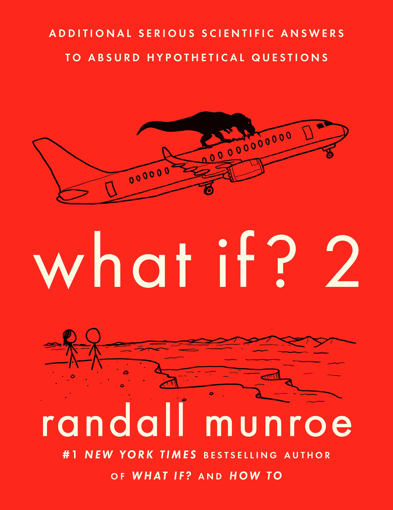
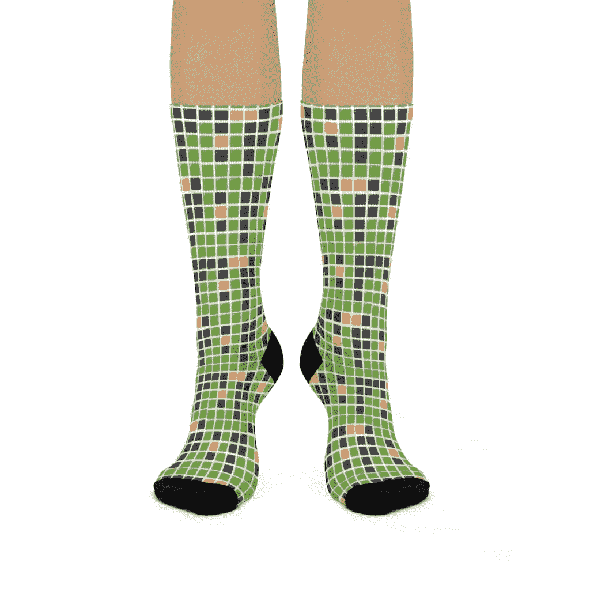
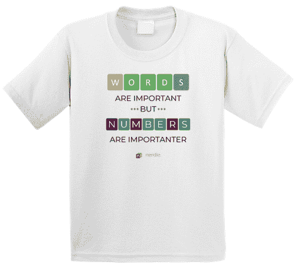
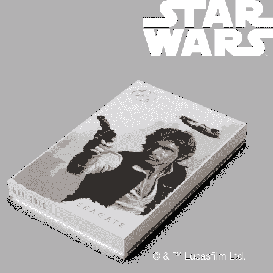
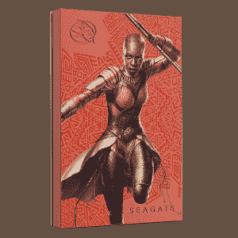
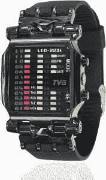
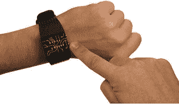
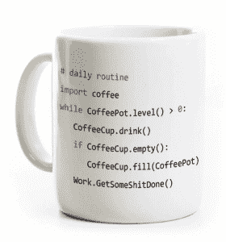
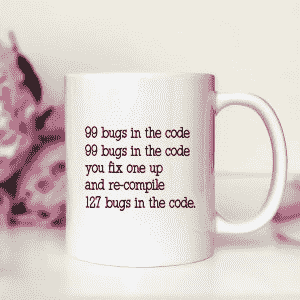
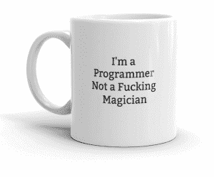

# 给你生命中某个技术人员的特别礼物

> 原文：<https://thenewstack.io/special-gift-ideas-for-that-technical-someone-in-your-life/>

[现在是](https://thenewstack.io/the-2021-tns-gift-guide-4-ways-to-help-connect-to-community/) [安](https://thenewstack.io/exploding-kittens-geeky-gifts-secretly-wish-got/) [一年一度](https://thenewstack.io/geeky-gifts-secretly-wish-wed-gotten/) [传统](https://thenewstack.io/tech-y-gifts-geeks-2017-edition/)[at](https://thenewstack.io/a-very-geeky-christmas-four-gift-ideas-for-the-programmer-in-your-life/)[【TNS】](https://thenewstack.io/tns-gift-guide-for-2020-practical-projects-and-fabulous-fun/)—我们自己为你生命中的技术型人准备的礼物指南。

但是无论你今年最终送了什么古怪的礼物——无论是侏罗纪公园的国际象棋还是外形像 PlayStation 控制器的闹钟——心意仍然是最重要的。你最喜欢的技术人员会感谢你对他们的关心，勇敢地去寻找完美的技术礼物。这些建议可能会让你赢得一个真诚的微笑…

## 1.XKCD 的漫画家又写了

XKCD 漫画家兰道尔·门罗的这本对极客友好的新书不会错。他板着脸，带着痴迷的认真，处理他的连环漫画读者提出的一些奇怪的假设背后的科学。(“有关于激光、爆炸、秋千、糖果和汤的问题，”门罗在最近的一篇博客文章中解释道。"几个星球被毁灭了——其中一个被汤毁灭了.")

事实上，这一年的一大亮点是 YouTube 上的一个科学频道 Minute Physics 对门罗的新书进行了动画提问。具体来说:如果冥王星是钚呢？天王星铀呢？还有水星水星？(“剧透警报！”视频的旁白警告说。“这不会有好结果……”)

[https://www.youtube.com/embed/6tu0mIpX8nU?feature=oembed](https://www.youtube.com/embed/6tu0mIpX8nU?feature=oembed)

视频

整个夏天，《连线》[发表了](https://www.wired.com/story/swallow-whole-cloud-what-if/)门罗对两个特别愚蠢的问题的回答。如果一些外层空间变成了汤会怎么样？如果你试图吞下一朵云呢？这本书的[官方网站](https://www.penguinrandomhouseaudio.com/book/576761/what-if-2/)给出了更多等待在里面的教育狂热的例子。“在你开始一次宇宙之旅，给纽约市的居民喂霸王龙，或者用香蕉填满每个教堂之前，一定要参考这本实用指南，寻找不切实际的想法。

门罗没有被荒谬所困扰，他参考了从秋千物理学到飞机弹射器设计等各方面的最新研究，清晰而简明地回答了读者的问题。"

这本备受期待的书已经成为出版界的一个小现象。正如漫画家自己在本周指出的那样，“只要在你的设备上的某个随机框中键入‘如果 2’会怎样；这可能会奏效。”甚至还有威尔·惠顿朗读的有声读物版本。

最棒的是，漫画家已经设法将这本书改编成他自己的三部漫画。

## 2.内尔德尔·沃尔多连续统

如果你最喜欢的极客对桌游更感兴趣，纽约时报商店现在提供今年最热门的在线游戏的家庭版。 [*Wordle:派对游戏*](https://store.nytimes.com/products/wordle-the-party-game) 是一种和朋友一起玩的 Wordle，一个现场“Wordle 主持人”在房间里走来走去，亲自将黄色和绿色方块分发到每个玩家的写字板上。(这样玩家就可以实时对战了。)为了获得更多以文字游戏为主题的赠品，这家商店还提供一系列文字别针、文字水瓶和文字棒球帽。

但它变得更加激烈。在 Etsy 上，粉丝们已经将所有东西都提升到了一个新的水平，有[圣诞饰品](https://www.etsy.com/listing/1340896723/ornament-wordle-christmas-joy-to-the?click_key=836d73ed49262406c4cc310eed87f3c7b476bcc0%3A1340896723&click_sum=c9a0f742&ga_order=most_relevant&ga_search_type=all&ga_view_type=gallery&ga_search_query=wordle&ref=search_grid-847105-4-27&pro=1&edd=1)、[长袜](https://www.etsy.com/listing/1222707683/original-wordle-inspired-socks-gift-idea?click_key=ac4d4a85679cdd163818d96eca4971b1b3801c72%3A1222707683&click_sum=37cbbde1&ga_order=most_relevant&ga_search_type=all&ga_view_type=gallery&ga_search_query=wordle&ref=search_grid-425758-2-4&edd=1&pop=1&sts=1)，甚至还有可定制的 3D 打印 [Wordle 耳环。](https://www.etsy.com/listing/1158519680/3d-printed-wordle-earrings-can-be?click_key=8f7127b6cc76a1967e3deeb2f67c78c75248da34%3A1158519680&click_sum=eefca850&ga_order=most_relevant&ga_search_type=all&ga_view_type=gallery&ga_search_query=wordle&ref=search_grid-847105-4-32&frs=1&cns=1&edd=1&sts=1)

更有趣的是，你可以下载自己的 3D 打印机模型来生成所有部件，以便每天精确复制你的 Wordle 分数。(CNET 建议用挂绳把它挂在脖子上。)

数学爱好者可能更喜欢用 8 个符号的*等式*代替五个字母的单词。因此，对于所有那些数学积极的书呆子粉丝来说，有一个他们自己的[官方商店](https://www.nerdleverse.com/)，提供纪念他们的极客游戏及其所有粗糙变体的 t 恤——从两方程 [Binerdle](https://www.nerdleverse.com/view/42/binerdle---curious-ladies-t-shirt) 到六符号[迷你书呆子](https://www.nerdleverse.com/view/36/mini-nerdle---quite-a-challenge--big-text----youth-short-sleeve---white--t-shirt)。

有几十种衬衫可供选择，上面印有简洁的数学口号，如“[人多力量大](https://www.nerdleverse.com/view/17/nerdle---safety-in-numbers-long-sleeve-t-shirt)”或“[分而治之](https://www.nerdleverse.com/view/43/nerdle-divide-and-conquer---adult-t-shirt)”

甚至还有为你的狗狗准备的 Nerdle t 恤[——当然，还有官方的](https://www.nerdleverse.com/view/23/nerdle-color-logo-horizontal--t-shirt) [Nerdle 主题咖啡杯](https://www.nerdleverse.com/view/6/nerdle-color-logo-mug)。

## 3.星球大战:天行者的驱动力

希捷最近公布了第二代[双致动器 MACH.2 系列硬盘](https://www.seagate.com/innovation/multi-actuator-hard-drives/)。但更重要的是，他们正在出售外壳上画有*《星球大战》*角色的[外置硬盘](https://www.seagate.com/products/gaming-drives/special-editions/)！
 
这是 2tb 的特别版[韩 Solo 外置硬盘](https://www.seagate.com/products/gaming-drives/special-editions/han-solo/)(希捷承诺这是“以臭名昭著的走私者和飞行员的信心设计的……另外，由于其巨大的容量，您可以收集大量的游戏、文件和媒体。”)

如果你不想太自大，还有一款[卢克·天行者推进器](https://www.seagate.com/products/gaming-drives/special-editions/luke-skywalker/)，“根据主人公的推进目的设计”和“注定伟大”但是如果你购买希捷的[达斯·维德驱动器](https://www.seagate.com/products/gaming-drives/special-editions/darth-vader/)，“黑暗降临在你的收藏上。”(尽管“强大的能力唾手可得…”)

当你爱的人已经有了一套配套的 [*《星球大战》*椒盐研磨机](https://amzn.to/3ueoPgp)时，这是最完美的礼物。

对于曼达洛人*的粉丝来说，希捷还出售印有[波巴·费特](https://www.seagate.com/products/gaming-drives/special-editions/boba-fett/)、[格罗古](https://www.seagate.com/products/gaming-drives/special-editions/grogu/)和[曼达洛人本人](https://www.seagate.com/products/gaming-drives/special-editions/the-mandalorian/)的可爱驱动。*

 *对于漫威的粉丝来说，还有纪念 11 月票房冠军的驱动器，*黑豹:永远的瓦坎达*，有四个单独的驱动器纪念电影中的角色。([黑豹](https://www.seagate.com/products/gaming-drives/special-editions/black-panther/)、[奥科耶](https://www.seagate.com/products/gaming-drives/special-editions/okoye/)、[首里](https://www.seagate.com/products/gaming-drives/special-editions/shuri/)——加上一个特殊的[瓦坎达驱动之王](https://www.seagate.com/products/gaming-drives/special-editions/king-of-wakanda/)。)希捷还提供[三款](https://www.seagate.com/products/gaming-drives/special-editions/ghost-spider/) [独立](https://www.seagate.com/products/gaming-drives/special-editions/miles-morales/) [蜘蛛侠](https://www.seagate.com/products/gaming-drives/special-editions/spiderman/)硬盘——外加一款纪念[漫威的《复仇者联盟》](https://www.seagate.com/consumer/play/game-drive-playstation/)。

“充分展示你的激情，”希捷的网页敦促道，“用我们的特别版珍藏版硬盘。”

## 4.二进制数的时间到了

对于极客的终极新奇物品，制表商 Tomoro 正在出售一款手表，这款手表[仅以方块图](https://amzn.to/3GDzRmE)显示时间。(“一个真正的谈话引子…”亚马逊上的描述是，“保证无论你去哪里都能吸引注意力和问题。”)一位评论家给了它五颗星，[写道](https://www.amazon.com/gp/customer-reviews/R2GL7MVRZIQD8Y/ref=cm_cr_dp_d_rvw_ttl?ie=UTF8&ASIN=B01N7SVMEN)“我喜欢这只手表给试图阅读它的人带来的困惑！!"另一个人滔滔不绝地说，这是“一种令人惊奇的、令人讨厌的测量时间的方式”

虽然 Tomoro 将其称为“男士二进制矩阵”手表，但亚马逊上的 63 名评论者中有一名足够古怪，足以真正了解其肮脏的秘密。它根本不是二进制数[——而是以 5 为基数(而不是以 2 为基数)。](https://www.amazon.com/gp/customer-reviews/R3H3S1U6NH4B2M/ref=cm_cr_getr_d_rvw_ttl?ie=UTF8&ASIN=B01N7SVMEN)

然而，你几乎可以听到圣诞老人安慰地对购买礼物的极客们说，是的，弗吉尼亚，这里有*二进制数字手表。*

“发光二极管代表 32，16，8，4，2，1，”亚马逊为专业人士的 getDigital 二进制腕表列出的清单解释道。"只要把发光的数字加起来，你就大功告成了！"

## 5.程序员的咖啡因

对于那些“结对编程”仅仅意味着用一杯咖啡进行编码的深夜编码会议，至少有一个咖啡杯在说你的语言。(仔细选择——cups 既有 [Python](https://www.etsy.com/listing/741338614/python-program-coffee-mugtea-cup?ga_order=most_relevant&ga_search_type=all&ga_view_type=gallery&ga_search_query=programmer&ref=sr_gallery-1-27&edd=1&sts=1&organic_search_click=1) 也有 [C++代码](https://www.etsy.com/listing/280870354/c-program-coffee-mug-coding-computer?ga_order=most_relevant&ga_search_type=all&ga_view_type=gallery&ga_search_query=programmer&ref=sr_gallery-1-1&edd=1&pop=1&sts=1&organic_search_click=1)。)

事实上，Etsy 充满了程序员主题的咖啡杯。其中一个甚至提供了经典歌曲“墙上的 99 瓶啤酒”的编码版本[。](https://www.etsy.com/listing/1134006758/computer-programmer-mug-coffee-mug-funny?ga_order=most_relevant&ga_search_type=all&ga_view_type=gallery&ga_search_query=programmer&ref=sr_gallery-2-13&pro=1&edd=1&sts=1&organic_search_click=1)

而其他咖啡杯[直奔主题](https://www.etsy.com/listing/1027305802/im-a-programmer-not-a-fucking?click_key=794108db6b157577eea4f4f8c4ea68765e7f0705%3A1027305802&click_sum=7145ceb5&ga_order=most_relevant&ga_search_type=all&ga_view_type=gallery&ga_search_query=programmer&ref=search_grid-323180-2-13&pro=1&edd=1&sts=1%20) …

请记住，最后，这些礼物建议不仅仅是我们最喜欢的古怪东西。它们是我们今年一起工作的所有乐趣的美好回忆——也是一个向我们玩的所有那些令人讨厌的方式致敬的机会。

因此，每份礼物都提供了一个围绕共同兴趣走到一起的机会，在这个神奇的空间里，想法与笑声相遇，书呆子式的幽默感变成了有趣的圣诞乐趣。

祝你节日快乐！

<svg xmlns:xlink="http://www.w3.org/1999/xlink" viewBox="0 0 68 31" version="1.1"><title>Group</title> <desc>Created with Sketch.</desc></svg>*