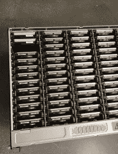

# 规格:Dropbox 的第六代定制服务器

> 原文：<https://thenewstack.io/specs-dropboxs-sixth-generation-of-custom-built-servers/>

文件托管服务 [Dropbox](https://www.dropbox.com/) 发布了其第六代服务器的细节，这是一个针对更高容量和更低延迟而优化的舰队。

Dropbox 在近十年前开始运行自己的硬件基础设施，推出了 [Magic Pocket](https://dropbox.tech/infrastructure/inside-the-magic-pocket) ，这是一个内部的多 EB 存储系统。作为世界上为数不多的千兆级存储系统之一，Dropbox 发现，最重要的是承担起保持内部工程的责任，从而防止任何外部实体阻止他们向客户提供他们认为他们可以提供的最佳服务。

设计、运输和维护 Dropbox 数据中心中的所有物理硬件并非易事，正如 [Eric Shobe](https://www.linkedin.com/in/shobe/) 和 [Jared Mednik](https://www.linkedin.com/in/jaredmednick/) 在他们的[最新文章](https://dropbox.tech/infrastructure/sixth-generation-server-hardware)中详细描述的那样，当第六代硬件发货时，一个令人兴奋的里程碑刚刚到来。

## **一对多**

一种可用于设计服务器配置的方法是硬件行业所称的雪花。雪花是为每个服务设计的硬件。Shobe 和 Mednick 将这种方法描述为一种花哨的跑车，针对速度进行了优化，但不太适合旅行，如送孩子上学或拿干洗衣服。如果一个人永远不需要做这些旅行，这辆车可以工作。但由于 Dropbox 有 100 多项服务，这将是许多为个人旅行优化的豪华车。

与汽车相似，Dropbox 为这些服务器配置采用的方法更像是一辆通用轿车。它把每个人带到他们需要去的地方，不管有多远或多近。这款轿车虽然是 2022 款，但还是有点花哨。Dropbox 提出的解决方案是通用设计，最适合其服务多样性不断增长的规模和广度。

核心应用程序的服务器层有三种分类，而服务于边缘网络的服务器层有一种。

*   **存储**:运行 Magic Pocket (Dropbox 的不可变块存储系统)并托管所有客户数据
*   **数据库**:驱动他们的持久存储层(想想 MySQL 和元数据)
*   **计算**:为应用程序提供通用计算
*   **Edge** :通过分布式 POP 站点将客户连接到数据中心

## 认识第六代服务器

讨论服务器代码名称花了很多时间。Dropbox 团队试图坚持卡通名字，每个名字的第一个字母与第一个字母匹配，作为其服务器层。边缘是一个例外，因为它被视为计算层的一个分支，而不是其完整的层。第六代硬件名字是史酷比、迭戈、卡特曼、可可。

### **史酷比**存储层

这一层是与 Magic-Pocket 团队共同设计的。它们提供一系列高容量 3.5 英寸硬盘，允许每台服务器扩展到 2PB 以上，每机架扩展到 20PB 以上。每个机箱包含 100 多个驱动器、一个运行 Magic Pocket 软件的计算机箱和一个用于连接的 100 Gb NIC。与前几代产品相比，八个机箱安装在一个机架中，提供了最高的性能。

### **迭戈**数据库层

现在，永久存储层中的机架密度实际上增加了一倍。每个机箱都有超过 60%的 CPU 内核和 16 TB NVME 固态硬盘，其闪存存储量是第五代的两倍。闪存存储是提供非常快速的输入/输出和低延迟元数据访问的关键。Edgestore、File Journal 和 Magic Pocket 是该层支持的一些服务。

### **卡特曼**计算层

每个节点都是低端服务器，位于 1U 机柜中，每个机架堆叠 46 个节点，并通过架顶式交换机互连。Cartman 将计算层的速度和能力提高了 3 倍，远远超过了任何前代产品。计算的飞跃主要是由多租户(意味着多个应用程序共享同一空间)和 CPU 行业趋势推动的，这种趋势使 Dropbox 在使用更少 CPU 的情况下获得了更高的性能。盒子里面是 48 核处理器，256 GB DDR4 RAM，1 TB 固态硬盘和 25Gb 网卡。

### **Coco** 边缘层

Coco 的服务器负责接受、加密和谴责进出 Dropbox 数据中心的流量，是离客户最近的一层。这第六代允许 Dropbox 将 pop 的机架密度提高 17%，将核心数量增加 50%，将网络速度提高 25%，并将总内存增加两倍。最终结果是降低了连接到数据中心时的延迟并改善了用户体验。

## **接下来是什么？**

硬件工程师与软件团队密切合作，监控硬件的运行情况。与软件团队共同设计硬件使他们能够利用最新的技术，采用定制的内部方法使他们能够创造出独一无二的解决方案。

Dropbox 定期重新评估服务器配置，以确保他们做出最佳决策，并继续为客户需求提供最佳服务。正如文章中提到的，Dropbox 以在新技术上进行创新押注而自豪，例如与 AMD 合作推出他们的那不勒斯和罗马处理器，以及为 Magic Pocket 部署 SMR 驱动器。

第七代已经成型，虽然没有发布日期在这个时候被提及。第七代的两项新技术是机器学习和热辅助磁记录(HAMR)硬盘驱动器。

Dropbox 车队的新硬件加速器在运行推理和回归类型的工作负载时可以提供巨大的性能增益，机器学习将允许 Dropbox 充分利用它们。HAMR 使用过热的激光聚焦在盘片上，同时在适当的位置写入新的比特。这将开启数据存储的新密度。

<svg xmlns:xlink="http://www.w3.org/1999/xlink" viewBox="0 0 68 31" version="1.1"><title>Group</title> <desc>Created with Sketch.</desc></svg>