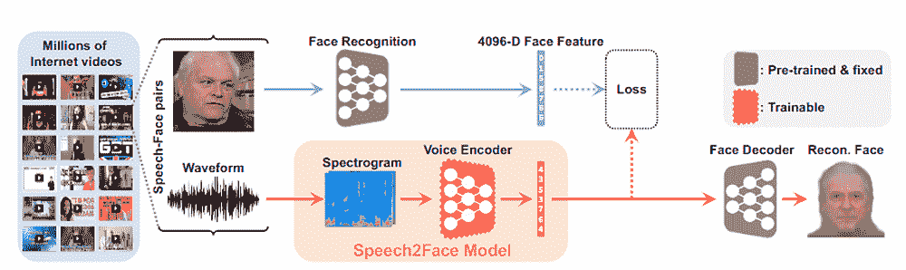
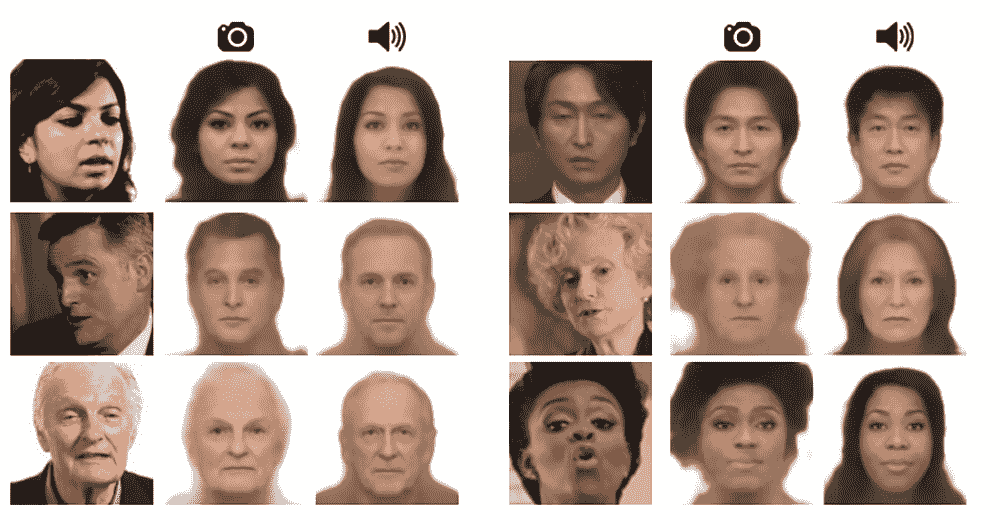

# 麻省理工学院的深度神经网络仅使用语音音频重建人脸

> 原文：<https://thenewstack.io/speech2face-reconstructs-faces-using-only-voice-audio/>

即使我们从未见过某个人，他们的声音也能传达很多信息:他们是男是女，是老是少，或者是口音表明他们可能来自哪个国家。虽然我们有可能随意猜测某人的面部特征，但我们很可能无法仅凭声音清晰地拼凑出某人的长相。

然而，当机器被投入这项任务时，情况就不同了，正如麻省理工学院[计算机科学和人工智能实验室](https://www.csail.mit.edu/) (CSAIL)的研究人员在开发一种人工智能时发现的那样，这种人工智能可以生动地重建人的面部，具有相对令人印象深刻的细节，仅使用他们声音的简短音频剪辑作为参考。

该团队在他们的预印本[论文](https://arxiv.org/pdf/1905.09773.pdf)中解释了他们如何训练一个[深度神经网络](https://en.wikipedia.org/wiki/Deep_learning#Deep_neural_networks)——一种模仿人脑非线性结构的多层人工神经网络——使用数百万个互联网视频，其中有超过 10 万个会说话的脑袋。正是从这些视频中，该团队的 Speech2Face AI 能够“学习”某人的面部特征与这些特征最有可能产生的声音之间的相关性。

该团队写道:“言语和外表之间有很强的联系，其中一部分是言语产生机制的直接结果:年龄、性别(影响我们声音的音高)、嘴形、面部骨骼结构、薄唇或厚唇——所有这些都会影响我们发出的声音。”“此外，其他声音和外貌的相关性源于我们说话的方式:语言、口音、速度、发音——这些语音特性通常在不同民族和文化中是共有的，这反过来又可以转化为共同的身体特征。”

## 自我监督机器学习

虽然之前在预测人脸和声音之间的联系方面已经做了一些工作，但一个大的障碍是这些方法需要人类手动分类和标记音频输入信息，将其与一些特定的属性联系起来，无论是人脸特征、性别还是年龄。然而，正如人们可以想象的那样，对于人类监管者来说，这将是一个昂贵而耗时的过程——更不用说这种方法会限制预测人脸的输出以及一组严格预定义的面部属性。

为了克服这一限制，Speech2Face 使用了[自我监督学习](https://hackernoon.com/self-supervised-learning-gets-us-closer-to-autonomous-learning-be77e6c86b5a)，这是一种相对较新的[机器学习](https://thenewstack.io/machine-learning-not-magic-guide-get-started/)技术，仍然被认为是监督学习的子集，但训练数据是由机器本身通过识别和提取各种输入信号之间的联系来自动标记的，而不必显式地对这些属性进行建模。这种方法特别适合人工智能在动态和多样化的环境中自己收集信息的情况，例如在互联网上发现的情况。

除了使用自我监督学习技术，Speech2Face 还使用 [VGG-Face](http://www.robots.ox.ac.uk/~vgg/data/vgg_face/) 构建，这是一个现有的人脸识别模型，已经在一个大型人脸数据集上进行了预训练。Speech2Face 还有一个“语音编码器”，它使用卷积神经网络(CNN)来处理[声谱图](https://en.wikipedia.org/wiki/Spectrogram)，或者是在长度为 3 到 6 秒的声音片段中找到的音频信息的视觉表示。然后，一个单独训练的“面部解码器”利用数百万语音-面部对的数据集 [AVSpeech](https://looking-to-listen.github.io/) ，利用翻译的信息生成一个预测版本的某人面部可能的样子。

对比结果:说话人的原始视频截图在第一列；第二列是从图像重建；第三列是音频重建。

正如你所看到的，该团队实验的一些输出与真实的人有着惊人的相似，而其他的则有点偏离。但总的来说，结果相当令人印象深刻——即使在一些特殊情况下，有人可能会说两种不同的语言而没有口音，系统也能够相对准确地预测说话者的面部结构，甚至种族。

正如该团队指出的那样:“我们的目标是*而不是*预测一张可识别的精确人脸图像，而是捕捉与输入语音相关的人的主要面部特征。”最终，这种技术将在各种情况下有用，例如在电信中，说话人的重建图像或漫画化身可能出现在接收蜂窝设备上，或者在视频会议场景中。

<svg xmlns:xlink="http://www.w3.org/1999/xlink" viewBox="0 0 68 31" version="1.1"><title>Group</title> <desc>Created with Sketch.</desc></svg>