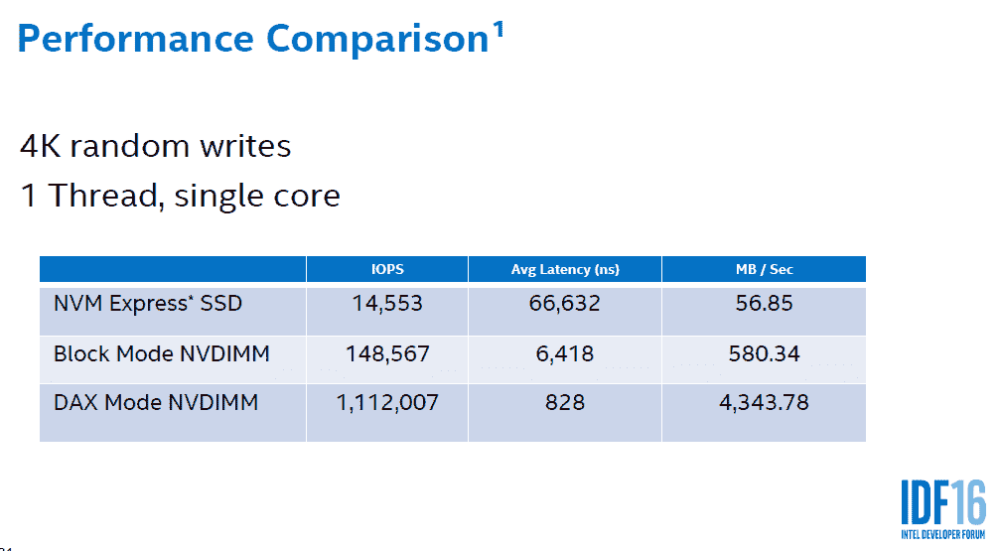

# 微软为 Windows Server 2016 准备了超快速持久存储

> 原文：<https://thenewstack.io/speed-kills-microsoft-prepared-windows-server-2016-persistent-storage/>

随着 [Windows Server 2016](https://blogs.technet.microsoft.com/hybridcloud/2016/10/12/another-big-step-in-hybrid-cloud-windows-server-2016-general-availability/) 的发布，微软已经为系统架构即将到来的结构性变化做好了准备，即围绕内存在服务器中的工作方式。

一种新类型的内存悄悄进入市场，通常被称为持久内存，它有可能从根本上动摇计算机架构，消除在服务器上保留大量 RAM 内存的需要。

“我认为这是一项极具颠覆性的技术，”在三藩市举行的英特尔开发者论坛上，微软首席软件开发主管[尼尔·克里斯蒂安森](https://www.linkedin.com/in/nealchristiansen)解释道。Christiansen 负责 NTFS 文件系统，即 Windows 的文件系统。

这种新型内存可能会对应用程序处理存储造成一些干扰。但是，哦，性能的提升会是甜蜜的吗——根据微软的计算，接近两个数量级。

简而言之，持久性存储器——在各种场合也称为存储类存储器、非易失性存储器或字节可寻址存储器——是以 RAM 速度运行的非易失性存储器。

这种技术的存在，以商业价格，[可能会摧毁传统的计算模式，这是过去 50 年中占主导地位的计算形式。在这个模型中，计算机系统由一个计算节点、一个永久磁盘存储器和一组可快速访问的工作存储器组成，用于加载程序。](https://thenewstack.io/speedy-solid-state-storage-may-radically-change-data-center-design/)

但是永久存储和工作记忆一样快，为什么你还需要工作记忆呢？为什么不直接访问数据呢？永久内存具有非常低的延迟和高带宽，因为它直接位于内存总线上。

然而，为了充分利用永久存储器所能提供的速度，在应用程序中需要做一些改变。

Christiansen 说，对于 Windows Server，文件系统团队希望支持“对永久内存的零拷贝访问”。但与此同时，他们认识到绝大多数用户仍然希望不加修改地运行他们的应用程序。大多数客户不打算重写他们的应用程序来利用这项技术。

因此，为了适应这项新技术，微软创造了两种新的存储访问模式，这两种模式都可以识别开箱即用的 [JEDEC](https://www.jedec.org/) 定义的 [NVDIMM-N](https://www.jedec.org/news/pressreleases/jedec-announces-support-nvdimm-hybrid-memory-modules) 设备。

首先，他们创建了一种新型的数据卷系统，称为 DAX(直接存取存储器)。在这种设置中，应用程序可以直接访问字节可寻址存储，无需操作系统的任何干预。Christiansen 说，这种架构的原则是“系统软件妨碍性能”。

但是，展望未来，Windows 还将提供一种新的“块”模式，它提供了永久存储器的一些性能增益，但同时提供了向后兼容性。

应用程序在格式化时可以选择以 DAX 模式或向后兼容模式访问存储。

## 权衡取舍

所以开发者可能要慎重考虑这个决定。在 DAX 模式下，Windows 本身不接触数据，这意味着操作系统提供的一些典型功能可能无法用于 DAX。例如，NTFS 有内置加密，这是不能使用的。压缩也不能用。克里斯蒂安森说，有了 DAX，操作系统“没有转换数据的地方”。

系统中没有分页 I/O，尽管 DAX 仍然可以与现有的缓存软件一起工作。

Microsoft 修改了缓存管理器，因此当它创建到 DAX 卷的缓存映射时，它会直接映射到底层硬件。因此，当应用程序进行缓存读取或缓存写入时，缓存管理器会直接进入内存位置。他说:“存储堆栈不会向下移动。根本不会生成分页读取或写入。

设计团队不得不面对这种模型的一个挑战是如何处理文件系统过滤器，这些过滤器位于文件系统之上，以提供额外的功能，如加密、快照、活动监控、配额监控等。这些过滤器由微软和第三方供应商制造。

为了不干扰这些驱动程序的运行，微软创建了一个新的卷类，允许那些管理过滤器的人以自己的速度更新他们的驱动程序。这意味着当装载 DAX 卷时；这些驱动程序不会知道它，除非它们的创建者更新它们。

## 更快的

需要完成的额外工作远远超过了由此带来的性能提升，如果它们如预测的那样成功，那将是令人难以置信的。今天的高速 NVM 固态硬盘 14，553 IOPS，产生 56.85 MB/秒的吞吐量，这是在单核上运行的单线程上 4k 随机写入的测量结果。NVDIMM 上的 DAX 产生 1，112，000 IOPS，产生 3，343 MB/秒的吞吐量！

这是近两个数量级的跳跃。想象一下，您的应用程序运行速度是现在的近 100 倍，使用几乎相同的 CPU。额外的工作甚至可能是值得的。

但是，即使你使用块模式，你仍然可以获得一个数量级的性能提升，而无需调整你的应用程序。明天的性能提升可能不是来自 CPU，而是来自内存。

[英特尔](https://www.intel.com/content/www/us/en/it-management/intel-it/it-managers.html)是新堆栈的赞助商。

Neal Christiansen 的 IDF 演示图片。

<svg xmlns:xlink="http://www.w3.org/1999/xlink" viewBox="0 0 68 31" version="1.1"><title>Group</title> <desc>Created with Sketch.</desc></svg>