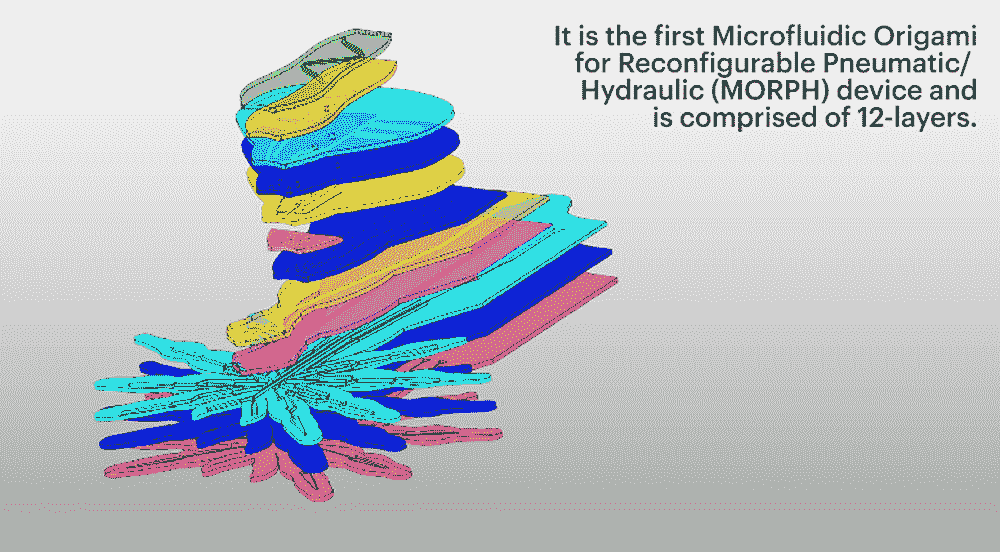

# 蜘蛛状微流体软机器人是为精密手术而制造的

> 原文：<https://thenewstack.io/spider-like-microfluidic-soft-robot-is-built-for-precision-surgery/>

随着越来越逼真的各种形状和大小的人形机器人首次亮相，呆板、笨拙的锡罐机器人的老式形象正在发生变化。但是机器人领域并不局限于这些更大的、人类大小的机器；现在也出现了更小、更软的机器人，它们具有类似动物的特征，并由微流体回路控制，以及有朝一日可以探索其他星球危险地形的 T2 机器人。

哈佛大学[威斯学院](https://wyss.harvard.edu/)和[工程和应用科学学院](https://www.seas.harvard.edu/) (SEAS)和[波斯顿大学](http://www.bu.edu/)的研究人员希望创造一个小于一厘米的机器人，有朝一日可以进行精确手术或帮助摧毁肿瘤，他们从大自然中寻找灵感，并开发了一种新的微加工技术来构建它。他们的微型机器人看起来像一只橡胶般透明的蜘蛛——事实上，该团队模仿了澳大利亚着名的彩色迷人的孔雀蜘蛛。手表:

该机器人被称为可重构气动/液压(MORPH)机器人的微流体折纸，由 12 层硅树脂材料制成，这些材料是使用软光刻技术生成的。每一层都使用模具和基于激光的微机械加工技术切割，然后结合在一起，形成完整的蜘蛛机器人，形成一个整体结构。然后加入不同颜色的墨水染料，给眼睛上色，给机器人的腹部添加图案。

但该设计的独特之处在于一个嵌入的静脉状中空微流体通道网络，这些通道交织在这些层中。使用另一种称为注射诱导自折叠的方法，研究人员可以泵入液体材料或空气，填充微流体致动器，从而改变机器人的形状。如果注入诸如紫外线固化树脂的相变材料，这些材料一旦暴露在紫外线下就会硬化，从而在结构上“锁定”变形的微流体致动器，并使转变更加永久。

“我们可以通过改变不同层中邻近通道的硅树脂材料的厚度和相对一致性，或者通过在离通道不同距离处进行激光切割，来精确控制这种类似折纸的折叠过程。托马索·兰扎尼博士说，在加压过程中，这些通道充当致动器，诱导永久性的结构变化，他是这篇论文的第一作者，论文发表在 *Advanced Materials* 上。

腹部、头部、下颚和腿部也有微流体致动器，这为这种设备提供了前所未有的运动量。以前完成的类似项目可能只有几个运动自由度，但 MORPH 机器人有九个独立可控的自由度和五个结构自由度。

“最小的软机器人系统仍然倾向于非常简单，通常只有一个自由度，这意味着它们只能驱动形状或运动类型的一种特定变化，”该研究的合著者 Sheila Russo 博士说，“通过开发一种融合三种不同制造技术的新混合技术，我们创造了一种仅由硅橡胶制成的软机器人蜘蛛，具有 18 个自由度，包括结构、运动和颜色的变化，以及微米级的微小特征。”

这种更广泛的运动可能性意味着变形机器人可以定期向其中泵入流体，以使一条腿或另一条腿变形，例如进行行走等运动。该团队指出，MORPH 的创新微制造方法不仅意味着它可以使设计和生产过程更加简化，而且它可能会扩大软机器人对寻求开发更小、更灵活的医疗机器人的研究人员的吸引力。目前，与更刚性的机器人相比，柔软的机器人相对简单，但如果进一步发展，这可能意味着有一天，像这样的微小而柔软的机器人可能会被送入人体，实施微型手术或进行内窥镜检查，以显示内部发生的事情，而不会有太多的不适。

图片:哈佛大学威斯学院和工程与应用科学学院(SEAS)，波斯顿大学

<svg xmlns:xlink="http://www.w3.org/1999/xlink" viewBox="0 0 68 31" version="1.1"><title>Group</title> <desc>Created with Sketch.</desc></svg>