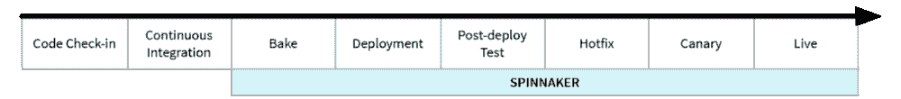
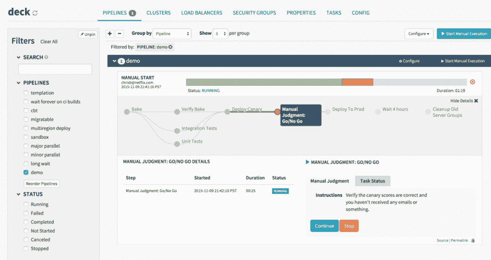

# Spinnaker 连续交付平台从 1.0 版本开始运行

> 原文：<https://thenewstack.io/spinnaker-continuous-delivery-platform-goes-live-1-0-release/>

当[网飞](http://www.netflix.com)和[谷歌](https://www.google.com)联手打造一个持续交付平台时，你可以打赌人们会刮目相看。今天，[大三角帆](https://github.com/spinnaker)，这一合作的产物，达到了[版本 1.0](https://cloudplatform.googleblog.com/2017/06/spinnaker-10-continuous-delivery.html) 。该项目的最终目标是支持全球、多云部署，以及跨这些部署的自动化发布。

“在 Spinnaker 中，部署是使用定制的发布管道来编排的，其阶段可以包含几乎任何您想要的内容——集成或系统测试、启动或关闭服务器组、手动批准、等待一段时间，或者运行定制脚本或 Jenkins 作业，”Google 产品经理 [Christopher Sanson](https://www.linkedin.com/in/christophersanson/) 、[在一篇发布博客中写道，该博客详细介绍了 1.0 的变化以及 Spinnaker 的整体工作方式](https://cloudplatform.googleblog.com/2017/06/spinnaker-10-continuous-delivery.html)。

最初创建于网飞，谷歌在 2014 年首次注意到 Spinnaker。到 2015 年 11 月，Spinnaker 由网飞开源，因为该项目开始在 [Target](http://www.target.com) 、[甲骨文](http://www.oracle.com)和[微软](http://www.microsoft.com)等公司中接受新用户。

今天的版本包含了过去四年在支持多种云方面所做的工作。截至今天，Spinnaker 支持 Google 的云平台、AWS、Microsoft Azure、Kubernetes 和 OpenStack。Oracle 裸机云将于年底获得支持。

Spinnaker 还支持诸如释放金丝雀、多级环境、蓝/绿或红/黑部署、流量分流和简单回滚等功能。Spinnaker 本身甚至包括一个工具，使它更容易管理。随着 Spinnaker 1.0 的发布，该项目现在还包括 [halyard](https://github.com/spinnaker/halyard) ，一个用于配置、安装和更新平台的工具。

Spinnaker 项目作为一个整体包括一些其他的护理和喂养工具。这包括 [deck](https://github.com/spinnaker/deck) ，它是一个管理 UI、一些监控工具、一个名为 [roer](https://github.com/spinnaker/roer) 的命令行界面，以及 igor，它处理 Spinnaker、git 和 Jenkins 之间的集成。

大三角帆输油管道(网飞)。

Sanson 写道，Spinnaker 对企业特别有吸引力，因为它支持许多身份验证和授权选项。这意味着 Spinnaker 可以使用 OAuth、SAML、LDAP、X.509 证书、GitHub 团队、Azure 组或 Google 组来提供基于角色的授权和权限。

Spinnaker 可以将这些角色直接应用到开发阶段，这意味着如果需要的话，对管道的访问甚至可以被限制为需要手动批准过程。还可以根据一天或一周的时间来限制阶段，这意味着新部署可以在深夜自动部署。

1.0 版本也为重新设计 [Spinnaker 网站](https://www.spinnaker.io/)提供了一个理由。而且，由于 Spinnaker 起源于网飞，它也与[混沌猴](https://github.com/Netflix/SimianArmy/wiki/Chaos-Monkey)兼容，这意味着混沌可以在 Spinnaker 管道的特定阶段产生影响。

<svg xmlns:xlink="http://www.w3.org/1999/xlink" viewBox="0 0 68 31" version="1.1"><title>Group</title> <desc>Created with Sketch.</desc></svg>