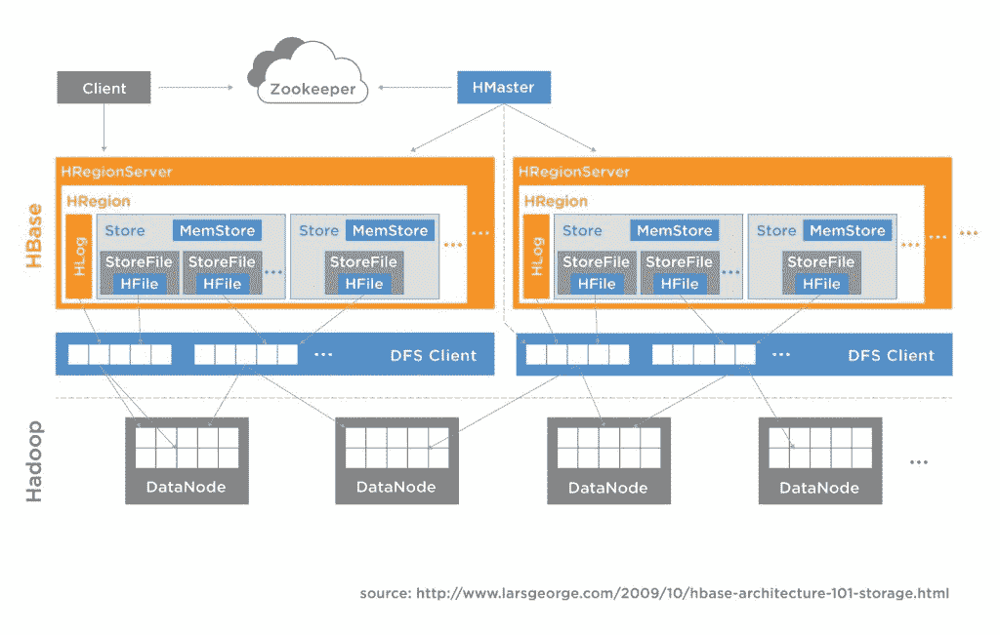

# 拼接机混合 SQL 系统融合事务和分析

> 原文：<https://thenewstack.io/splice-machine-hybrid-sql-system-fuses-transactions-analytics/>

尽管人们都在谈论大数据和分析，但企业基于实时数据做出决策的能力仍然落后。这是拼接机关注的领域。Splice Machine 的联合创始人兼首席执行官 Monte Zweben 表示，这家初创公司拥有一个混合数据库系统，旨在构建涉及交易操作和实时分析的应用程序。

现在[公司](http://www.splicemachine.com/)正在为其混合 SQL 数据库寻找一些优秀的测试人员。该公司刚刚[在 10 月](https://appdevelopermagazine.com/3313/2015/10/31/Spice-Machines'-Hadoop-RDBMS-Scales-Real-Time-Applications/)发布了 1.5 版本，具有包括 ETL 加速和 BI 工具兼容性在内的企业特性。它的 2.0 版本现在处于测试阶段，增加了 Spark。

Zweben 说，Spark 提供了内存中的速度和性能以及隔离的资源，将 OLAP(在线分析处理)和 OLTP(在线事务处理)作业的 CPU 和内存分开，互不干扰。

Splice Machine 的支持堆栈基于 HBase、Spark 和 Apache Derby，后者是一个轻量级(< 3 MB)、基于 Java 的 ANSI SQL 数据库，可以嵌入 HBase/Hadoop 堆栈中。

HBase 提供了成熟的自动分片、复制和故障转移技术，而 Spark 对节点故障的恢复能力也是一大优势。虽然其他内存技术会丢弃与故障节点相关的所有查询，但 Spark 使用重复的节点来重新生成其内存数据集。

正如 Zweben 解释的那样，当一个语句被输入到系统中时，它会根据预期返回的结果集的大小进行评估。如果结果集相对较大，它会被发送到 Spark。如果它是一个事务性的动作，比如对一条记录的简短读取，那么它会进入 HBase 计算引擎。

“我们的系统部署在一组分布式节点上，Spark 和 HBase 运行在相同的服务器上，可以快速相互交互。因此，每条语句都是在每个单独的节点上并行执行的，这是你获得速度的地方，然后我们将每个并行计算的结果再次拼接在一起，因此该公司的名称就是这样来的，”他说。

拼接架构

据该公司称，它特别适合数字营销、ETL 加速、运营数据湖、数据仓库卸载、物联网应用、网络、移动和社交应用以及运营应用。

## 现在的 NoSQL

兹韦本、尤金·戴维斯和约翰·利奇在 2012 年创立了 Splice。总的来说，他们都有连续创业的背景，并在美国宇航局工作。

本月早些时候，Splice Machine 被提名为富国银行创业加速器计划(Wells Fargo Startup Accelerator program)的三家初创公司之一，这是一个为期六个月的实践加速器计划，可能包括收购。

他说，其最初的成就是在 Hadoop 的基础上提供 ACID 事务，结合了 NoSQL 的横向扩展优势和关系数据库管理系统的传统优势。

Zweben 说，它通过在 HBase(一个 MVCC[多版本并发控制系统]上建立一个事务语义或事务引擎来实现这一点，该系统提供快照隔离，建立在谷歌和雅虎的工作基础上，因此数据库的读者在更新期间不会被锁定。

“我们是唯一一家为这样的事务性和分析性工作负载提供 ACID 语义的公司，”Zweben 说。

Splice Machine 只是 NoSQL 和 NewSQL 众多新解决方案中的一个，旨在满足应用程序对实时数据交易的需求，以及对全球大量同时访问数据的用户进行分析的需求。

它们包括 [Redis Labs](https://redis.com/) 、 [Aerospike](http://www.aerospike.com/) 、 [NuoDB](http://www.nuodb.com/) 和 [FoundationDB](http://techcrunch.com/2015/03/24/apple-acquires-durable-database-company-foundationdb/) ，后者在 3 月份被苹果收购。

在一个新的播客中，波特兰市被 CenturyLink Cloud 收购的数据库即服务(DBaaS)提供商 Orchestrate 的首席执行官兼联合创始人 Antony Falco 说，他认为有 35 到 40 个数据库在生产中，而这些数据库在 10 年前并不存在。

例如，有一个[cocroach db](https://thenewstack.io/cockroachdb-unkillable-distributed-sql-database/)，它是一个分布式 SQL 数据库，构建在事务性和一致的键值存储之上，为 ACID 事务、水平可伸缩性和可生存性而设计(因此得名)。

Riak KV NoSQL 数据库运行在 Apache Mesos 资源管理器上，这是一个集成，当 Mesos 为 Riak 节点聚合资源时，允许“按钮”缩放。

然而，Zweben 并不认为创业公司是 Splice Machine 的主要竞争对手。相反，他指出了根深蒂固的供应商——Oracle exa data 和 SAP HANA——他们正在应对这样一种观念，即[将 OLTP 和 OLAP 结合在一个平台上](https://scn.sap.com/people/irfan.khan/blog/2013/04/30/crush-conventional-wisdom-run-oltp-and-olap-together)永远行不通。多年来，T2 一直致力于将它们结合在一起。

“竞争对手和我们之间的区别在于，我们是一个横向扩展的解决方案，这意味着我们将我们的数据分布在许多廉价的商用服务器上，而他们拥有庞大的系统，这些系统在从 CPU 到网络的每个层次上都经过了高度设计，所以这是解决同一问题的一种完全不同的方法，”Zweben 说。

咨询公司[第三自然](http://thirdnature.net/)的马克·马德森仍持怀疑态度。他提到了以前不太成功的将 OLAP 和 OLTP 处理相结合的尝试，比如被微软收购的 DATAllegro。

“任何时候，一家公司说他们在同一个数据库上做 OLTP 和 OLAP，人们应该对这种说法持怀疑态度，直到他们能证明不是这样，”他说。“我发现，他们通常在进行基本的事务处理和扩展，但系统的查询部分通常非常薄弱。”

Splice Machine 承认，过去声称支持 OLTP 和 OLAP 的数据库只是 OLTP 数据库，没有对 OLAP 的特殊支持，但坚持认为它是不同的，因为它使用双引擎架构，HBase 引擎用于 OLTP，Spark 引擎用于 OLAP。

麦德森发现，该公司提到 OLAP 是由 Spark 支持的，而不是称之为 SparkSQL，这仍然是新的和未经证实的。该公司明确表示，Splice Machine 只使用更成熟的 Spark 内核，而不是 SparkSQL。

马德森在 Splice Machine 的网站上看到了另一个危险信号，他说:“Spark 具有非常高效的内存处理能力，如果查询处理超过可用内存，它可以溢出到磁盘(而不是丢弃查询)。”

“当你在 Spark 上撞上记忆墙的时候，你就撞上了性能墙，”Madsen 说。“它并不打算这样工作。像这样使磁盘读写路径快速，是沿着传统数据库设计的道路开始的。针对磁盘和内存进行优化与仅针对内存进行优化有很大不同。”

在寻求同时提供 OLAP 和 OLTP 处理的过程中，Zweben 将 Hadoop 和 Spark 视为改变游戏规则的技术。

“溢出到磁盘让你计算完成，这是一个非常强大的功能，”他说。“如果数据集溢出到磁盘，它会比在内存中执行要慢。我们已经在 1.0 的相同版本中进行了测试，并看到了显著的性能改进。

“溢出到磁盘是一种允许内存中的数据库在内存资源不足时完成其计算的方法，您肯定会为此付出较小的性能损失，但总体而言，Spark 引擎在速度上是无与伦比的。”

如果查询不适合内存，那么您有三个选择——添加更多内存(通常在以后)、删除查询或溢出到磁盘。

“溢出到磁盘会更慢，但我们交谈过的每个客户都更喜欢这样，而不是放弃查询，”Zweben 说。

通过 Pixabay 的特征图像[。](https://pixabay.com/en/knot-seizing-hitch-splice-bend-145498/)

<svg xmlns:xlink="http://www.w3.org/1999/xlink" viewBox="0 0 68 31" version="1.1"><title>Group</title> <desc>Created with Sketch.</desc></svg>