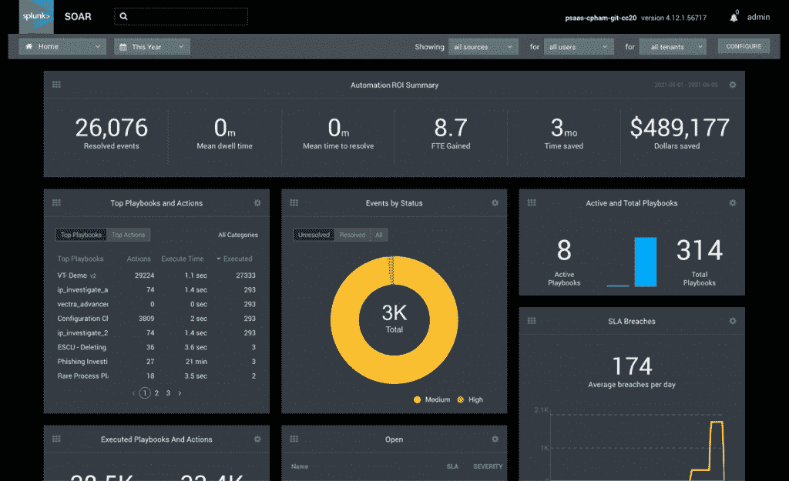

# Splunk 将其安全服务引入云

> 原文：<https://thenewstack.io/splunk-brings-its-security-soar-service-to-the-cloud/>

自称为“数据到一切平台”的 Splunk 公司推出了 Splunk 安全云，将之前的本地安全产品带入云中。

Splunk 安全云是一个安全平台，Splunk 安全营销负责人 [Eric Schou](https://www.linkedin.com/in/ericschou/) 表示，Splunk 采用了与 Splunk 其他部门相同的安全方法:数据优先。它包括 Splunk [在 2018 年购买 Phantom](https://www.splunk.com/en_us/newsroom/press-releases/2018/splunk-agrees-to-acquire-phantom.html) 时获得的安全协调、自动化和响应(SOAR)软件。

“总的来说，Splunk 是一家数据公司。Schou 在一次采访中说:“Splunk 为客户提供的价值是带来数据、吸收数据、规范化数据，并让客户可以操作这些数据，无论是安全性、开发运维领域还是核心 it。“该公司真正扎根于 IT 领域，然后随着公司的发展，有些事情可能是从安全等用例开始的，然后客户很快意识到，可视化、访问和分析这些数据，以快速了解他们在哪里、他们可以做什么，并采取主动措施来保护自己，这真的很好，不仅仅是一个用例。”

借助 Splunk 安全云，这种数据优先的方法包括机器学习驱动的分析、来自 Splunk 众多来源的威胁情报，以及该公司称可缩短“检测、调查和响应时间”的自动化方法；过去需要 30 分钟的警报，现在只需 30 秒钟。”

虽然 Splunk 安全云结束了对 Phantom 的收购，但 Schou 也强调了最近对 [TruSTAR](https://www.trustar.co/) 的[收购，TruSTAR](https://www.splunk.com/en_us/newsroom/press-releases/2021/splunk-announces-intent-to-acquire-trustar.html) 是一家在 SOAR 领域的云原生安全公司，也采用以数据为中心的安全方法。Schou 表示，正是这种对数据的关注吸引 Splunk 收购 TruSTAR，TruSTAR 之前是其合作伙伴。

“这项技术不仅有助于安全分析以及我们正在处理和规范化的数据类型，而且还将加快我们的 SOAR 产品正在使用的自动化，”Schou 说。“他们也有一个非常以数据为中心的方法来寻找这个市场。这与 Splunk 是什么以及 Splunk 是谁是一致的。因此，我们一起强调数据是一个安全问题，安全是一个数据问题。”

Schou 将 TruSTAR 收购归功于该版本中改进的自动化功能，这使公司能够加快响应时间，“而不需要大量人员来做同样的工作。”本着同样的精神，Splunk 还发布了 Splunk Security Analytics for AWS，这是一款简化的安全分析解决方案，专为运行在 [Amazon Web Services](https://aws.amazon.com/?utm_content=inline-mention) 上的精益安全团队设计，将于 6 月 29 日在 AWS Marketplace 上市。

“我们看到许多传统 SIEM 的消费者都是规模相对较大、人员配备齐全的企业。这种情况已经持续了相当长一段时间。“我们希望优先让这种围绕安全分析的体验更容易使用、更容易管理、更容易提高速度，并且能够与一个并不真正扩张和庞大的团队一起完成。”

Schou 说，目前还没有将 Splunk 引入其他云提供商市场的类似计划。

此外，他说，将 Splunk 安全功能转移到云中的另一个好处是，公司可以更容易地迭代产品。

“他们现在得到的产品即使不是更好，也是一样的，但是他们不必承担在内部使用硬件的负担。如今有了更多的灵活性，”Schou 说。“然后我们展望未来，只要有云优先的心态，我们就能更快地将功能推向市场。从客户那里获得反馈，并将其转化为功能，这样的速度会更快。”

<svg xmlns:xlink="http://www.w3.org/1999/xlink" viewBox="0 0 68 31" version="1.1"><title>Group</title> <desc>Created with Sketch.</desc></svg>