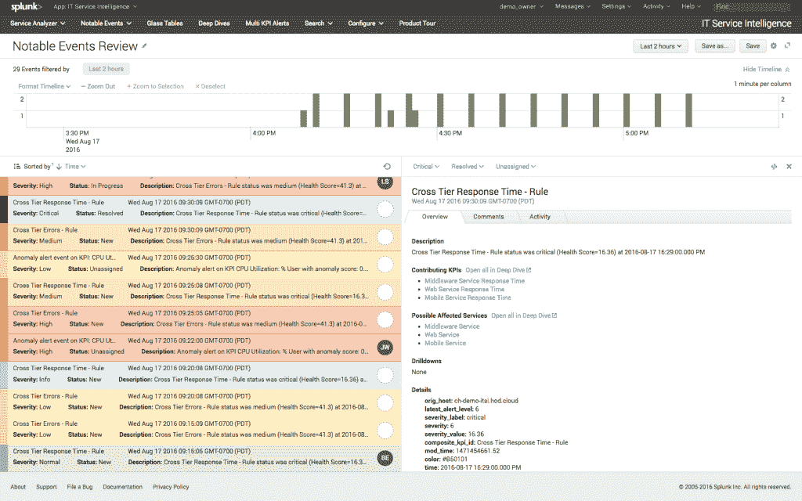
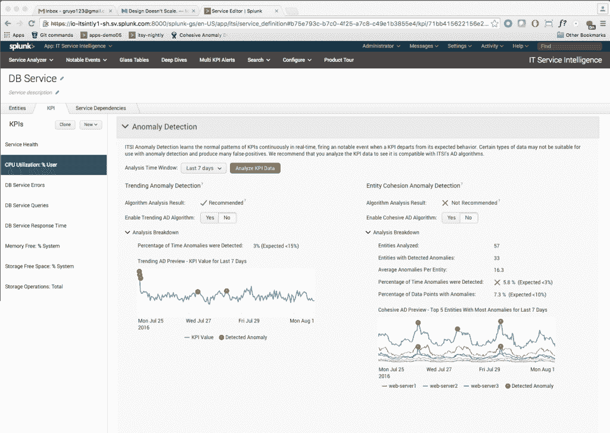

# Splunk 采用机器学习来帮助安全监控和开发工作流

> 原文：<https://thenewstack.io/splunk-incorporates-machine-learning-security-monitoring-devops-workflows/>

IT 分析公司 [Splunk](https://www.splunk.com/) 正在加倍研究机器学习。

下一个版本的 [Splunk Enterprise](https://www.splunk.com/en_us/products/splunk-enterprise.html) 、 [Splunk IT 服务智能](https://splunkbase.splunk.com/app/1841/) (ITSI)、[Splunk Enterprise Security](https://www.splunk.com/en_us/products/premium-solutions/splunk-enterprise-security.html)(ES)和 [Splunk 用户行为分析](https://splunkbase.splunk.com/app/2941/) (UBA)将包括基于机器学习的定制预测分析，包括内部版本和云版本。

[Splunk 云和 Enterprise 6.5](https://www.splunk.com/en_us/resources/video.wwa2cwNjE628gGLvQHbQJDls6WK-9cJp.html) 获得一个新的界面，帮助您构建自己的[机器学习](/category/machine-learning/) (ML)模型，以及 ML 工具来预测维护窗口，并通过基于您自己的流量和客户构建模型来帮助您预测需求和对变化做出反应。

Splunk ES 和 UBA 是预测分析工具，它们现在将了解您的系统的正常行为基准是什么样的，这样您就不会在一切顺利运行时被警报淹没，从而错过严重问题的警告。

Splunk ITSI 已经是一个 ML 驱动的工具，可以帮助您找到问题的根本原因并更快地解决问题；它获得新的 ML 模型来发现可能意味着存在安全或系统问题的异常事件。

“ITSI 和 UBA 都有用于发现异常的机器学习模型”，Splunk 负责机器学习的首席产品经理 [Manish Sainani](https://twitter.com/manishsainani) 解释道。“ITSI 专注于关键绩效指标，而 UBA 则专注于原始事件及其顺序。”

“机器学习可以帮助检测、预测和预防对一个组织来说最重要的事情，”Sainani 告诉 New Stack。“他们可以使用它来帮助检测 it 或安全事件，预测和防止停机，预测产品库存，等等。与人工分析不同，Splunk 的机器学习始终开启，这是对其正常监控、运营和业务分析的重要补充。”

“通常，客户会使用机器学习来检测不符合正常模式的异常、事件或情况，”他说。“在 IT 中，这可能是 web 服务器响应时间、网络拥塞或许多其他基础设施读数。更有经验的客户可能会衡量对业务至关重要的复杂 KPI 和 IT 服务。在安全方面，他们可能会寻找异常的用户行为、系统通信、数据传输或失败的登录。”

## DevOps 的机器学习

Sainani 建议 Splunk 的机器学习非常适合的几个 DevOps 工作流:

*   **对根本原因进行排序**分析，使用分类字段的聚类和预测来更快地解决问题。
*   **异常值检测**使用统计方法检测关键绩效指标(KPI)中的异常值。
*   **自适应阈值**根据您的数据表现进行调整，以便自动更新以反映您数据的变化。
*   **异常检测**针对您服务中的单变量(单个)KPI 和多变量(多个)KPI。

Splunk 使用三种机器学习技术:聚类，取大量数据，放入组中；分类，产生一个预测；回归，使用历史值来预测未来。

用户行为分析使用这些机器学习技术进行行为基线和建模、异常检测(它有 30 多个模型)和高级威胁检测。对于这两个工具，您还可以创建自己的自定义分析。

IT 服务智能使用机器学习进行异常检测、自适应阈值处理和 KPI 管理。这种检测需要七天的历史数据才能在统计上是合理的。“算法本身不需要超过两天的历史数据，”Sainani 告诉我们，但 Splunk 决定使用七天的数据以获得更好的准确性。

“一旦基线被输入异常检测模型，它就可以立即开始检测以前从未见过的异常模式并发出警报。”如果你的系统已经被入侵，他声称“算法足够强大，可以避免受到它的影响。”

Sainani 告诉我们，如果你想要定制机器学习模型来处理 Splunk Enterprise 中的数据(Splunk Enterprise 已经提供了 20 多种机器学习命令)，新的 [ML 工具包](https://splunkbase.splunk.com/app/2890/)也可以让你处理开源 Python 库( [scikit-learn](http://scikit-learn.org/stable/) 、 [statsmodels](http://statsmodels.sourceforge.net/) 、 [pandas](http://pandas.pydata.org/) 、 [numpy](http://www.numpy.org/) 、 [scipy](https://www.scipy.org/) )，其中包括 300 多种算法。

这些算法可以直接应用于针对特定使用情形(无论是 IT 还是安全)的检测、警报或分析数据。Sainani 说，ML 工具包还为数据科学家建立他们自己的模型提供了一个指导工作台。

异常检测。

该界面通过交互式示例指导您创建定制的机器学习分析。“只需点击一下鼠标，他们就可以将模型部署到生产环境中，以帮助检测 IT 或安全事故、预测和防止停机、预测产品库存，等等。ML Toolkit 带来的最大优势是客户可以轻松构建机器学习模型，并利用 Splunk 的警报和预定搜索框架将其投入运行。”

451 Research 的数据平台和分析分析师 Jason Stamper 认为，ML 正成为越来越有用的安全和分析工具，它非常适合 Splunk 现有的可视化工具。“通过广泛集成机器学习，Splunk 为现代组织面临的最大挑战之一提供了全面的答案:如何利用多样化、普遍且日益丰富的数据来获得有价值的商业见解。”

图片:Splunk。

<svg xmlns:xlink="http://www.w3.org/1999/xlink" viewBox="0 0 68 31" version="1.1"><title>Group</title> <desc>Created with Sketch.</desc></svg>