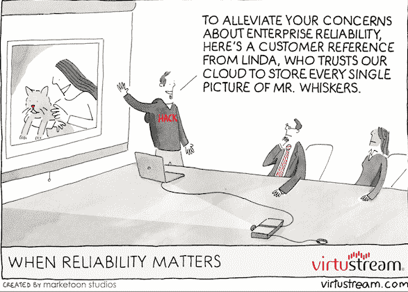

# 赞助商 Feed:Velocity 的经验教训、面向傻瓜的 API、Google Ups 的企业游戏

> 原文：<https://thenewstack.io/sponsor-feed-lessons-from-velocity-apis-for-dummies-google-ups-its-enterprise-game/>

赞助源出现在新堆栈中每个帖子的底部。赞助商提要中的项目链接回赞助商的博客。赞助商发布的帖子越多，他们的帖子出现在提要顶部的就越多。以下是过去两周出现在 feed 中的帖子，本周由 New Relic、Apigee、Kinvey、Adallom、Digital Ocean 和 Virtustream 为您带来。要了解更多关于加入赞助商的信息，请联系[山姆·查林顿](mailto:sam@thenewstack.io)。

### 新遗迹

速度的教训:

*   MercadoLibre 首席技术官 Daniel Rabinovich 谈论公司的技术和文化转型(以及公司如何在此过程中摆脱 QA 和产品管理团队)
*   Intuit 首席移动架构师 Desirée Gosby 关于大规模开发移动应用的会议

其他亮点包括 Joyent 首席技术官 Bryan Cantrill 关于大数据历史以及数据和计算融合的演讲。注意:Joyent 已经在 [Manta](http://www.joyent.com/products/manta) 上投入巨资，这是一项在云中与数据一起进行计算的服务，数据可以在一个地方处理。

New Relic 的 [Patrick Lightbody](https://twitter.com/plightbo) 也做了关于“面向性能书呆子的软件分析”的主题演讲。

[https://www.youtube.com/embed/Rw_lPI6ju9Y?feature=oembed](https://www.youtube.com/embed/Rw_lPI6ju9Y?feature=oembed)

视频

### 顶点

假人用原料药

作者

这本书包括基础知识，以及API如何为企业奠定基础，以“迎接新的挑战，包括满足日益增长的客户期望，提高内部效率和企业敏捷性，确保合作伙伴生态系统的繁荣，并从遗留系统中释放数据。”

### 金维

[谷歌正在加速他们的企业游戏:谷歌 I/O 笔记，第一天](http://www.kinvey.com/blog/3851/google-is-stepping-up-their-enterprise-game-notes-from-google-io-day-1?utm_source=feedburner&utm_medium=feed&utm_campaign=Feed%3A+kinvey+%28Kinvey+Backend+as+a+Service+Blog%29)

Ed Fleming 在一篇文章中指出，谷歌正在以几种方式加强其企业游戏:

*   Android 将无处不在，迫使公司雇佣更多的移动开发者或者与科技公司合作。
*   新版本的 Android 将是有史以来最大的更新，有 5000 个新的 API。
*   谷歌正专注于 UX，这是吸引新一代商务用户的必经之路，这些用户将体验看得比什么都重要。
*   “谷歌正在 Drive 中加大对微软 Office 的支持，这一直是企业采用的一个主要症结。现在，数据在存储和传输过程中都进行了加密，以解决这些始终存在的安全问题，他们还发布了一组 API 来访问审计所需的数据，并解决其他安全问题。最后，一款名为 Drive for Work 的新产品还包括对谷歌应用程序库的访问，因此公司可以出于合规目的保留文件和电子邮件。他们真的开始认真推动硬盘成为企业的默认云存储选项。”
*   安全性是更高的优先级。比如三星 Knox 代码现在正在滚入 Android。谷歌还增加了更多的安全性和沙盒应用，这样用户就可以在同一台设备上使用工作应用和个人应用。

### 阿达洛姆

保护您的 SaaS:与 Neil MacDonald (Gartner)和 Tal Klein (Adallom)的最佳实践

它仍将是企业的一部分，但对 T2 来说，更多的是作为顾问，而不是控制力量。“企业 SaaS”现已建立，并不断改变安全要求。进入 Gartner 及其新类别: [云接入安全经纪人](http://www.gartner.com/it-glossary/cloud-access-security-brokers-casbs/) 。CASB(Adallom 的 Tal Klein 发音为“ kasbee ”)。这是一种全新的方式来思考帮助保护 SaaS 环境的新服务提供商。 Adallom 与 Gartner 分析师 Neil MacDonald 就此主题举办了一场 [网络研讨会](https://event.on24.com/eventRegistration/EventLobbyServlet?target=registration.jsp&eventid=807046&sessionid=1&key=8FAE00BC154DEA64D9057C73AE2FA807&sourcepage=register) 。

### 数字海洋

客座博文:数字海洋上的 MongoHQ 不只是准备好了，生产准备好了！

MongoHQ 的 MongoDB 的弹性部署技术现在 DigitalOcean 的云技术上。弹性部署提供了一种升级到全功能 MongoDB 系统的方法。

" DigitalOcean 为云实例提供了与 MongoHQ 为 MongoDB 数据库提供的相同的快速配置。不到一分钟的时间就可以启动一个 SSD 云实例，该实例包含 20 GB 的 SSD 存储和 512 MB 的 RAM。数据中心内有易于使用的仪表盘和 API、第 1 层对等和虚拟专用网，这是我们在 MongoHQ 喜欢的服务，我们的合作伙伴关系意味着开发人员可以利用托管和数据库供应的完美结合。”

### 虚拟流

云计算的不幸:当可靠性变得重要时

Virtustream 的文章着眼于消费者服务和企业服务之间的区别。“重要的是你储存了什么，以及你如何使用它。它关乎备份可靠性和业务连续性。缺乏足够的安全性或具有持续威胁监控的 ERM 战略会给企业带来比数据丢失更严重的后果。它会严重影响客户，并对企业福利产生直接影响。”

通过 Flickr 知识共享的特色图片[。](https://www.flickr.com/photos/h-k-d/4380427452/in/photolist-8jGX3w-b3QGPk-aeXdMU-4PP5bx-fv5bEb-bdT3AK-btFkh8-bVbmKz-7F5Qtf-ohewW-jhpEen-buC5Da-5FZsUo-bVbn18-fDiYkW-hLdNz3-bbLDDX-hHkxzC-b68V3n-csYqEU-9CJa2N-dzweRL-7ifMSt-b8qxuK-i5uvb5-joumhz-dfB3mC-evyFqt-5Tunyv-75nwv4-aZzWta-bgVMJt-iz5ott-ic8rjp-bDdzYS-dwHPyp-95yrdY-5soBof-nCtBTm-6cy5ym-jYpxp1-b9uu3B-baLPyD-4CqCKB-bTMXAP-bVbn5K-dzwf2Y-mLGhi1-bxffsw-bK98Uk)

<svg xmlns:xlink="http://www.w3.org/1999/xlink" viewBox="0 0 68 31" version="1.1"><title>Group</title> <desc>Created with Sketch.</desc></svg>