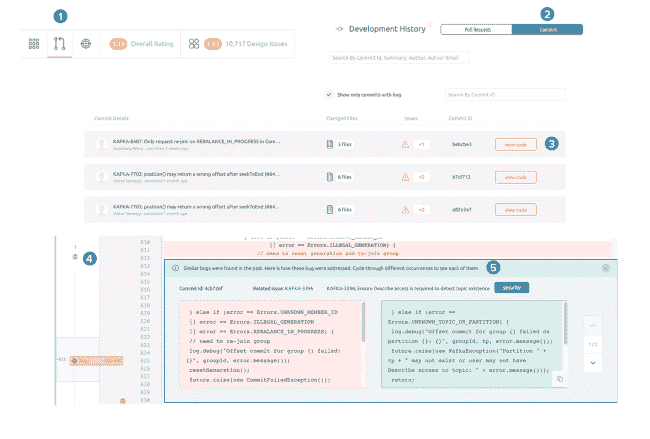

# 使用 boled 的人工智能静态分析和可视化工具在编码时发现错误

> 原文：<https://thenewstack.io/spot-bugs-as-you-code-with-embolds-ai-enabled-static-analysis-and-visualization-tool/>

所有的软件都有缺陷。但是，站在一个大客户的首席执行官面前，面对他的顾问团队交付的软件中的错误，首席执行官 Vishal Rai 发现自己想知道软件是否必须有这么多的错误，以及自动化工具是否能比人类开发人员做得更好。经过一些研究后，他决定让开发人员使用查看源代码的静态分析工具将是改进他们代码的唯一最佳方式。

“软件可能已经吞噬了世界，但现在虫子正在吞噬软件。如果现在世界上的每家公司都是软件公司，那么每家公司都需要一个软件开发堆栈来帮助他们编写更好的代码，”Rai 告诉新堆栈。

“我们有‘什么’，这是用来编写特性的工具。一旦你写好了你的软件，我们就有了“在哪里”，也就是 GitHub 和 Bitbucket。但介于两者之间的是“如何”；你怎么写好软件？”

boled 旨在填补至少部分空白。它使用自然语言处理(NLP)、机器学习和一套算法来分析源代码，以发现设计问题、错误和反模式。输出是代码质量和复杂性的可视化，您可以随时间跟踪的代码质量的高级指标，最重要问题的优先列表，以及机器学习驱动的修复建议。

based 根据关键因素给你的代码库打分，帮助你理解哪些组件对代码质量影响最大

有几十种静态分析工具，但 Rai 认为其中没有几个是“普通开发人员”容易理解的。

“要么它们是超级昂贵、复杂的工具，要么是给你度量标准的开源工具，但你的代码仍然有问题，”Rai 说。“如果他们给你太多的数据，说有 50 个关键问题，100 个中等问题和 1000 个次要问题，这对只有 15 天时间发布代码的开发人员有什么帮助？他们需要的是一个静态分析工具，它可以找到 50 个关键问题，并显示哪个问题最关键，在您解决它时会给您带来最大的经济效益。”

他建议说，给问题打分比仅仅将它们分为关键、主要或次要更有帮助。“每个软件都有缺陷，总有一些组件比其他组件写得更好。我们根据设计和编码的好坏对每个组件进行排名；我们从负五分到正五分对它们进行评分，并将其汇总为一个系统分数。因此，我们不会说你的软件有 8，000 个类，其中 50 个是关键类，而是对它们进行排序，这样你就可以说‘让我们找出前十个最差的组件并修复它们。’我们还告诉他们为什么一个组件是坏的；如果它设计得不好，有大量的依赖。开发人员不必担心他们应该如何判断问题，平台会为他们进行排名，因此是一致的。"

## 架构和反模式

在最高级别，加粗显示了代码库的总体得分，该得分是根据复杂性、对象之间的重复和耦合、代码问题的数量和级别以及组件的设计质量等指标的得分计算的，同时还显示了代码库的大小和“热点”的数量，热点是有大量问题的区域。有了度量标准，就可以更容易地跟踪项目的质量，并查看您是否正在改进，只是跟上问题报告还是落后了。

你不必对你的代码做任何修改就可以开始使用 boled；只要对准 git master 就可以开始扫描了。

您可以在一个仪表板中有多个项目，因此您可以一起查看所有项目和回购的状态，以了解概况或您遇到最多问题的地方，并且您可以开始点击查看特定项目的更多详细信息。

高级仪表板显示代码库中所有组件的大小和质量的热图；大型组件中的关键质量问题可能会比较小代码中相同级别的问题花费更多的资源来解决。它还使用更新频率等信息。

“如果一个组件频繁变动，并且有数百个提交，那么风险系数就很高，”他建议道。

使用滑块，您可以只看到评分较低的组件，以了解哪些地方需要改进。“你可以说‘这是最糟糕的组件，它的设计很差，所以我们应该把它交给架构师，但是这些组件只有这些代码问题，所以开发人员可以修复它们’。它有助于你对如何解决问题做出判断，”Rai 解释道。“团队总是有有限的时间来处理代码，这给了你更好的工具来管理它。”

您可以浏览组件的注释视图，并通过依赖关系图查看它们在代码中是如何使用的；对理解代码库有很大帮助但通常很难看到的东西。

静态分析工具支持 17 种语言，包括 C/C++、C#、Java、JavaScript、TypeScript、Python、PHP、Swift 和 Go。有针对 Eclipse 和 Visual Studio 的插件，而 boled 正在致力于对 IntelliJ 的支持。“我们通过编译器运行代码，无论是 Eclipse、Java、CLANG 还是 Roslyn，并建立一个图形数据库，”Rai 说。

boled 可以通过向您展示更高或更低粒度的影响来帮助重构代码。

boled 发现反模式；容易引发问题的编码习惯。Rai 解释说，“我们根据编程的基本原则开发了大约 22 个反模式”，比如拥有一个包含许多函数的类，拥有许多重复的代码，在 switch 语句上没有默认标签。它们不是特定于语言的，但是它们中的许多都与面向对象编程相关。“每个人都知道围绕全局变量的 C++反模式，但人们使用它们是因为它们很方便。”

反模式也可能暴露安全漏洞。“设计与错误有很强的相关性，安全性是设计良好的结果。如果你有太多的依赖项，你可能会有内存泄漏。如果你有猎枪模式，你有潜伏期。

有一个内置的拉请求工作流，你可以并排看到不同版本之间的代码变化。

使用滑块通过减少或增加粒度来重构代码，并加粗创建具有英文名称的新组件。"我们使用 NLP 来理解基于变量名和方法名的类的意图."即使你不让它帮你处理重构，你也能看到方法和函数之间的联系，这样你就能发现一个类中的功能单元并提取出来。如果这些新组件中有几个有相同的名字，也许它们是一个共同的任务，应该是一个你调用的类，而不是做同样事情的五种方法。

## 更智能的静态分析

静态分析基于检查代码所依据的规则；通常这些规则是由专家手写的，除非你为自己的代码库编写规则，否则它们不会反映出你已经了解的内容以及过去已经修复的错误。Rai 估计，用户报告的 bug 中有很大一部分是之前已经报告过的、之前修复过的和重新引入的(通常是由不同的开发人员引入的)。

当一个开发人员加入一个团队，意外地重现了一年前由其他人在代码库中修复的相同错误时，为什么工具不能发现这一点，并向他们展示上次在代码测试失败之前是如何修复的呢？这就是最新的 boled 工具的目标。

“想象一下，如果一个人可以从项目中报告的所有问题中学习，并看到这些问题是如何修复的，并记住这一点作为未来开发人员的规则。或者，如果我们可以通过这个星球上所有流行的开源问题数据库以及它们是如何修复的，来训练一个神经网络。那将非常强大。”目前，推荐引擎在您的 git 回购或发行系统上训练，并从中学习规则。

boled 的智能分析器跟踪回购随时间的变化(它与 GitHub 和 SVN 一起工作，并计划支持 git、GitLab 和 BitBucket)，并连接到其他工具，如 JIRA 和 FindBugs，以匹配票证和问题到 bug 和代码更改。

加粗推荐引擎查看新问题，并为以前提交的类似问题找到修复方法

“它会看到您的回购中的哪些提交产生了错误，并记住这些提交。当您编写代码时，它看到类似的模式，它会注意到这一行看起来与报告的问题非常相似，下面是如何修复的。”

该工具还分析报告的新问题，并建议可能导致 bug 的代码区域，并建议开发人员解决这些问题。

目前，该 AI 仍处于测试阶段，可用于 Java、C 和 C++。对这些语言的强调并不是巧合。该公司正在努力将 boled 认证为汽车和医疗软件开发的功能安全工具。许多自动驾驶平台已经将其用于 C++激光雷达和雷达开发。

他还希望开源项目将开始使用 boled。虽然它是商业软件，可以作为 SaaS 或在你自己的服务器上运行，但托管的 SaaS 版本对开源项目是免费的。为了证明它可能有用，他在 Kafka repo 上运行了它，推荐引擎在那里发现了一个缺失的条件检查；“我们没有为此编写规则，但它从项目中之前报告的问题中找到了它。

通过 Pixabay 的特征图像。

<svg xmlns:xlink="http://www.w3.org/1999/xlink" viewBox="0 0 68 31" version="1.1"><title>Group</title> <desc>Created with Sketch.</desc></svg>