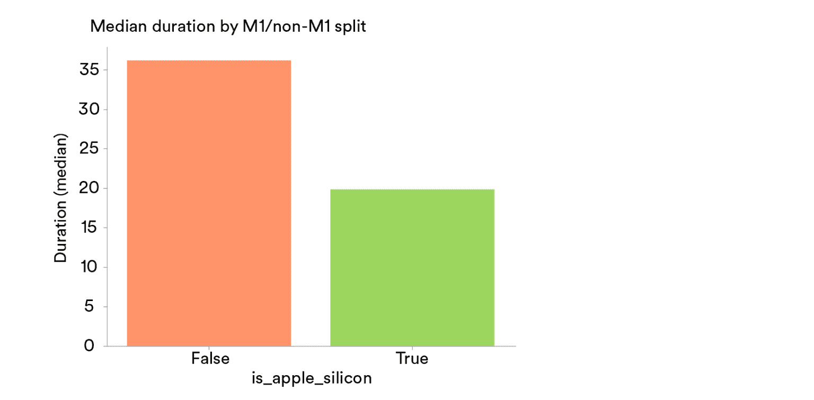
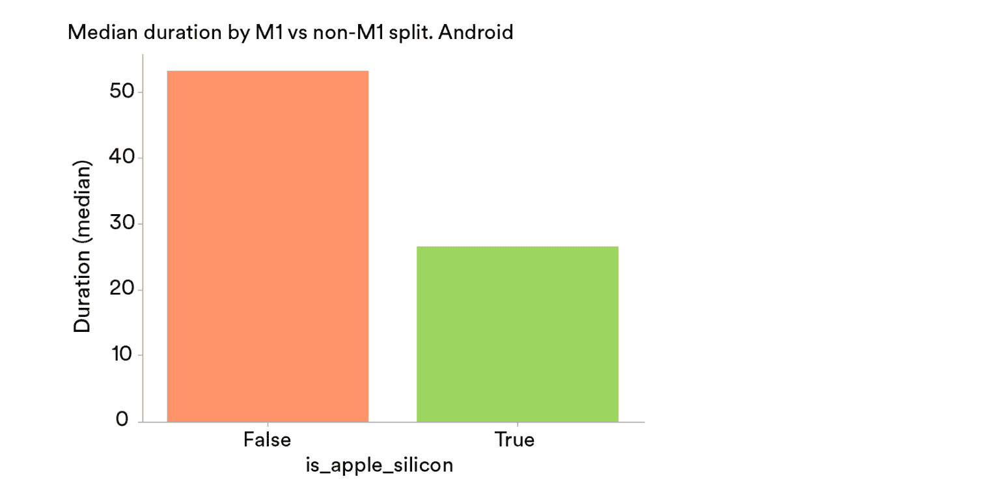
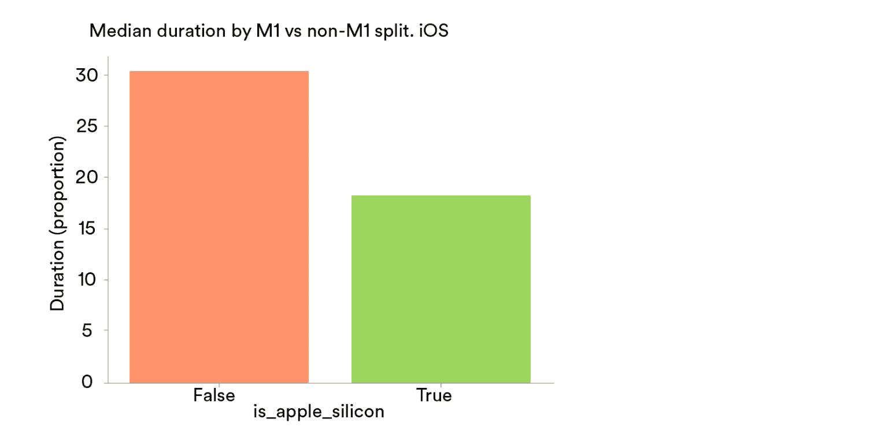
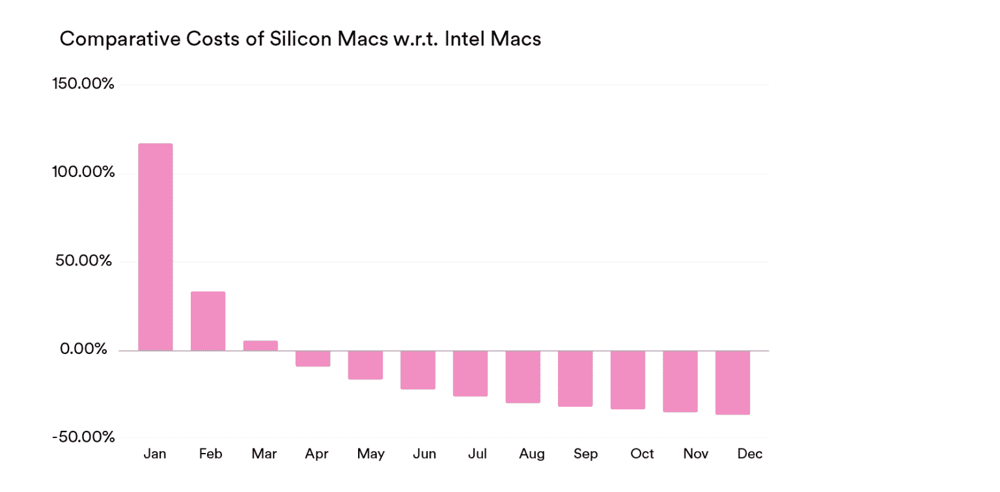
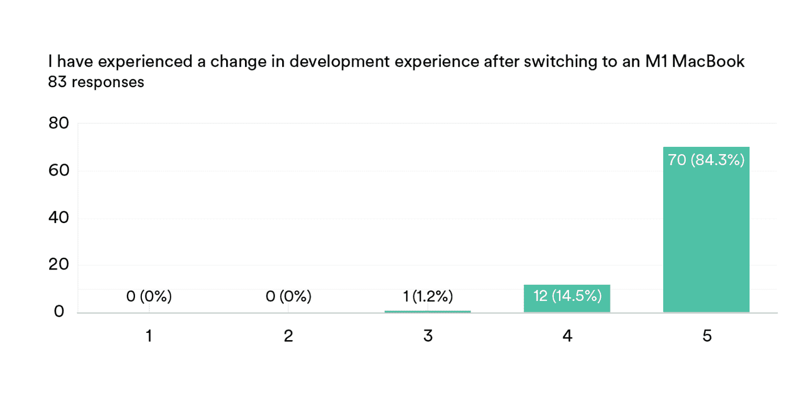
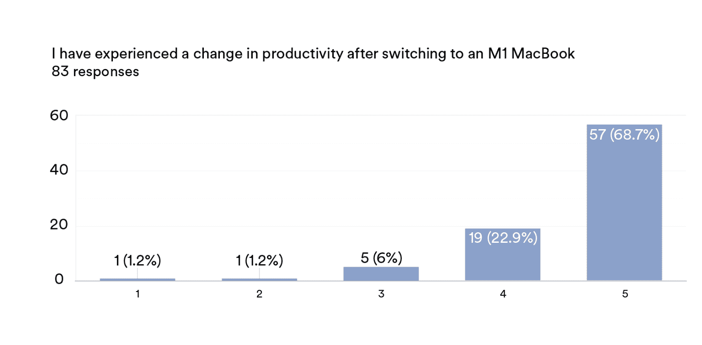
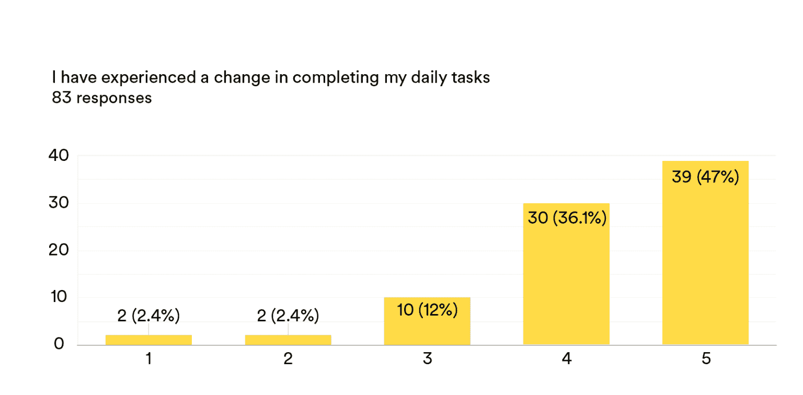

# Spotify 开发者获得新的苹果 M1 MAC 电脑

> 原文：<https://thenewstack.io/spotify-developers-boost-productivity-with-fresh-apple-m1-macs/>

音乐流媒体服务 Spotify 最近为其客户端平台(CLiP)团队升级到了苹果 M1 设备，此前内部测试证明，这些机器比基于英特尔的 Mac 系统快 43%:在 Android 版本上快 50%，在 iOS 版本上快 40%。

[Spotify](https://open.spotify.com/) 进行季度工程满意度调查，其中一项调查显示，更长的构建时间降低了开发人员的生产力和满意度。Spotify 在不同的硬件上进行了多次构建测试，发现采用苹果芯片( [M1 芯片](https://thenewstack.io/apple-disposing-traces-of-intel-in-mac-with-new-chip-os/)及更高版本)的机器的构建时间总体上快了 43%(M1 Pro 和 M1Max 的结果略好于 M1)。Spotify 花了 2022 年升级开发者硬件。

最近由 Spotify 产品经理 [Anna Granhed](https://www.linkedin.com/in/annagranhed/) 和 Spotify 高级数据科学家 Nandini Singh 撰写的[博客文章](https://engineering.atspotify.com/2022/10/how-we-improved-the-development-experience-for-our-client-developers/)解释说，在升级获得批准之前，有两个问题需要足够的答案。

Spotify 开发者使用的新机器“足够好”吗？在这种情况下，足够好被定义为 Android/ iOS 本地构建时间的统计显著改善。

**性能改进是否证明升级所需投资的相关成本是合理的？**Reddit 的一名员工工程师撰写的这篇[博客文章](https://www.reddit.com/r/RedditEng/comments/qzoxp0/mobile_developer_productivity_at_reddit/)启发 Spotify 将升级也作为一个财务用例进行评估。

**Spotify 将采用什么标准来衡量成功？**

*AvgLocalBuildTime(M1)<AvgLocalBuildTime(非 M1)*

**实证研究结果**

总体而言:苹果芯片快了大约 43%。

安卓:苹果芯片快 50%左右:

iOS:苹果芯片快了大约 40%:

## **升级到 M1s 的财务收益**

更快的开发时间使收支平衡时间表在三个月内完成，每个团队的工程成本可能节省 36%。

构建时性能更好吗？是啊！

性能改进值得投资吗？是啊！

因此，问题从“如果 T4”转移到“如何”*。*

 *## **在全球范围内升级硬件**

升级分几步进行。首先，Spotify 需要在其开发基础设施中增加对新机器的支持。他们首先建立了一个工作流，致力于在达到完全支持的过程中帮助他们的开发人员。接下来，整个组织的团队更新了他们的依赖项和相关工具(如果需要的话)。

Spotify 为客户端开发人员推荐了一个快速的、非正常的循环机器升级，因为构建性能很高，这就是这一切是如何开始的。然后，这个小组被分成两类:新员工和现有员工。新团队从一开始就收到了新硬件，并根据员工当前的硬件规格对他们进行了优先排序。他们的硬件对开发者体验产生负面影响的因素越多(例如，旧型号和低 RAM)，他们在优先级分配线中的位置就越高。

Spotify 的分布式优先工人模式使他们有机会在世界各地雇用工人，但在升级时，这无疑带来了一些额外的挑战。Spotify 有“减少碳足迹的承诺”，所以除了安排送货，他们还收集旧硬件以确保适当的回收。

总的来说，升级涉及运输五种不同的 SKU，面临各种供应链限制，并与有助于最小化延迟的经销商和 OEM 制造商建立关系，所有这些都是为了将新硬件运输到 11 个国家的数百家 Spotifiers。这个过程是在技术采购的密切配合下完成的，并得到了客户开发人员的支持。

## **快进六个月——开发人员反馈**

这个项目到目前为止是成功的。100 名客户端开发人员接受了三个关键领域的调查，以评估新硬件。

开发者体验:

生产力认知:

任务成功:

设备上的直接反馈:

## Spotify 的经验

结果总体上是积极的。Spotify 表示，“创造积极的开发者体验仍然是我们的首要任务，我们从调查中获得的反馈表明，我们正朝着实现开发者满意度目标的方向前进，”工程师们写道。

供应链问题并没有使这一过程变得更容易，但向客户员工提供所有 ETA 和交付信息变更的透明度，得到了耐心和理解。

6 月，苹果[为 MacBook Air、MacBook Pro 和 iPad 推出了](https://www.apple.com/newsroom/2022/06/apple-unveils-m2-with-breakthrough-performance-and-capabilities/)M2 处理器，这是 M1 的继任者，可能会带来进一步的性能提升。

<svg xmlns:xlink="http://www.w3.org/1999/xlink" viewBox="0 0 68 31" version="1.1"><title>Group</title> <desc>Created with Sketch.</desc></svg>*