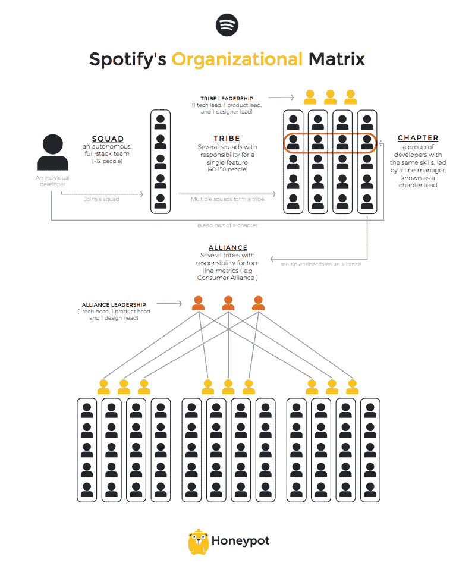

# Spotify 从其应用商店的失败中学到了什么

> 原文：<https://thenewstack.io/spotify-learned-flop-app-store/>

常言道，平台可能永远赢，但这并不意味着所有的平台都会赢。音乐服务 Spotify 在 2011 年推出了一个专注于音乐的应用程序商店，虽然没有引起公众的兴趣，但至少教会了该公司一些大规模开发应用程序的重要经验，其中一些经验由 Spotify 工程总监 Marcus frdin 在最近于伦敦举行的 [Spark the Change conference](http://sparkthechange.co.uk) 上分享。

Spotify 在 2011 年开始了一项非常公开的实验，到 2014 年被认为是一次失败。Spotify 团队决定，他们将成为音乐的“平台”,而不是试图创建一个应用程序，而是一个完整的应用程序商店。frdin 说，他们认为平台总是赢家，决定提供一个公共应用程序编程接口(API)，让他们成为艺术家和用户可以建立的音乐操作系统。

到 2012 年，该公司已经发布了数百款应用，他们还雇佣了一个专业团队。到 2013 年，他们仍然只有数百个应用程序，没有增长，用户没有花很多时间使用这些应用程序。在开始后的三年内，他们决定彻底关闭它，给公司造成了巨大的金钱和士气损失。

为什么会失败？他们遵循斯蒂芬·班盖的[行动艺术](http://availagility.co.uk/2016/07/13/strategy-deployment-and-directed-opportunism/)进行战略部署，思考分为三个不同的阶段:

1.  规划
2.  行动
3.  结果

想象这是一个缓慢但持续的循环，结果会反馈回来，并通知下一个计划，然后导致下一个行动。但在 Spotify 音乐应用平台三年承诺的每一步中，frdin 都发现了一个重大差距，即不允许从错误中学习或在出现问题时进行调整:

*   计划和结果之间的知识差距:除了游戏，专业应用商店根本不起作用。
*   规划和行动之间的差距:在移动设备上运行应用程序比在桌面上运行要困难得多，因此他们专门为此聘请了一个专业团队，这不符合成本效益。“移动对我们来说最初是失败的，因为知道这将是痛苦的，我们应该更早开始，”他说。移动应用本身具有挑战性，只有 0.07%的成功几率——想象一下整个应用商店的几率。
*   由于没有尽早关注因果关系，效果差距改变了结果:没有为开发者提供激励措施来实现平台的货币化，Spotify 也没有采取足够的措施来吸引用户使用平台及其应用。

这些差距从何而来？frdin 说，这种典型的自上而下的系统留下了一些严重的漏洞，并导致了异步学习。

## Spotify 学会组织速度

为了让想法在组织中快速传播，Spotify 认为有目的的迭代是关键。

“你可以通过一次做很多事情来获得很高的速度，”frdin 说，这就是为什么他们努力创建一个相当独特但分形的组织结构。

Spotify’s Organization Matrix, compliments of HoneyPot

客观地说，LinkedIn 目前有大约 2500 人在 Spotify 工作。已经有很多关于 Spotify 组织的文章，所以这里有一个简短的总结:

*   **团队** —最小的跨职能团队，在明确的业务任务上共享授权。一个团队通常由 7-15 名成员组成，通常有一名产品负责人、一名设计师、一名敏捷教练、工程师，也许还有一名数据分析师。在这个演讲的时候，Spotify 有大约 150 个不同的团队。
*   **部落**——把有相似任务的小队分成 15 人左右的一个部落。每个部落都有一个技术领导、一个产品领导和一个设计领导。
*   **联盟**——这是拥有更大使命的部落的更高等级，如创意或消费者联盟。
*   **章节** —虽然 Frö din 没有涉及这一方面，但这更像是不同部落中具有相似技能的人的掌握和专业成长组合，在这里他们可以解决共同的挑战。

现在，Spotify 之前有这些团队和这个独特的组织，但所有这些团队都是用户焦点团队。2014 年，他们切换到所有小队都直接与用户互动。

在上述每个步骤中，Spotify 的团队和其他组织结构都关注这些问题，以便将战略和实验(以及失败)与可衡量的公司范围战略联系起来:

计划:

*   谁拥有用户体验？
*   谁拥有这种体验的质量？
*   谁拥有整体质量指标？

行动:

*   团队是否具备拥有这种技能的适当技能？
*   如果没有，他们将如何到达那里？

结果:

*   这最终会给用户带来更好的产品吗？
*   你怎麽知道？

他们通过创建公司战略意图的仪式来回答这些问题，专注于“缩小差距就是传播意图”，并不断反馈和衡量。

## Spotify 的战略意图仪式

像大多数公司一样，Spotify 喜欢激励性的首字母缩写词，让人们专注于共同的目标。这两种习惯一起帮助定期回顾目标和重点，这样他们不一定会更少失败，但他们会更快失败。

### 迪布斯:数据洞察信念赌注

弗罗丁称这种仪式为“我们如何争论策略来理解我们如何相信。”

*   **数据** —这是他们不断学习的较短迭代，应用了许多敏捷和精益方法。这就是他们如何发现许多在实践中行不通的伟大想法，这也是他们坚持错误越晚修复越昂贵的说法的原因。
*   **洞察力**——当他们全程告知消费者他们在做什么时，他们可以学得更快。
*   **信念**——事实上，迭代的速度比质量更重要。
*   **Bet**——对 Spotify 的组织架构和流程进行了优化，以提高学习和执行速度。

要了解 Spotify DIBBs 的更多信息，请阅读 Henrik Kniberg 的这篇博客文章。

### 拍子:现在、下一次和以后

对于 Action，你如何从数周的计划到一个或多个团队实际测试的东西？对于 TAPS，Spotify 以一种反向的[看板](http://kanbanblog.com/explained/)工作，赌注按照从左到右的顺序组织:现在，下一个，然后是可以稍后处理的事情。然后，从最高优先级到最低优先级组织 Now 列表，并与整个公司共享。TAPS 每六周重新排序一次，在一次特别会议上检查赌注。

"默认情况下，窃听创造了同行问责、自然的出货压力和透明度."frdin 解释说，这是因为 Spotify 所做的一切都是为了确保那些将要使用它的人更接近这个过程。

“我们认为沟通有点反模式。随着距离的增加，沟通的成本也在增加。好的工作任务是让沟通需求下降。”

这就是为什么当许多以软件为核心的公司允许分布式或远程团队时，Spotify 确保其团队是并置的。frdin 说，这是因为当他们共同承担一项相互依存的任务时，完成工作所需的一切对他们来说都很重要，包括所有的队友。

除此之外，在他们对“越快越好”的关注中，他们还坚持另一个价值观:“反应过度胜过反应不足”，这正好呼应了速度和沟通的重要性。

## Spotify 现在找到了自己的位置？

或者更好的是，app 平台跌跌撞撞之后发生了什么？他们对“加速通过失败”的改变真的有效吗？Frö din 告诉我们，他们构建了一个 Web API，这使他们能够“为我们的用户和内部构建许多有趣的东西”，因为 API 使他们能够为快速变化提供很大的灵活性。

然后 [PlayStation Music](https://www.spotify.com/uk/playstation/) 出现了，它从想法到游戏用户手中的最小可行产品只花了四个月。

“战略意图是无处不在——让人们在任何地方使用 Spotify，而(音乐应用)平台只是实现这一目标的一种策略，”他说。现在，应用程序平台已经消失，但 API 使 Spotify 无处不在，包括通过与 PlayStation 的重要合作伙伴关系。

最后，Spotify 认识到，雇佣适应性强、有学习能力的人比他们之前瞄准的专业队友重要得多。

现在，我们将看到这种快速学习的文化将如何继续，当他们可能[今年晚些时候](http://www.bloomberg.com/news/articles/2016-07-20/will-a-spotify-ipo-live-up-to-its-8-billion-valuation)上市时。

通过 Pixabay 的特征图像。

<svg xmlns:xlink="http://www.w3.org/1999/xlink" viewBox="0 0 68 31" version="1.1"><title>Group</title> <desc>Created with Sketch.</desc></svg>