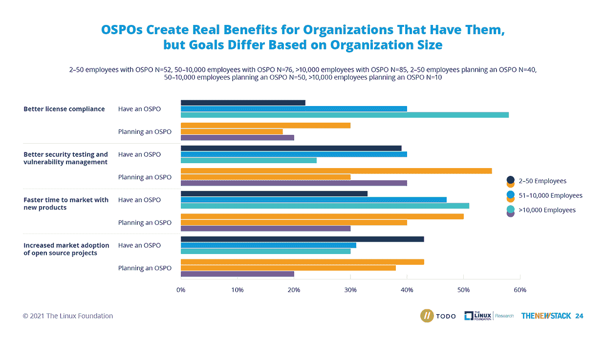

# Spotify 重启 OSPO，为开源项目拨款 10.9 万美元

> 原文：<https://thenewstack.io/spotify-reboots-ospo-earmarks-109000-for-open-source-projects/>

音乐流媒体公司 [Spotify](https://www.spotify.com/us/) 将向独立、积极维护的开源项目捐赠 10.9 万美元(10 万欧元)，这些项目符合公司的核心价值观。它还开设了一个专门的开源项目办公室(OSPO)，以进一步促进开源生态系统的可持续性。工程师 T2 将领导这个办公室。

Spotify 的技术主管[泰森·辛格](https://www.linkedin.com/in/tysonsinger/)在[最近的一篇博文](https://engineering.atspotify.com/2022/05/the-open-future/)中解释道，开源环境是科技社区的支柱。几乎每个公司，包括 Spotify(早在 Spotify[的早期](https://thenewstack.io/40-something-dude-asks-for-music-recommendation-redditors-point-to-the-algorithms/)，都将开源技术纳入他们的堆栈。即使只看前端技术的使用，在 [React](https://reactjs.org/) 、 [Angular](https://angular.io/) 和 [Vue](https://vuejs.org/) 都是开源的情况下，也很难说开源在所有行业都是普遍的。

Singer 更进了一步，他指出虽然开源的使用在增长，但是开源维护者的社区并没有增长。如果工作持续增长，但贡献者的数量却没有增长，那么生态系统是无法自我维持的。Spotify 希望尽自己的一份力量来改变这种状况。

Spotify 是众多开始或重振 OSPOs 的公司之一，理由很充分。正如 Spotify 发现的那样，协同努力可以让自己的开源项目做出更多更好的贡献。它可以帮助[更好地保护自己的软件供应链](https://thenewstack.io/how-an-ospo-can-help-secure-your-software-supply-chain/)(这是[T21 最近对开源越来越多的关注)。在最近的一项调查中，Linux 基金会发现 63%拥有 OSPO 的组织认为对他们的工程或产品团队的成功“非常关键”。](https://thenewstack.io/the-challenges-of-securing-the-open-source-supply-chain/)

## **后台:Spotify 的开源成功故事**

Spotify 是开源社区的用户和贡献者。虽然它开源了一些内部技术，但迄今为止，[后台](https://backstage.io/)是它最引人注目的。该技术本身旨在构建定制的开发人员门户，统一工具、服务、应用程序、数据、文档和其他一些特性，使开发人员的生活变得更加轻松。这项技术被网飞、宜家、惠普和 Expedia 等公司使用。

在 4 月份接受 VentureBeat 采访时，辛格详细阐述了开源后台带来的附加值。开发团队从各种贡献者那里得到反馈，从世界上一些大公司的工程师到小的个人贡献者。辛格说，内部招聘无法提供这种类型的反馈。

Signer 认识到，如果没有后台，有可能会出现另一个产品来代替后台。如果这是真的，并且这另一个产品在后台获得了所有开源的好处，那么这种虚构的技术也很可能更优越。按照这种思路，当新技术最终在后台黯然失色时，从后台迁移到新技术会产生开发成本。

云本地计算基金会(CNCF)最近在后台推广了一个孵化项目。

## **Spotify 的 OSPO**

Spotify 的 OSPO 本身并不新鲜，因为它已经存在了近十年，但它确实有了新的热情。过去，OSPO 由一群全职员工组成，他们在 Spotify 的主要工作是关注其他地方。

目前，OSPO 的家位于平台策略单元，然而，这最终将跨越多个团队，允许开发者共享他们的工具、研究和实验。

在接下来的一年里，Spotify 的[自由/开源软件基金](https://engineering.atspotify.com/2022/04/announcing-the-spotify-foss-fund/)将向不同的独立、积极维护的开源项目捐款，这些项目符合 Spotify 自己的开源价值观。初始金额被指定为测试金额。Spotify 的目标是用这笔资金产生真正有意义的影响。Spotify 将采取更系统的方法来评估技术，看看影响在哪里，并在必要时使用这些信息对程序进行调整。

这些项目由 Spotify 的 R&D 内部工程师、数据科学家、研究人员、设计师和产品经理社区提名。每个被提名者都是团队成员坚信的东西。Spotify 计划近期在其工程博客上发布最终获奖者名单。

## **未来的希望**

辛格认识到 Spotify 在使开源生态系统更加可持续方面的作用。辛格断言，有了 Spotify 可以支配的大量资源，公司高管确实感到使用这些资源的责任感有所增强。他们希望其他公司受到他们的开源计划的启发，在参与、贡献和加强环境方面发挥积极或更积极的作用。辛格相信这些想法，就像开源技术的本质一样，只会随着时间的推移变得更好。

<svg xmlns:xlink="http://www.w3.org/1999/xlink" viewBox="0 0 68 31" version="1.1"><title>Group</title> <desc>Created with Sketch.</desc></svg>