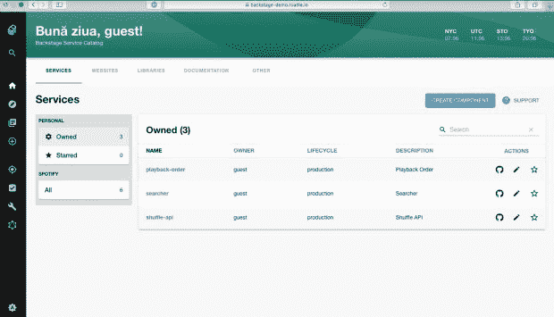

# Spotify 的后台:战略指南

> 原文：<https://thenewstack.io/spotifys-backstage-a-strategic-guide/>

‍Backstage 是一个内部开发者门户，最初由 Spotify 创建，几年前贡献给了开源社区。Spotify 的营销能力帮助它获得了整个社区的关注，但它是适合你的内部开发者平台吗？有哪些利弊？在评估 it 与专家解决方案时，您需要了解什么？

让我们来看看 Backstage 的特点，运行它需要什么，以及如何决定它是否是您的工程基地的最佳选择。

## Spotify 的后台是什么:快速定义

[Backstage](https://backstage.io/) 是一个围绕目录构建的内部开发者门户。它帮助你组织所有的服务、数据管道等。在一个地方，并提供一个架子工使用建筑蓝图和文档即代码解决方案来加快新项目。

使用 Backstage，您可以:

*   组织您的服务(以及数据模型、数据管道等。)和关于它们的关键信息放在一个地方
*   使您的工程师能够使用经批准的架构蓝图来搭建新项目
*   监控技术健康、一些云成本、语言使用等方面的基本分析。

### 后台历史

Spotify 将后台描述为[“出于需要而生”](https://backstage.io/docs/overview/background)它的基础设施发展迅速，开发团队行动迅速，分布在几个地区。结果，他们的工具和流程支离破碎，难以管理。

因此，他们的团队花在弄清楚如何开始的时间比他们写、构建和测试代码的时间还多。他们的基础设施需要单一的事实来源。

在 2010 年代，Spotify 在其工具和基础设施之上建立了一个层，使其更容易找到、使用和管理其服务和工具。然而，一个功能齐全的内部开发者门户需要相当大的工程投资。2020 年，Spotify 选择向社区捐赠其内部开发者门户的核心组件，并试图围绕它建立一个社区来推进工程工作。

## 后台组件

Backstage 由四个主要功能组成:目录、分析、架子工和 docs-as-code。

### 后台软件目录

Backstage 有一个软件目录，作为跟踪内部应用程序、库、管道和网站的集中位置。工程团队通过 YAML 文件在目录中注册实体，这些文件构成了组件、API 和资源的可探索索引。Backstage 希望 YAML 文件存储在您的 git 存储库中，因此它会备份您的目录，并且可以通过完整的历史进行恢复。目录中实体之间的依赖关系可以手动声明。

关于目录条目的元数据通过插件从您的工具中获取，这些插件在服务的 YAML 中进行配置。

软件目录解决了两个大问题:

1.  这是团队管理和维护他们所拥有的软件的一种方式。每个人都获得了他们所有软件的一致视图；服务、库、网站和模型以及关于它们的关键元数据，而不需要为各种工具打开十几个或更多的浏览器选项卡。
2.  现在，您公司中的所有软件都被编入索引并可被发现。

### 后台金路架子工

大型工程组织中的另一个挑战是让团队在维护项目一致性的同时轻松地开发新服务。后台的黄金路径架子工帮助解决部分问题。

您可以在 Backstage 内部创建模板，只需点击一个按钮，就可以在 GitLab 和 GitHub 等地方创建新项目。因此，与其立法约定和标准，不如让团队轻松地开始新项目。

### 后台技术文档

[TechDocs](https://backstage.io/docs/features/techdocs/techdocs-overview) 是一个将你的文档和你的代码存储在一起的工具，同时还能让工程师方便地查看。

您的工程师在 Markdown 中编写他们的文档，并将其存储在源代码控制中，就在他们的代码旁边。当您的 CI 管道构建代码时，一个 [MkDocs](https://www.mkdocs.org/) 构建步骤会创建一个文档网站。Backstage 拉入站点并在您的门户中显示。

## 为什么在后台？

由于您自己下载、安装和构建 Backstage，因此您可以在任何您希望的地方运行它。这意味着它可以在内部或您的云基础架构中运行，因此可以轻松地将其直接绑定到您的系统，而不必担心向外界开放。

这使得 Backstage 的承诺“统一你所有的基础设施工具、服务和文档”成为可能。不管你在运行什么，在哪里运行，你都可以把它提供给后台的抽象层。

Backstage 的插件架构，以及已经可用的 130 个插件，意味着它非常强大并且可以“开箱即用”后台可以和 AWS Lambda、Azure Pipelines、Datadog、GitHub Actions 等很多第三方工具对话。

所以，后台有实现承诺的力量，但代价是什么？

## 为什么不在后台？

### 安装和维护成本

成本？但是我们不是说后台和啤酒一样免费吗？是的，我们做到了。但是，我们也说过，你自己下载、安装和构建后台。构建 Backstage 门户需要大量的工作和持续的维护，包括编辑代码以设置和配置插件。

总之，后台是一个项目，不是解决方案。在你采用 Backstage 之前，问问你自己这个问题:你的公司有资源承担额外的项目吗，或者你的工程能力不足，需要专注于为你的客户提供价值吗？如果你的答案是后者，你需要的是解决方案而不是后台。

另一个选择是从第三方主机提供商那里购买后台服务。虽然这外包了维护您的 IDP 的时间和精力，但它限制了您对服务提供商将提供的服务的选择，并且 Backstage 也是他们的一个项目。

### 难以设置

尽管是 CNCF 的产品，Backstage 并不提供预制的码头集装箱。[安装](https://backstage.io/docs/getting-started/)需要 Node.js 和 Yarn，根据您现有的技术，可能需要额外的人员来构建 IDP 并保持其运行。

Backstage 是一个基于代码的产品，需要通过编辑源文件和 YAML 文件进行大量定制。没有单击甚至多次单击的安装过程。您几乎肯定需要一个相当大的专门团队来维护系统并保持应用程序最新。

此外，配置插件将数据带入后台增加了额外的复杂性。每个插件都需要配置，而不是单击集成。Backstage 确实有针对关键云资源的插件，但数量极其有限，您必须为每个云服务配置一个插件，而不是为您的所有云资源进行一次单击集成。(AWS Lambda 和 AWS Proton 都需要自己的插件，需要单独的配置，而不是覆盖几十种云资源类型的一键 AWS 集成)。

### 难以维护

难以建立也意味着难以维护。每个插件都有一个错误修复和发布时间表，并且每次更新都可能带来突破性的变化。

后台托管提供商资源有限，所以他们通常不愿意立即应用更新，他们通过预先安排的承诺来分配他们的支持资源。因此，你可能会面临最低成本，而不是保持尽可能低的成本。谨防不透明的定价！

### 插件质量

要从像 Backstage 这样的目录中释放价值，您必须将正确的信息放入其中。这是通过由第三方编写的插件实现的。因此，不同插件的质量差别很大，查看插件的 GitHub 库并决定是否值得安装它完全取决于你。

例如，Backstage Kubernetes 插件支持本地 K8s，并提供关于当前状态、错误、接近自动缩放限制和容器重启的有用细节；然而，Azure 的 AKS 和 AWS 的 EKS 都没有插件，谷歌 GKE 插件仅限于使用和成本监控。另外，插件有不同的实现深度。例如，有些会启用搜索，有些不会，除非你准确地阅读代码，了解插件功能的深度，否则这是不透明的。如果存在的话，这些文件是很少的。

### 缺少基本特征

后台并不真正了解基础设施。它对主要云提供商的覆盖有限，只有三个 AWS 插件，两个 Azure 插件和一个 GCP 插件。对于大多数成熟的企业来说，基础设施意识是一个重要的购买考虑因素。这些信息有助于工程团队自助解决问题，从而将故障单转给您的运营团队，使运营团队能够更快地解决故障单，并提供有关成本、合规性和其他重要情况的强大分析。

它也缺乏统一的搜索。每个插件都收集自己的数据，对于它应该收集什么或者应该如何格式化数据，并没有标准化。

Backstage 有用于实现或添加搜索引擎的[文档。所以你可以试着提高你在系统中搜索的能力，但前提是你有时间、人员和资金投入。该项目将所有的用例都集中在搜索实体上，没有一个用例涵盖实体之间的关系，这暗示了它的局限性。](https://backstage.io/docs/features/search/getting-started#Backend)

许多这些限制来自后台的架构。它充当现有服务和工具的抽象层。它读取描述您的基础架构的 YAML 文件和提要，但是它几乎没有查询和报告功能。它显示了描述您的资产的联合供稿。

这严重限制了它让用户回答问题、构建有用的分析的能力，甚至在某些情况下限制了核心目录的效用(想象一下，如果您没有一个时间序列数据库来在故障排除时轻松观察更改历史)。

后台也缺乏数据完整性的解决方案。因此，当企业工具链中的数据发生变化时，Backstage 中的目录条目会变得陈旧，直到服务所有者独立地认识到漂移已经发生并手动更新他们的 YAML 文件。

### 僵硬的方法

对于一些人来说，Backstage 对 TechDocs 的统一方法是一个优势。然而，对于其他人来说，这是将他们的开发团队锁定在一个工具中的最小公分母方法。为什么不让开发团队选择最适合他们情况的工具呢？

Backstage 进一步将您锁定在它的脚手架上，在一个有引人注目的开放和封闭源代码软件解决方案提供越来越多的专业化和预先存在的操作和配方的大型存储库的世界中，这可能不是工作的最佳工具。

Backstage 收集和显示数据的联合方法损害的不仅仅是搜索功能。它还限制了平台显示有用分析的能力，因为它们不能跨设备集成。Backstage 缺乏其付费竞争对手所拥有的灵活的分析工具。

Backstage 确实提供了见解，但你被锁定在它的预装技术健康和成本工具中，他们报告的数据仅限于插件开发者决定提供的内容。

## 后台备选方案

如果你要支付与后台相关的内部管理成本或与服务提供商相关的托管成本，那么为什么不考虑一个闭源的替代方案呢？否则，您可能会放弃重要的功能差异和有利的总拥有成本(TCO)优势。

## 配置 8

[配置 8](https://www.configure8.io/) 提供一个真正通用的目录——您的所有基础设施、环境、服务(以及无服务器功能、数据管道等)和应用，以及来自团队和企业工具链的关键数据——在一个具有标准化模式的不断更新的社会技术知识图表中。

它还提供了对图表中数据的高级分析，可以用来回答有关架构标准、合规性、安全性、可靠性甚至价值流指标的问题。用户还可以组织计划来帮助团队围绕类似的度量标准进行改进，这些度量标准都可以由管理层自定义(而不是局限于一组有限的僵化模板)。Configure8 提供了一个自由的免费层，用户无需与销售人员交谈即可访问该平台。

<svg xmlns:xlink="http://www.w3.org/1999/xlink" viewBox="0 0 68 31" version="1.1"><title>Group</title> <desc>Created with Sketch.</desc></svg>