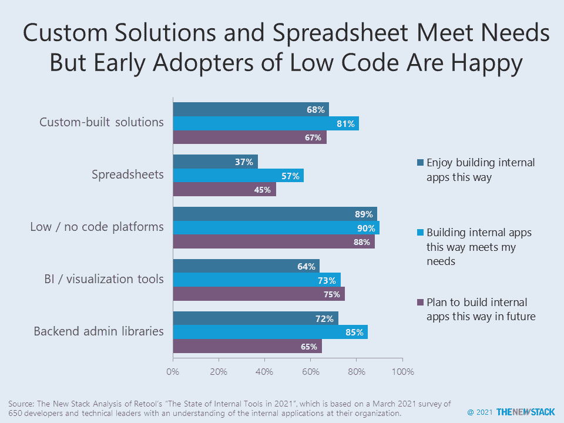

# 电子表格和低级代码开发平台

> 原文：<https://thenewstack.io/spreadsheets-and-low-code-development-platforms/>

开发人员经常用电子表格构建内部应用程序，但对此并不满意。低代码开发平台可能是一种升级，但应该在考虑与其他系统和数据集成的更广泛的背景下看待。

根据低代码供应商[重组](https://retool.com/)的“[2021 年内部工具的状态](https://retool.com/blog/state-of-internal-tools-2021/)，”40%构建内部应用程序的人使用电子表格来这样做——将这种方法置于定制解决方案之后(63%)，领先于低/无代码平台(33%)、商业智能/可视化工具(21%)和后端管理库(17%)。唉，63%的时间开发人员不喜欢使用电子表格的体验。既然 57%的人认为使用电子表格构建实际上满足了他们的需求，那么这是怎么回事呢？训练有素的软件工程师肯定知道电子表格的许多有据可查的问题——安全性、版本控制、易犯人为错误、可伸缩性，还有很多。对新投资的渴望可能凸显了当前体系中的所有负面因素。

定制解决方案和后端库在 80%以上的时间里满足当前需求，但与低代码平台相比，在未来的路线图中出现的频率较低。几乎十分之九的开发人员使用低级代码来构建类似的内部工具，并计划再次使用它。超过 70%的低代码开发人员在使用工具更新，所以这个发现显然更多的是关于工具更新的客户，而不是整个市场。

在 2021 年 3 月的调查中，仪表板、管理面板、数据输入和客户支持是最常见的内部应用类型，尽管像 [Outsystems](https://thenewstack.io/outsystems-pushes-low-code-beyond-its-visual-basic-legacy/) 这样的供应商也在更关键的企业范围用例中提供帮助。

微软的最新努力 [Power Apps](https://thenewstack.io/microsoft-open-sources-the-power-fx-language-for-customizing-logic-in-low-code-apps/) 提醒人们，低代码采用的最大障碍之一是对供应商锁定的恐惧。仅仅因为办公效率套件目前不是一个大问题，并不意味着可能会出现新的垄断。确保您使用的低代码平台具有与基于语言、数据类型、API 等的其他应用程序集成的广泛能力。

电子表格经常被用作将业务流程与像 Zapier 这样的工具集成起来的一种方式。在这些情况下，它们是一个平台还是仅仅是一个美化的 csv 文件的文本编辑器？

考虑锁定的另一种方式是评估一个平台可以支持多少集成。根据调查，PostgreSQL 是 47%的内部应用程序使用的内部数据库。同时，几乎一半(48%)的应用程序使用 GitHub API。其他连接的第三方 API 有 AWS (42%)、Slack (37%)、Stripe (32%)、Twilio (23%)和 SendGrid (23%)。所有这些都是用于管理应用程序本身的基础结构的一部分。

哪个外部数据源可以连接到低代码应用程序只是由[加速战略集团](https://accelst.com/)进行的现场[调查](https://www.surveymonkey.com/r/7FPSR3L?LawrenceHecht)中被问到的一个话题。我们期待在结果公布后对其进行分析。

自从 40 多年前 [VisiCalc 的](https://thenewstack.io/how-visicalcs-spreadsheets-changed-the-world/)问世以来，电子表格就已经实现了业务流程的自动化。昔日的数据分析师和会计师是今天的公民开发者。但是这些新加入的程序员并不是专业的软件工程师。开发者希望每个人都知道这一点。不幸的是，这与低代码供应商的营销目标相冲突，他们将电子表格视为一种入门药物——让业务用户感兴趣，然后开始使用您的工具，然后在项目需求变得太大而无法处理时召集专业开发人员。也许这太愤世嫉俗了，但电子表格、数据库和平台之间的界限继续模糊，以至于 [Airtable](https://airtable.com/) 和 Google [AppSheet](https://www.appsheet.com/) 最终被当作三者来谈论。

通过 Pixabay 的特征图像。

<svg xmlns:xlink="http://www.w3.org/1999/xlink" viewBox="0 0 68 31" version="1.1"><title>Group</title> <desc>Created with Sketch.</desc></svg>