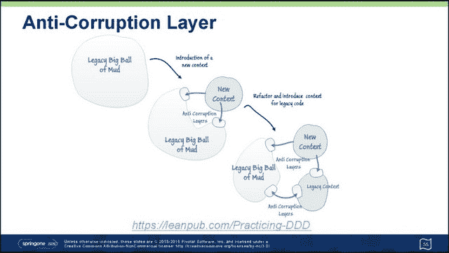

# SpringOne 2GX 会议:管理和迁移 Mud 的巨石

> 原文：<https://thenewstack.io/springone-2gx-conference-managing-migrating-monoliths-mud/>

我们经常谈论新的堆栈，好像它们是巨大的宫殿，乌托邦的宫殿，是世界上每个数据中心的最终目的地。奇怪的是，尽管有各种各样的名字，软件总是比硬件持续的时间更长。企业所依赖的应用程序，以及许多企业一直以来所依赖的应用程序，不会消失，也许永远不会消失。

只有带上行李，我们才能踏上通往这座云中宫殿的旅程。对于几乎所有考虑向云迁移的大型组织来说，其高管希望并期待他们能够将其应用移植到新的平台上，并在那里生根发芽。

## 库存

通常是咨询公司第一个告诉这些人事情不是这样的。

“埃森哲的发现阶段旨在掌握您正在运行的应用程序的数量、您使用它们的频率、谁在使用它们、它们是何时编写的以及用什么语言编写的，”埃森哲公司的一本小册子 [PDF]描述了它为公司提供的应用程序迁移服务。“我们建立评估框架，发现和审核产品组合中的应用程序，并确定应用程序的处置。

“在我们建立了定制的评估框架之后，”手册继续说道，“我们可以帮助您为每个应用程序确定合适的迁移路径。我们权衡安全性、可扩展性、您的增长计划、高优先级业务计划和风险以及法规等关键因素。我们的评估工具会生成影响分析图表，以确定迁移准备情况。从那里，我们可以辨别最合适的目标云部署选项…以及适当的补救级别。”

> Pivotal 咨询建筑师 [Rohit Kelapure](https://www.linkedin.com/in/rohitkelapure) 指着一张直接取自埃森哲宣传册的“客户之旅”图表宣称:“这是迁移整体建筑的老派方式”。“我们的方式不同于老派的方式。我们的方法是，只推送应用程序。您已经有了云平台，并且已经在将您的应用程序迁移到云中。所以只要把应用程序推到云端，看看有什么问题。”

Kelapure 可能是我们见过的最不传统的开发者之一。这可能是我们一个人的错:他在 Pivotal 的工作就是满足客户将现有应用程序迁移到云平台的请求，就是通过这样做。他的全部职业是让旧的东西继续工作，这样客户就有希望享受新平台的好处。

组织甚至不能开始做我们在日常基础上谈论的所有美好的事情(例如，集装箱化)，直到他们可以使他们现有的信息系统和他们的生活来源与这些东西共存。他认为，只要组织被构建庞大的计划电子表格、最终产品是 PowerPoint 演示的分析师和盘点员所困扰，这种情况就不会发生。

## 打碎东西

由于显而易见的原因，Kelapure 选择的 PaaS 平台是 Cloud Foundry。自从他上周二在华盛顿特区的 SpringOne 2GX 大会上发言以来，应该很清楚他选择的工具之一是 Spring 框架，尽管他在必要时会默认使用 Java EE。

但在某种程度上，这些都不是重点。Kelapure 拥抱了一个他称之为“[极限编程](https://thenewstack.io/agile-management-how-to-manage-microservices-with-your-team/)的模型，尽管他所描述的似乎是从 1996 年第一次为其构思的[模型演变而来的。](http://www.extremeprogramming.org/)

这是一场由重新编程实践推动的进化，或者用他的话说，“重新平台化和重构。”第一部分实际上有点简单，可能会因为 Cloud Foundry 而变得更简单，他描述说 Cloud Foundry 从一开始就被设计成对传统方法和新方法都开放。

从那里开始，Kelapure 的“极端重构”包括打破东西。一旦移植到新平台，旧应用就会崩溃。因此，他承认，找到裂缝所在的最佳方法是加快进程，立即打破僵局。

“当它崩溃时，为它写一个测试，”他告诉 SpringOne 2GX 的开发者。“编写一个涵盖特定功能的测试，修复应用程序的特定方面，然后反复修改。从一件事开始；从小处着手。推 app 就行了。”

正如他所描述的，平台再造是用最少的步骤将应用程序移植到新平台的行为。

> “完成应用程序功能所需的最基本功能。你不应该做任何不能让应用程序在云上运行的改变。这是你在这里的使命。”

根据目标的不同，重构并不采用同样的简约方法。Kelapure 给与会者的例子正式有 14 个步骤，尽管其中一些似乎是由较小的步骤粘在一起组成的。

然而，大量的重构过程实际上可能发生在生产中，日常用户有很多机会代表开发人员破坏应用程序。在这里，重新开发人员寻找应用程序中的漏洞和裂缝。这些裂缝实际上可能是自然形成的，Kelapure 援引一幅地质学图像说道。它们可能实际上是旧的、单一的应用程序想要被细分的地方的指示器——在未来，模块之间的分界线可能在哪里。

二次开发人员可能花更多的时间写测试，而不是写产品代码。Kelapure 说，这是可以预料的。测试将揭示代码在其新平台上如何以及为什么表现不同背后的逻辑，这可能与以下事实有关:云平台不是旧服务器的舒适、可靠的界限，旧服务器具有固定数量的 RAM 和固定驱动器号的专用存储。

这些测试可能会揭示，为了让应用程序工作，二次开发人员将需要做出某些改变，而 Kelapure 甚至没有试图用一个相当委婉的说法来掩盖这些改变的性质。

> “当你重新搭建平台时，你必须对应用程序进行某些修改。他建议道:“你的应用不会尽善尽美。“你会做某些丑陋的事情。您创建了一个技术债务的积压，您将在以后解决它。”

这个 backlog 将积累所有这些必要的技巧，使重新定位的应用程序可操作，并按预期运行。重新平台化的结果不会很好，但这并不是应用程序的最终状态。

## 美化孟买

新的、永久的代码的实际组成就是 Kelapure 所说的“现代化”这发生在重构过程中，新的技术模型可能会发挥作用，比如容器化。Kelapure 似乎对 Docker 有点兴趣，并看到了它的一些好处，但绝不把它作为实现重构应用程序的重要工具。

这是克拉普勒会议的一个反复出现的主题，即巨石并不像名字所暗示的那样令人生畏。他分享了一张照片，照片上是他的老家孟买的一个街区里成千上万压缩的临时泥屋(他承认自己在一个更好的社区长大，那里真的有柴炉)，他说，

> “我们的大多数企业应用程序在经过一段时间后，就会变成这样。开发蔓延，到处都是代码模块，没有设计中心。根据新的需求和我们为客户所做的修复，很多问题都得到了解决。”

他说，棚户区在孟买发挥了作用，因为如果没有棚户区，那些清洁和维护更好的多层建筑的人就没有地方住了。同样，旧的应用程序也有自己的位置和功能。

也就是说，它们并不漂亮。或许是为了至少从企业中消除贫民窟心态，如果不是从他成长的地方，Rohit Kelapure 建立了一个几乎是心理的重构巨石模型。首先，他宣称它们是泥巴做的——也许是半个世纪以来胡乱拼凑的补丁、掩饰和修补。

然后，他描绘了这些“大泥球”(他的话)的变化，这些泥球上的块状物被移除，就像粘土块一样，而“反腐败层”(还是他的话)被钉在这些小球被移除后留下的间隙的两侧。

新的泥球就像代码模块的连接器。这些模块中的一些可能实际上是旧代码的“破碎”碎片，通过破碎和测试过程来分离。这些旧的代码连接器为旧的代码模块提供了一个“遗留环境”,以继续与它们的老家进行通信。第二种类型使用开发人员认为合适的任何工具，为任何可能需要改造的现代化组件提供“新的上下文”。

在某些情况下，组件的旧版本和新版本可能需要共存一段时间。Kelapure 描述了一种在旧泥球周围放置栅栏或“立面”的过程，给外部世界以完整的外观。(孟买再次引发了他的类比。)抽象层提供了一个单一的联系点，将这个外观转换成单独的接口。Kelapure 称这部分过程为“扼杀巨石”

> 他告诉与会者，“当你看到应用程序的一部分经常变化时，你就会隔离掉这部分应用程序。”“然后你创建了同一个部件的第二个版本，这要好得多。现在，您已经隔离了应用程序中违反所有约束的旧部分，并且您基本上拥有同一个界面的两个版本。”

当测试证明新组件满足与旧版本相同的语义目的时，抽象层可以被指示将调用路由到新版本。一旦安全了，“你就把丑陋的部分去掉了。”

许多面向对象的代码架构师会认为创建两个(或更多)接口违反了原则。但是正如 Kelapure 所指出的那样，首先建造这个大泥球也是如此。

在他的演讲中，这位 IBM 的老员工引用了康威定律(T2):应用程序是根据他们的设计者工作的公司来设计的。

“这里最重要的一点是，您需要改变您的组织，以反映您想要的应用程序体系结构。您对组织结构进行了有意识的重构，以获得您的应用程序架构。”

Docker、IBM 和 Pivotal 是新堆栈的赞助商。

封面图片:YGLvoices-Flickr 的“印度达拉维”。[通过 Commons](https://commons.wikimedia.org/wiki/File:Dharavi_India.jpg#/media/File:Dharavi_India.jpg) 由 2.0 在 CC 下授权。

<svg xmlns:xlink="http://www.w3.org/1999/xlink" viewBox="0 0 68 31" version="1.1"><title>Group</title> <desc>Created with Sketch.</desc></svg>