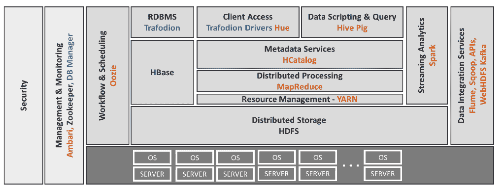

# Hadoop 上的 SQL 数据库流量桥接事务和分析

> 原文：<https://thenewstack.io/sql-hadoop-database-trafodion-bridges-transactions-analysis-divide/>

据项目管理委员会成员 [Suresh Subbiah](https://github.com/sureshsubbiah) 称，阿帕奇软件基金会的[最新顶级项目之一](https://blogs.apache.org/foundation/entry/the-apache-software-foundation-announces27)、 [Trafodion](http://trafodion.apache.org/) 一点也不新鲜，但它通过成为开源项目重新引起了人们的兴趣。

这项技术是 20 多年前由串联计算机公司发明的。根据 Subbiah 的说法，它最初是为银行而建，一度被用于大多数自动取款机。它非常适合需要具有高可用性和可伸缩性的数据库的组织。

Trafodion 这个名字在威尔士语中的意思是“交易”，它源于在线交易处理(OLTP)。

Tandem 被康柏收购，康柏又在 2002 年被惠普收购。在惠普，它被称为 [SQL/MX](https://en.wikipedia.org/wiki/NonStop_SQL) ，该公司开始在内部使用它作为后端来生成报告，导致了 OLAP(在线分析处理)功能的开发，将它带入了不断增长的混合事务和分析处理 (HTAP)市场，这是一种可以同时处理事务和运行分析的数据库。

苏比亚说，在某一点上，它与 SAP HANA 和甲骨文竞争很好，尽管惠普最终决定停止对它的开发，并于 2015 年 5 月将其捐赠给 ASF。

Trafodion 的功能包括:

*   ANSI SQL 支持，基于现有的 SQL 技能；
*   分布式 ACID 数据保护，保证跨多个表和行的数据一致性；
*   编译时和运行时优化器，为 OLTP 工作负载提供性能改进；
*   并行感知查询优化器，支持大型数据集；
*   Apache Spark 集成，支持流式分析；
*   与现有 Apache Hadoop 工具和解决方案的互操作性，如 Hive、Ambari、Flume、Kafka 和 Oozie。
*   Apache Hadoop 和 Linux 发行版中立。

它正在被包括中国移动、中国联通、戴尔、艾斯金公司和 T21 在内的公司使用。

转向开源意味着从专有存储引擎切换到 [HBase](https://hbase.apache.org/) ，这使得它与 Hadoop 和 HDFS 相集成。

“这给你带来了很多东西，比如 Hadoop 的可扩展性，”Subbiah 说。

它也可以在 Hadoop 的默认数据仓库软件 [Hive](https://hive.apache.org/index.html) 上运行。

根据 Subbiah 的说法，Trafodion 的独特之处在于它结合了广泛流行的 Hadoop 和 SQL，以及它的 HTAP 功能。

Hadoop 通过 HDFS 提供了读取大量数据的能力，然后通过 HBase 成为了快速查找的引擎，数据以键/值格式存储。

“它提供了与 SAP HANA 类似的功能——你可以进行交易或快速查找，”Subbiah 说。“但是 SAP 数据库要求你将数据以其专有格式放入表格中。你不能用 SAP 读取 Oracle 数据。在 Hive 中，它的文本格式，这是最简单的一种，数据只是文本，任何人都可以阅读。”

然而，“尽管 HBase 在快速查找方面非常出色，但当您想要读取所有数据时，它并不那么出色。因此，假设某个特定查询需要读取数千兆字节到数千兆字节的数据，而该查询要求您扫描所有交易数据……如果您尝试使用 HBase 扫描数千兆字节的数据，有一些技术可以让它变得更快，但通常情况下，它不会像 Hive 那样快。”

自从进入 Apache 孵化器以来，该项目已经发布了四个正式版本。下个月左右会有新的版本发布。

苏比亚承认，可能有 100 个基于 Hadoop 的 SQL 数据库，包括 Apache [Phoenix](https://phoenix.apache.org/) 和 [HAWQ](http://hawq.incubator.apache.org/) ，它们试图解决部分类似的数据库问题。但是他相信对于交通来说，也许是时候了。

通过 Pixabay 的特征图像。

<svg xmlns:xlink="http://www.w3.org/1999/xlink" viewBox="0 0 68 31" version="1.1"><title>Group</title> <desc>Created with Sketch.</desc></svg>