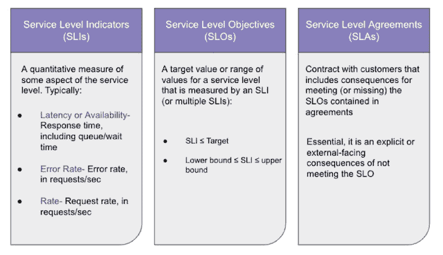
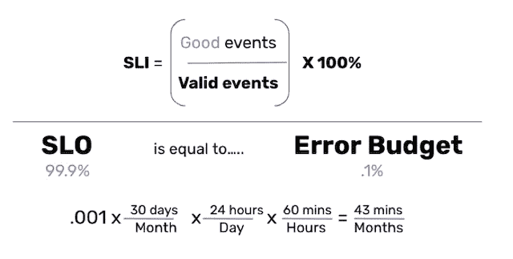

# SRE 家政:新员工从哪里开始

> 原文：<https://thenewstack.io/sre-housekeeping-where-to-get-started-for-new-hires/>

我最近加入了一个新的早期规模扩大项目 [Firefly](https://gofirefly.io) ，并不得不从头开始建立他们的[站点可靠性工程](https://thenewstack.io/5-tips-to-improve-your-sre-incident-metrics/) (SRE)战略。在这篇文章中，我想先看看需要注意的地方，也就是“内务”，为我们未来的运营打下基础。我们希望这篇文章对公司的第一个 SREs 和加入更大团队的人都有好处，并让他们更好地理解 SRE 在生产运营中的作用。

一旦我们在这些核心领域取得了进展，实现了更好的流程和文化，我们就可以专注于更大的规模和增长挑战。我将分享一个 SRE 如何通过平衡一些关键部分来确保整个工程组织和业务的成功，通过性能、稳定性和错误预算管理，以及通过不必要的约束减少复杂性和摩擦的关键文化方面。

## 在一家快节奏的初创企业中开始做 SRE

虽然有很多帖子关注 DevOps、平台工程和 SRE 之间的差异，但这篇帖子将更多地关注 SRE 作为一门学科，并为有抱负的 sre 如何以及从哪里开始提供指导。未来的文章将更深入地探讨这些领域，并揭示所有这些是如何实现的。

为了在 SRE 领域的主要领域取得进展，关键是首先要收集数据，以了解当前对速度的限制，从而了解如何消除这种摩擦。此过程包括与开发人员交谈，以便更深入地了解在以下方面影响他们带宽的因素:

*   **特性:**他们开发和发布新特性的速度
*   成本和财务:最大的支出是什么
*   **数字:**当前的绩效指标和基准(如果有)
*   **业务目标:**了解工程团队如何与公司目标保持一致。

例如，行政领导(无论是首席执行官还是工程副总裁)的一个持续需求是能够优化成本。然而，对于 SRE 来说，重要的是这样做不影响工程的其他关键方面，如速度或稳定性。

最终，工程不仅仅是将代码从一个地方运送到另一个地方的冰冷、艰苦的技术工作。它的核心是以人为本，因此，良好的 SRE 不是仅仅通过从上到下实施新的法律和秩序就能实现的——它需要创造一个良好健康的工程环境。好的 SRE 意味着帮助开发人员理解为什么要做出改变，以及这些改变将如何改善每个人的生活和业务。

当您与 R&D 组织合作，为最大限度地利用资源做出急需的改变时，您向开发人员开放了他们直接影响的许多方面，以及他们如何能更好地完成工作。如果做得好，这通常会使开发人员更加快乐，他们在过程中的工程能力更加成熟。

### SRE 和性能工程

大多数 sre 被要求(定期)关注的一个主要领域是绩效，但这通常是一个重要的首要改进。为了开始改进性能，您需要从测量开始，并创建一个基线，在此基础上您可以创建 KPI 和度量来改进这个初始基线性能。与平台工程师类似，SRE 通常具有很强的工程背景，因为 SRE 人戴的一顶帽子几乎就是 R&D 及其工程师的顾问和教育家。

SRE 将探索代码和度量，并使工程师能够回顾他们的代码，以指出他们需要在代码中的什么地方改进系统的性能。SRE 将引入“生产原则”——在生产中运行代码，以及代码是如何影响系统的。对您的代码如何影响整个系统增加一定程度的操作理解，可以在工程师的职业生涯中提供一定程度的成长和成熟。

### 在创业丛林中实现更大的稳定性

任何在早期创业或扩大规模中担任过 SRE 的人都知道，在 SRE 出现之前，通常都是弱肉强食——主导和指导原则是“出货”这意味着大多数 sre 出现在一个高度不稳定的环境中。当谈到实现更大的稳定性时——这是在两个层面上完成的:代码和工程，然后是基础设施。我们将从工程方面开始。

这是一个公司成长和成熟的重要阶段，因为 SRE 经常出现在已经拥有一个产品或其重要部分的初创公司，并且不是所有的站点可靠性工程都可以包含在第一行代码中。你进入了一个已经全速运转的工程组织，你需要调整你的任务，而一切都在不断变化。

**通过更好的代码实践提高稳定性**

如今，许多工程组织的团队中既有初级工程师，也有高级工程师，并且所有人都不断受到各种冲突和不同需求的轰炸，这些需求包括满足现有和潜在客户、利用开源项目、修复 bug 或推出新功能。作为一个年轻的开发人员，你并不总是知道如何在不断的轰炸中分清主次。

另一个需要注意的重要事情是，这种普遍的上下文切换(这是竞争优先级的副产品)也增加了复杂性，使代码更容易出错，根据开发人员的成熟度，这肯定会对代码的稳定性产生直接影响。稳定性从代码层面开始，一旦有了稳定的产品，就可以着手在基础设施层面增加更大的稳定性。

通过首先为开发人员创造更大的稳定性，然后你可以在基础设施方面优化稳定性，作为 SRE 实践的一部分。然而，如果没有稳定的产品和代码，您将无法实现稳定的基础设施，因此必须首先从那里开始。

稳定性始于程序和流程，以确保工程符合 SRE 学科 SLIs、SLO 和 SLA 的众所周知的指标(我们将在误差预算下深入探讨这些指标)。这就是调度，尽管它是有争议的和有争议的，给特性和版本的部署增加了急需的稳定性。

计划背后的意图是给混乱增加秩序，而不是摩擦。让我们来看一个常见的实践和例子:当部署计划被强制执行，并且一个版本或特性不能在下午 6 点或星期四(当以色列的周末开始时)被推送时。在其他地方，这可能是星期五，下午 1 点以后，但这是有原因的。

当您处理流程和计划，并且失败发生时(因为失败总是会发生)，它可以作为一种策略更快地被包含。如果在工作时间发生事故(甚至在非工作时间进行计划的部署)，您可以让工程师进行故障排除并缓解事故。如果您在计划之外的时间进行部署，那么很有可能您没有合适的功能来帮助实时排除故障，从而造成更大的系统不稳定性(并消耗错误预算，这将在后面讨论)。

在现代工程组织中，正如 Accelerate 和 DORA metrics 所推广的那样，速度是领先的基准和成功指标。然而，没有安全就无法做到这一点——安全的速度对于经营 SaaS 业务至关重要，这也是 Accelerate 研究的核心。

为了实现快速安全的交付，我们需要增加一层测试和自动化，因为人类天生就有偏见，容易出错。我们的配置也经历了同样的演变，代码和配置管理等基础设施几乎取代了手动配置。)为了避免人为的误配置和人工工作容易出现的错误。

**基础设施稳定性和优化**

一旦我们创建了想要优化的指标和 KPI，通过流程和调度引入了结构，降低了复杂性并提高了性能，我们就可以开始通过测试和自动化来优化我们的基础架构。

通过创建尽可能接近生产的试运行环境，并允许我们的代码在一段时间或一个工作负载周期内“存活”,我们就可以在没有人为偏见或错误的情况下自动查看指标、测试和验证代码——我们可以根据数据来决定是否将代码交付生产。如果代码不符合定义的指导方针和度量标准，它就不会被发布。所有这些都依赖于自动化而不是人工来添加急需的基础架构稳定性层。

## 误差预算

SRE 的很大一部分职责是提供数据和指标，并遵守针对客户和合同的服务级别协议(SLA)。不合规，本质上是错误，是对本合同和协议的违反，当您超过错误的阈值(“预算”)时，您最终需要补偿客户。

**这是什么意思？**

如果我们与客户 X 签订了年度合同，并且合同规定正常运行时间为 99.999%，这可以转化为我们需要避免超出该客户的停机时间“预算”的确切小时数和分钟数。

作为一名 SRE，并最终成为所有数据的监督者，您可以鸟瞰客户当前所有可用的误差预算。例如，如果客户端 X 停机了一个小时，客户端 Y 今年停机了 30 分钟，那么您需要不断地了解这些数字并进行计算，以便不违反您的 SLA 合同义务。

基于这个已知的每个客户端的可用预算，我们决定是否部署有问题的代码并冒着停机的风险。这时，SRE 需要计算是否值得，甚至采取预防措施，是否将某个客户排除在部署之外，以确保不违反合同。在这种情况下，通过相关的监控和衡量标准，准备和主动是至关重要的，这样您才不会发现自己已经违反了合同。

**SRE 成功指标**

这些指标通常被定义为 SRE 的北极星:

确保您持续保持 SLA 的推荐最佳实践是，您的 SLO 应该始终高于 SLA。在违反 SLA 之前，应该有很多阈值需要超越。

这也是我们需要嵌入强大的监控和警报的地方，它集成到我们的 CI 管道中，以便在我们接近危险区域时不断向我们发出警报。

## 降低复杂性——SRE 成功的关键

降低所有这些核心领域的复杂性最终会提高性能和稳定性，同时保持合理的误差预算。

如果一个系统变得太复杂，这反过来会导致需要考虑太多的变量，使 SRE 的核心指标难以计算，并导致决策过程变慢，因为决策变得更难快速做出(由于太多的[未知的未知](https://webinars.devops.com/find-the-unknown-unknowns-and-prevent-downtime-with-infrastructure-as-code-iac))。

降低复杂性也有直接的业务影响。我们的工程组织需要不断努力进行智能设计和开发，这样我们就不会积累技术债务，我们的代码也有更长的保质期。通过将开发人员从专注于复杂性副产品的 bug、技术债务和其他常见问题中解放出来，他们可以专注于我们每天工作的原因——业务驱动的开发——我们的产品、功能和创新。

<svg xmlns:xlink="http://www.w3.org/1999/xlink" viewBox="0 0 68 31" version="1.1"><title>Group</title> <desc>Created with Sketch.</desc></svg>