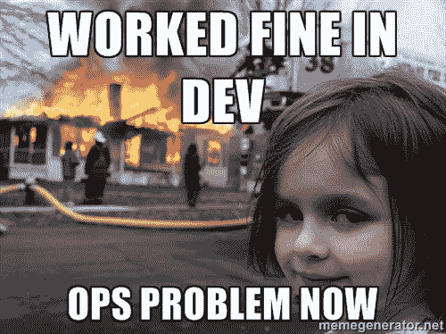

# SRE vs . devo PS——“运营 vs .开发 2.0”还是什么新东西？

> 原文：<https://thenewstack.io/sre-vs-devops-ops-vs-dev-2-0-or-something-new/>

IT 运营和软件开发之间的分歧已经争论了半个世纪。经验更丰富的技术专家会记住几个(很多？)这种争论已经持续了好几代，其背景是技术领域的颠覆性变革。

虽然这些中断都没有改变一切，但每一次都极大地改变了企业技术的工作方式，从而改变了运营和开发人员开展业务以及管理他们(通常是不稳定的)协作的方式。但一直以来，大多数注意力都放在了开发上，公平地说，开发的产出非常明显，具有业务差异化和价值生成性。

最近有哪些聪明的企业和技术团队(过去 5-10 年？)但是，我发现，为了帮助开发人员交付更多价值，需要有人更加关注运营。Ops 作为一个角色和最佳实践列表，已经成为每个人都需要做好的事情。

在这一点上，根据您所做的事情和您所处的位置，以及您的组织沿着云+容器+自动化曲线走了多远，战线似乎已经发生了变化。在 tech-forward，云原生组织，IT 运营的矛头现在在某些情况下已经演变成一个精英阶层:[站点可靠性工程师(SREs)](https://en.wikipedia.org/wiki/Site_reliability_engineering) ，他们从事平台工程的软件/系统部分。

与此同时，Dev 已经变成了 DevOps。我们的意思是，在这里——作为工作描述——devo PS 人员(我认为，无论如何)最好被定义为 SREs 创建的系统的面向应用的消费者，其任务是交付可用、灵活、高性能和高效的云原生应用。

## 这仅仅是 IT 运营与开发 2.0 的对比吗？

不，真的不一样。随着技术制造商越来越好地调整他们的产品来服务这些新学科的实践者，这一点得到了证明。

当前的许多活动都围绕着部署自动化的通用工具和构建自动化、CI/CD、测试驱动的开发工作流等的单点解决方案/SaaS 服务。

但是低级工具是不够的。而 DIY 的野心会扼杀前进。

大多数技术组织尚未配备平台工程师和软件工程师，许多在职技术人员仍在学习，这些技能很难找到，而且价格昂贵，尤其是在当今的就业市场上。更罕见和昂贵的是高度专业化的技能:弹性存储、入口、身份和访问管理、容器网络和安全，以及构建高性能和可靠的集群所需的其他学科。

随着云资产的增加和混合，以及在许多平台(开发/测试/生产、蓝/绿、边缘集群、托管裸机、专用硬件，如 GPU 主机)上交付一致的 Kubernetes 等需求的出现，挑战不断增加。最终很容易建立错误的团队，员工倾向于构建和生命周期管理云和底层基础设施，而不是专注于应用程序和交付商业价值。

在 DIY 环境中，开发得不到充分的服务。SRE 没有提供他们需要的系统(应用设计组织——标准模式、部署自动化、Kubernetes 操作员、可观察性工具),因为他们没有时间；还因为平台本身是不断变化的——在“飞机飞行时”被构建和重构

只要 SRE 继续努力构建和维护自动化，以将平台放置到位，观察它们，并保持它们的运行，SRE 与 DevOps 就将继续看起来像 Ops 与 Dev 2.0。

## 为平台工程师提供支持并为软件工程师提供支持的个性化解决方案

SRE 需要提升他们的工作水平。要做到这一点，他们需要有主见的解决方案——不同于“工具包”——直接并完全解决平台级的痛点。更高级、操作更简单、更完整，但仍然非常灵活的工具。例如，在多个平台和基础设施上实现生产级、一致的 Kubernetes 集群创建和生命周期管理的解决方案。

许多工具包都声称可以做到这一点。很少有人能做好这份工作。有些会产生可用性一般的低性能集群。有些以灵活性为名，要求用户在没有足够指导的情况下做出关于 Kubernetes 组件(如 ingress)的关键决定，然后配置工具来部署他们选择的解决方案，并在出现问题时寻求多个实体和/或开源社区的支持。很少有工具包能够提供完全具备可观测性的集群——这意味着在可用的集群到位之前，需要进行另一组决策、更多配置和更多实验，才能进行评估和实际操作。

简而言之，这些工具包没有做实际的工作，即在云转型或构建项目开始时限制对定制平台工程和专业技能的需求。一个实用的解决方案可以做到这一点，减少不确定性，严格限制实验和调整的需要，并使概念验证和基本部署能够或多或少地立即进行，让组织在获得任何好处之前就达到需要的目标。

为了可信地做到这一点(以满足复杂的最终用户)，解决方案必须包含许多专业知识平台工程师、分布式存储专家和其他类型的主题专家。它需要包含大量的最佳实践，以及将解决方案及其输出(集群)产品化的众多启示:

*   它需要提供一个完整、灵活、分层、基本简单、文档完善且可扩展的工具系统，用于管理裸机、云和其他底层基础设施，处理 Linux 和潜在的 Windows 主机操作系统，以及部署和生命周期管理完整的生产 Kubernetes 集群架构的所有方面，包括容器运行时、工作器和管理器组件、高性能容器网络、分布式存储、入口、容器注册和一切的可观察性。
*   它需要配备同类最佳的 Kubernetes 和附属组件，以实现一致性和互操作性。
*   因此，它需要对所有这些事情表达自己的观点——在现实世界中经过充分的论证和测试，没有一个是无关紧要的(见下面关于 Ceph 的注释)。
*   除此之外，It 需要对如何观察集群和管理生命周期有一个清晰的愿景(更有根据的观点)，提供所有必要的“开箱即用”的启示，加上足够的灵活性，使 sre 能够随着时间的推移增加自己的独特价值。

致力于负责任地做出这样的决策需要比任何典型的组织(几乎不管规模大小)内部拥有的或能够购买的更多的具体经验。例如，在 Mirantis 的案例中，我们的 Mirantis 容器云产品——用于 Kubernetes、Swarm 以及容器化 OpenStack 集群的完整部署和运营框架——部署了 Mirantis 自己的开源发行版的 Kubernetes 和 OpenStack 组件和子系统，所有这些组件和子系统都独立发展，但一起进行回归测试。因此，实际上，当使用 MCC 在多个基础设施上以特定的、经过测试的、高度可用的配置部署 Kubernetes 集群时，这些集群实际上是一致的:除了在运行时确定的资源需求和网络细节之外，没有什么可以阻止工作负载在它们中的任何一个上运行。

MCC 还优先使用 Ceph 分布式存储进行文件、数据块和对象存储。还有其他分布式存储系统吗？当然可以。但是，Mirantis 已经为 Ceph 项目贡献了近 10 年的时间，在一些世界上最大的私有云下大规模支持 Ceph，并且拥有大量的存储和专业的 Ceph 内部工程师，以确保 Ceph 能够很好地为大多数客户服务。“运行良好”比“本月风味”更有价值，特别是当云的目的是支持希望专注于应用程序的开发团队时。

像 Mirantis 容器云(以及 Mirantis Kubernetes 引擎、Mirantis 容器运行时、Mirantis 安全注册、Ceph 等)这样的解决方案所代表的多年(实际上是几十年)的经验和观点。)帮助确保 MCC 满足真正的需求:支持平台工程师和 sre，快速聚合所需的集群架构以服务于客户的用例，并部署可靠的生产集群，使应用程序构建的实际工作得以进行。

### SRE + DevOps 1.0

今天，随着固执己见的完整解决方案变得可用，以帮助应对真正的云平台挑战，SRE 和 DevOps 正在同一个团队中发挥作用——单一学科的实践者。是的，可能会有摩擦，因为快速编写应用程序比编写好应用程序更容易(“在开发和运营中运行良好，现在是问题”)。但是，如果有正确的解决方案让平台上线并保持健康，SRE 向 DevOps 展示有助于应用蓬勃发展的系统变得越来越容易，DevOps 也因此编写出好的应用(因此，我们所有人都可以更安全地在周五进行生产，并享受有趣的周末计划)。

有了正确的解决方案，SRE 和 DevOps 可以成为他们应该成为的样子:一个新的、实际上更好的东西。随着云原生技术和最佳实践继续渗透到每一个领域，并成为“事情是如何完成的”，我们可能最终能够告别“运营与开发”这一陈旧、有毒、相互指责的行业(虽然我永远不会不爱邪恶的迷因儿童，燃烧的房子，和“现在行动”的问题。")

<svg xmlns:xlink="http://www.w3.org/1999/xlink" viewBox="0 0 68 31" version="1.1"><title>Group</title> <desc>Created with Sketch.</desc></svg>