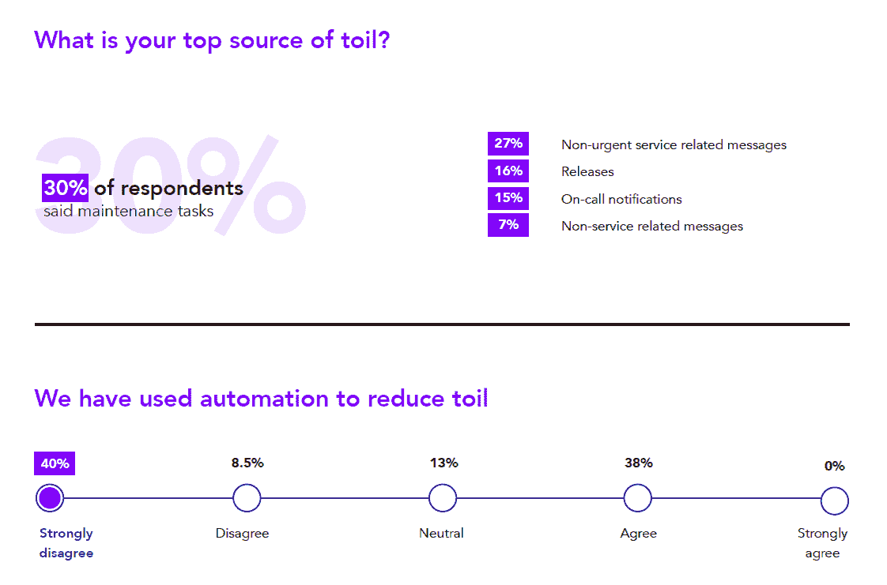

# SREs 希望自动化解决他们所有的问题

> 原文：<https://thenewstack.io/sres-wish-automation-solved-all-their-problems/>

“加倍，加倍的辛劳和麻烦；莎士比亚戏剧《麦克白》中的三个女巫唱道:“火在燃烧，大锅在冒泡。”她们警告说，她们会得到比你原本希望的更多的东西。该信息适用于现场可靠性工程师(SREs)。

虽然 [SRE 的工作角色](https://thenewstack.io/the-certainties-about-your-job-as-an-site-reliability-engineer/)通常被定义为自动化，但现实是 59%的 SRE 认为他们的组织中有太多的辛劳(定义为线性扩展的手动、重复、战术性工作)。根据 188 份来自在 SRE 工作的人的调查反馈，Catchpoint 的第二份年度 [SRE 报告](https://www.sresurvey2019.com/)令人惊讶地发现，几乎一半(49%)的 SRE 认为他们的组织没有使用自动化来减少工作。

来源: [2019 SRE 报告](https://www.sresurvey2019.com/)。随着 CI/CD 已经由 DevOps 和 SREs 自动化，只有 16%的人表示发布管理是重复性手动工作的主要来源。

sre 通常受到 DevOps 的启发，对自动化有很高的期望。然而，这两者还是有一些关键的区别，SRE 的职责更接近于系统管理员。sre 有能力实现自动化和创新，但通常受到 IT 运营部门的限制，他们过去一直关注事件管理和可靠性。

尽管根据去年的报告，自动化是 SREs 需要的最高技能，但现实是，IT 运营的日常职责并不总是能够通过编写新脚本或创建改进的基础架构配置来消除。事实证明，自动化 CI/CD 流程只是 SRE 的众多职责之一。

另一个责任是响应“事件”，这通常被定义为服务停止。52%的受访者每周处理不止一次事故，这可能会产生很大的压力，因为它们会影响客户满意度，并且可用性是衡量 SRE 成功的标准。

可用性是用来定义 SRE 角色的“可靠性”部分的“关键”指标。四分之三的 sre 表示他们的组织有服务级别目标(SLO ),在这组人中，几乎每个人都表示可用性受到跟踪。终端用户体验到的延迟和响应时间也得到利用，但不经常使用。

监控服务提供商和微调应用程序的性能可以减少事故数量，使组织更接近[五个九](https://uptime.is/99.999)，这意味着一年只经历五分钟的停机时间。然而，尽管有人工智能操作系统[的承诺，大多数事故无法自动消除。](https://thenewstack.io/new-relic-takes-on-aiops/)

虽然事故最受关注，但对 sre 来说，更大的问题可能是他们收到的非紧急警报的数量。27%的人说非紧急信息是他们“辛劳”的主要来源，而只有 15%的人提到了随叫随到的通知。

sre 不仅仅是荣耀的 IT 运营专业人员，但是对可用性的关注意味着他们通常没有能力处理他们应该处理的工程挑战。

## 来自其他报告的上下文

*   **事件在开发人员和 IT 运营人员之间制造摩擦:**四分之三的开发人员希望由应用程序开发团队负责处理重大事件。根据 2018 年 Atlassian 调查，软件开发人员的理由是他们更了解错误，因为与 IT 团队来回沟通需要太多时间。然而，中央 IT 运营团队的成员几乎同样强烈地认为他们应该带头，并且大多数 c 级高管也同意这一点。c 级高管可能是对的，因为三分之二的受访者认为在不到一半的重大事故中需要软件开发团队的参与。
*   **AIOps 只是解决方案的一部分:**ops ramp 进行的一项[调查](https://info.opsramp.com/aiops-report)发现，熟悉 AIOps 的高管中有四分之三认为这种工具的主要目的是消除繁琐的手动任务。然而，80%的受访者表示，不到一半的事件是重复发生的。换句话说，它们不能用自动化直接解决。

约翰·唐曼拍摄的专题图片[。](https://commons.wikimedia.org/wiki/File:John_Downman_Witches_from_Macbeth.jpg)

<svg xmlns:xlink="http://www.w3.org/1999/xlink" viewBox="0 0 68 31" version="1.1"><title>Group</title> <desc>Created with Sketch.</desc></svg>