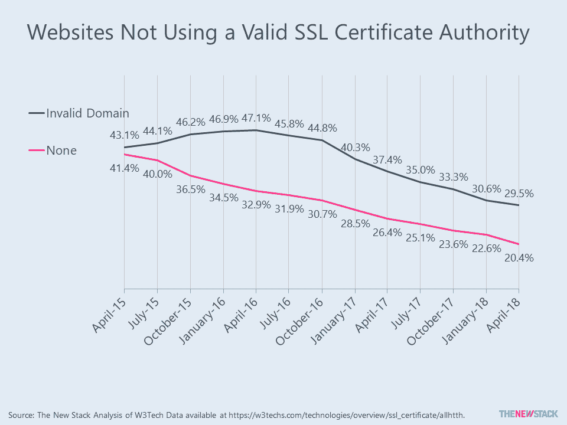
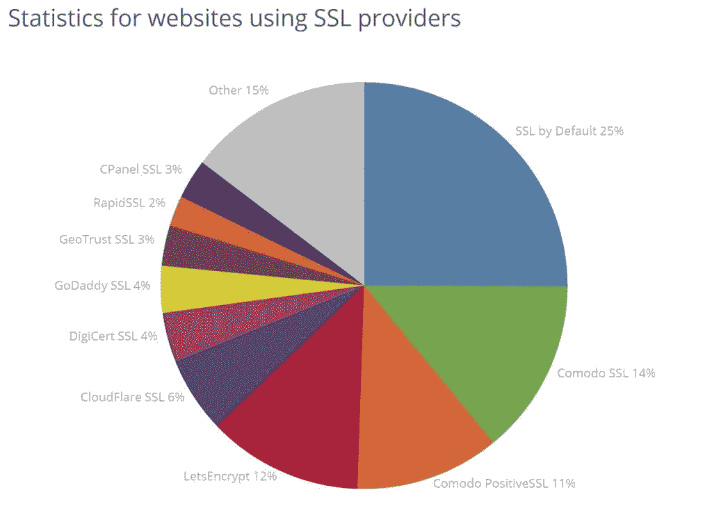

# SSL 的采用持续上升

> 原文：<https://thenewstack.io/ssl-adoption-continues-to-rise/>

三年前，全球只有 15%的网站使用有效的 SSL(安全套接层)认证机构。根据 W3Tech 的数据，2018 年 4 月，这一数字已跃升至 50%。其余的网站要么没有证书，要么有一个不被 Chrome 或 Firefox 等主流浏览器识别的证书。

SSL 采用率急剧上升的原因很简单。2014 年，谷歌的搜索引擎开始提升“https”网站的排名算法。截至 2018 年初，谷歌 Chrome 现在会在用户每次试图访问没有有效证书的网站时发出警告。因此，过去只与信用卡交易相关的安全措施现在是除了最不知名的网站之外的所有网站的必备工具。

 
我们研究了 W3Tech 和 BuiltWith，以确定哪些技术受益。有趣的是，这些网站给出了不同的答案，部分原因是它们的机器人被编程为寻找一组不同的参数。根据 W3Tech 的数据，在使用 SSL 的网站中，37%使用 Identrust，36%使用 Comodo。BuiltWith 说默认情况下[SSL](https://sslbydefault.com/)以 25%的份额领先于排名前 100 万的网站群。不过， [Let's Encrypt](https://letsencrypt.org/) 和 [Cloudflare](https://www.cloudflare.com/) 都在提供免费证书。其他显示出巨大市场份额的供应商包括 [DigiCert](https://www.digicert.com/) 和 GoDaddy。

展望未来，我听说现有解决方案将面临来自区块链身份和隐私解决方案的竞争。我们还没有看到支持这种说法的数据。

特征图片:18 世纪锁和钥匙，来自英国或美国，[纽约大都会艺术博物馆](https://www.metmuseum.org/art/collection/search/4819?sortBy=Relevance&amp;ft=lock&amp;offset=40&amp;rpp=20&amp;pos=48)。

<svg xmlns:xlink="http://www.w3.org/1999/xlink" viewBox="0 0 68 31" version="1.1"><title>Group</title> <desc>Created with Sketch.</desc></svg>