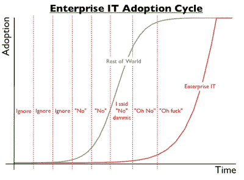

# 企业如何采用新的堆栈，或者“我说不，该死”

> 原文：<https://thenewstack.io/stack-always-changing/>

以下是典型的企业堆栈采用周期:

1.  **第 1 年**:我们做事的方式很棒；创业公司做的那些垃圾事情基本上和我们做的一样，但显然我们做得更好。
2.  **第二年**:初创公司正在做的事情对他们有用，但对我们没用，因为我们有不同的需求。
3.  **第三年**:如果我们从零开始，我们会按照初创公司的方式来做，但我们不是，我们有不同的要求。
4.  是的，好的，我们也许应该做一个试点项目，看看我们是否能做那些新公司正在做的事情。
5.  **第五年**:好的，嗯，其实挺好的。我们要在任何地方都这样做，重新变得棒极了。我们正在着手一项为期两年的计划，将这种创业的东西应用到任何地方。这将是昂贵的，但这是正确的事情，然后我们就真的准备好了。
6.  好的，我们花了三年半而不是两年，但是我们终于完成了！
7.  转到第一步。

这不是一个持续改进周期，而是一个资本改进周期。但是，最佳实践堆栈变化如此之快，以至于你不能处于资本改进周期。你需要从根本上改变你做事的方式，这样你就可以在新技术问世的前两到三年利用它们，而不是在第八或第九年。而且周期在缩短，所以差异只会越来越大。

## 堆栈总是在变化

而且我不仅仅是指栈的具体组件，还包括你需要哪些东西来构成一个栈。过去谈论“LAMP”(Linux/Apache/MySQL/PHP 或 Perl)栈是没问题的，但是考虑到云原生架构(服务器是软件！运行您构建的内容！)，我们现在最终将 DevOps 引入堆栈，因此我们需要了解您正在使用哪种配置管理或 PaaS 或容器技术，以及您正在使用哪些持续集成和部署工具等等。

堆栈变化如此之快，以至于很难跟上—每 18 个月左右，您的堆栈的某个部分几乎肯定会在客观上不如现有的。很难知道什么时候应该改变你的筹码，尽管如果你的筹码已经很长时间(18 个月？三年？五年？)，这可能不是当今最有效的开发人员用来构建您的东西的堆栈。虽然我同意丹·麦金利的观点，即[无聊技术是有效的](http://mcfunley.com/choose-boring-technology)，但这个基本原理可以用来为使用 Java 辩护。NET 和 Ruby-on-Rails 是默认的，当然也不应该是。(哦，你变得有防御心理了吗？听起来你过去五年一直忙于开发，没有足够的时间尝试新事物)。

为什么堆栈变化如此频繁？主要原因是，我们被要求提供的东西在不断变化:在智能手机和消费初创公司大量投资用户体验的引领下，可用性和可用性的标准不断提高。八年前我们选择了 Ruby on Rails，因为它为我们的开发人员提供了一种分离数据和设计的简单方法(MVC FTW！).但是 RoR 在服务器端做 MVC，这意味着每一个新的内容都被设计成通过浏览器中的新页面加载来交付。这不是消费者越来越喜欢的单页应用程序世界(例如，继 Gmail 之后的微软 Office 365)。

智能手机对堆栈的影响甚至比水疗还要大，Yo！，这是一个相当受欢迎的应用程序，它有完整的 Objective C 解析堆栈。美国开发者的速度或 UX 与 Java 或。NET 和许许多多你必须随身携带的东西。

让我们看一些例子:

### (后端)代码和数据库在哪里运行？

### 您如何确保高可用性？

### 您如何部署服务器代码？

堆栈也发生了变化，因为开发人员不断发布语言、工具、环境和模块，使软件开发更加愉快(例如，Jade 而不是直接编辑 HTML，CoffeeScript/TypeScript 而不是直接编辑 JavaScript)。鉴于对软件开发人员的总体需求，我们有越来越多的人学习如何在没有任何现有语言、工具或环境经验的情况下开发软件。因此，这些新的开发人员被吸引到最好的新东西，这意味着如果你想雇用他们，如果你能支持他们的首选堆栈，你将是最好的。所以，如果你现在正在雇用 Java 开发人员，我很抱歉地告诉你，你不会得到关心或考虑持续改进的开发人员(至少不是整体的)。

这并不是说你可以认可某种混乱，让每个开发人员选择他们想要的任何堆栈，这将导致灾难。但这确实意味着你不能考虑选择一个堆栈作为资本投资，将支付多年的红利(你会假设你的堆栈选择可以资本化，但它不应该有足够长的寿命来资本化)。相反，您需要不断地评估您的堆栈，并且您应该有适当的过程来更容易地定期和持续地更新您的堆栈。

小心那些头衔中带有技术名称的现有和潜在的未来员工！猜猜 Java 架构师会为她的下一个项目选择哪种语言？猜猜 Oracle DBA 将为他的下一个项目选择哪个数据库？雇佣技术人员，而不是产品或品牌，雇佣那些了解堆栈总是在变化的人。

图片来源:[企业 IT 采用周期](ttp://blog.gardeviance.org/2012/07/adoption-cycles.html)作者[西蒙·沃德利](http://blog.gardeviance.org/)。

特征图片:[smlp.co.uk](https://www.flickr.com/photos/biscuitsmlp/)的[开慢](https://www.flickr.com/photos/biscuitsmlp/2207398366/in/photolist-4n4uCw-9WVChL-9fLuoT-pvYwn1-8DiKPD-6WxybL-6qF3jA-bWM7ND-8rwSDR-fCDcn4-9ApKrj-8iVv6e-wfpcFa-8Cg54t-9f51k-9CWhYu-7weR7D-4zCY3z-d4SbtG-dQmNfn-ashW1j-bB8Zkm-5EU5yN-75LH5i-9UWPD1-9Ac6cg-9EU7gM-6JeH1h-7B5z6-5gujAB-C8Vdy-83gHRE-5wyR4d-fCVLJ1-6u8Zek-8LpdFz-7Wdn3b-eBKsa-7Y9RPW-7sSYRp-bwixKn-eCw3p9-9hcCNA-8aABa8-astkTV-a9BfkL-5sH9wt-7neHkk-dfyxvs-8Up9bq)是 2.0 的 [CC 下的授权。](https://creativecommons.org/licenses/by/2.0/)

<svg xmlns:xlink="http://www.w3.org/1999/xlink" viewBox="0 0 68 31" version="1.1"><title>Group</title> <desc>Created with Sketch.</desc></svg>