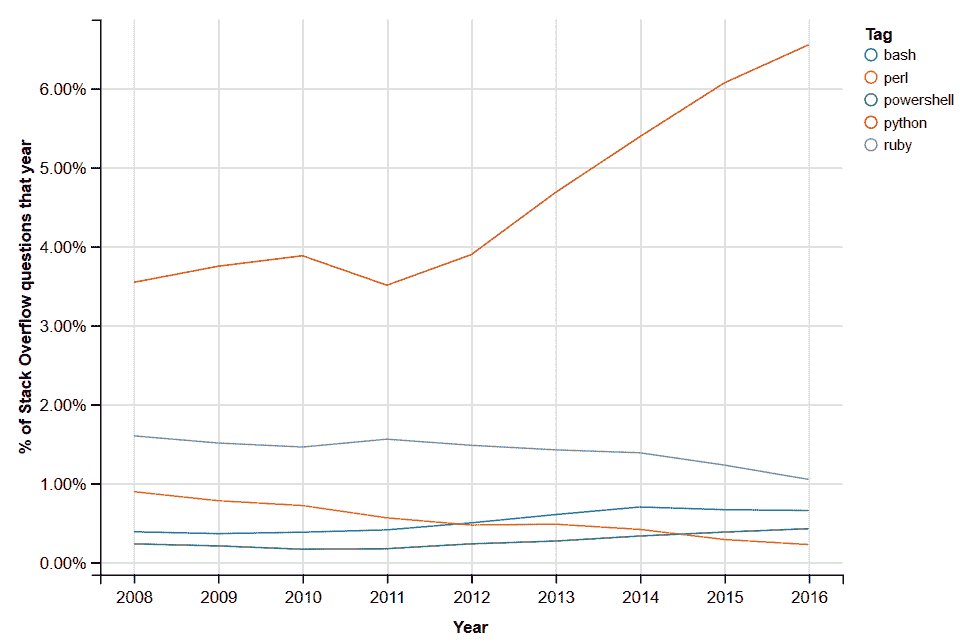

# Stack Overflow 的年度回顾揭示了最愤怒的程序员(也是最令人愉快的)

> 原文：<https://thenewstack.io/stack-overflow-data-highlights-stack-exchanges-year-review/>

在告别 2016 年的时候，Stack Exchange 在其年度[“年度回顾](http://stackoverflow.blog/2017/01/year-in-review-2016/)报告中发布了一些关于其网站 [Stack Overflow](http://stackoverflow.com/) 及其姐妹答案网站的新统计数据。他们 162 家酒店中最受关注的问题是什么？

“我如何让口袋妖怪 Go 检测我的手机的方向？”

那个[问题](http://gaming.stackexchange.com/questions/272904/how-do-i-get-pokemon-go-to-detect-my-phones-orientation)在其游戏网站 [Arqade](http://gaming.stackexchange.com/) 上被观看了 535，546 次。Stack Exchange 社区经理 Jon Ericson 写道，这些流行的问题“往往反映了技术趋势”。事实上，该公司许多网站上的其他 2016 年热门问题揭示了全球人民的想法:

在这一年中，在[所有 162 个网站](http://stackexchange.com/sites)-包括 Stack Overflow、 [Ask Ubuntu](http://askubuntu.com/) 和[物联网堆栈交换](http://iot.stackexchange.com/)-2016 年发布了超过 450 万个新答案。当然，“没有一连串的新问题，我们无法得到这些答案，”埃里克森写道，并补充说，2016 年有 360 万个新*问题*被发布。

此外，人们发表了 1440 万条*评论*，其中许多添加了额外信息。读者对他们不满意的答案或评论投下了 360 万张反对票。但是 T21 获得了 2490 万张赞成票——几乎是这个数字的七倍。

整个 2016 年有 150 万次，提问的用户对答案感到满意，并将其标记为“接受”

总的来说，旗舰网站 Stack Overflow——计算机程序员经常咨询的帮助网站——显示问题和答案仅比去年的数字增加了 10 万。

埃里克森写道:“我们认为，我们目前的受众已经饱和，应该关注那些感觉被边缘化或受到当今系统服务不佳的群体，”他暗示，他们可以为非英语网站——葡萄牙语、日语、俄语和西班牙语网站——做更多工作。

总体而言，非英语堆栈溢出网站从 2015 年的 55，000 个问题增长到 2016 年的 70，000 个问题。

## 知识的助产士

但是整个堆栈交换网络上的绝大多数活动仍然来自堆栈溢出。事实上，在所有网站上发布的所有问题中，72%的问题是关于堆栈溢出的——360 万个问题中的 260 万个。

该网站的程序员社区提供了 310 万个答案，其中 110 万被接受。有 240 万张反对票和 1680 万张赞成票。

但比统计数据更有趣的可能是该公司正在进行的数据共享本身。它的报告还强调了该网站的新数据工具——2016 年发布了 [StackLite](http://varianceexplained.org/r/stack-lite/) ，这是其社区数据集的一个较小的“轻量级”版本。(有趣的是，年复一年，[关于 Python](https://dgrtwo.shinyapps.io/so-trends/?tags=perl+python+ruby+powershell+bash) 的问题一直比 Perl、Ruby、Powershell 或 Bash 多。)

还有一个新的[用户贡献的教程](http://stackoverflow.blog/2016/06/learn-more-about-your-site-with-the-se-data-explorer-heres-how/)关于它的 2010 年网络工具[栈交换数据浏览器](http://data.stackexchange.com/)。

去年 12 月，Stack Exchange 还将其数据接入谷歌的 BigQuery 网络服务，提示一名用户调查哪些编程语言的评论者最愤怒。回答？Objective-C，其次是 C 和 C++。她还确定了 r、Ruby on Rails 和 XML 是哪些语言拥有最快乐的评论者。

该网站新的[文档功能](https://thenewstack.io/stack-overflow-reimagines-documentation/)已经产生了 21954 个例子，分布在 6761 个主题中，带有 890 个标签。“只有当许多开发人员投入到改进编辑中时，我们对文档的愿景才会成功，”社区经理 Ericson 写道。“令人鼓舞的是，10，238 名用户贡献了 49，486 项经批准的更改……”

该公司去年还将简历部分替换为“开发者故事”——有 278，455 名用户进行了更新。

但是对于社区来说，这并不是一个只工作不玩耍的例子。2016 年，该网站为用户的头像引入了卡通帽子，并报告称，最终有 797，074 顶帽子授予了 215，960 名不同的用户。

愚人节这天，[发布了一款名为 UniKong](https://unikong.github.io/) 的在线视频游戏，这是一款原创的以堆栈溢出为主题的山寨*大金刚*游戏，在游戏中，其最高评级的评论者滚动他的方式越过讨厌的巨魔。

这篇报道以引用苏格拉底的话开始。“很明显，他们从来没有从我身上学到任何东西；他们坚持的许多好的发现是他们自己的。”埃里克森在年度报告的结论中强调了这一点。

和苏格拉底一样，Stack Overflow 公司是知识的助产士。我们不创造信息内容；我们只是管理那些能让用户建立知识宝库的系统。”

在一个合适的结尾，上周看到了来自南极洲的有史以来第一个堆栈溢出答案的消息。

或许这证明了 2017 年可能会有更多新的里程碑等待着我们。

<svg xmlns:xlink="http://www.w3.org/1999/xlink" viewBox="0 0 68 31" version="1.1"><title>Group</title> <desc>Created with Sketch.</desc></svg>