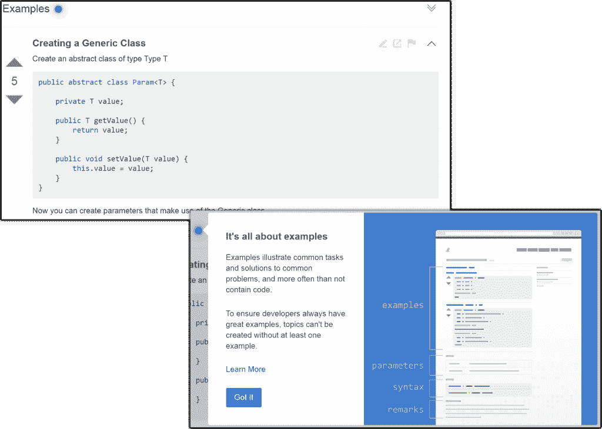

# 堆栈溢出重新映像文档

> 原文：<https://thenewstack.io/stack-overflow-reimagines-documentation/>

栈溢出给有时沉闷的软件文档工作带来了游戏化。周四，该公司推出了 Documentation，这是一项新服务，旨在记录不在公司防火墙后的每个软件程序的工作情况。

自从 2008 年推出以来， [Stack Overflow](http://stackoverflow.com/) 已经成为[非常受欢迎的](http://www.alexa.com/siteinfo/stackoverflow.com)社区驱动的问答网站，积累了超过 1000 万个条目的内容库，几乎可以回答程序员关于他们正在使用的任何语言或技术的任何可能的问题。这种新产品是该公司迄今为止最大的扩张。

文档，现在是测试版，[建立在相同的结构](http://blog.stackoverflow.com/2016/07/introducing-stack-overflow-documentation-beta/)上；栈溢出要求开发者社区分享他们经常使用的进程的例子。

堆栈溢出社区的副总裁 Jay Hanlon 说:“大多数软件文档都是告诉而不显示的。“我们要求社区上传如何让软件工作的例子，向学习者展示如何让软件为他们工作。”

> 通过抛弃传统的文档章节系统，设计者创造了一个知识基于主题的结构。

文档化的关键是将文档化请求分解成小单元。该公司并没有要求工程师提交每个软件的完整文档，只是一个如何完成一个独立功能的例子，与相关的动作相联系。这些例子是文档创新的关键。

该公司希望，通过上传一个展示如何完成一项功能的可视化示例，然后将其与相关的动作相链接，该社区将构建可访问、可用、准确和可视的软件流程示例。

Hanlon 说，就像堆栈溢出问答一样，提交的内容将被投票表决，所以最好的会浮到顶部。

此外，该公司正在保持问答反馈循环，旨在让贡献者看到他们的提交对他人有多大帮助。这个循环的目的是让人们知道他们帮助了多少人。

通过抛弃传统的文档章节系统，设计者创造了一个知识基于主题的结构。在主题下面是备注、语法和示例部分。

## 更多示例

Hanlon 最感兴趣的是示例部分，因为即使是文档最完善的软件也很少使用示例。

为了启动内容流，该公司宣布了与主要公司的合作伙伴关系，这些公司已经与 Stack Overflow 文档合作。已经入局的:微软，英特尔，Paypal， [Dropbox](https://www.dropbox.com/home) ， [Twilio](https://www.twilio.com) ，[流星](https://www.meteor.com)， [Xamarin](https://www.xamarin.com) ， [PubNub](https://www.pubnub.com) ，以及 [Twitch](https://www.twitch.tv) 。这些公司不打算替换他们当前的文档，而是向社区添加材料。

几年内没有计划好的软件的自始至终的文档。堆栈溢出将等待社区创建文档后再考虑端到端流。

文档将允许工程师为堆栈溢出社区做贡献。汉伦与全国各地的工程师交谈，他总是问的一个问题是，“你有贡献吗？”答案通常是否定的。不仅已经有了这么多可用的内容，当新的问题出现时，已经做出成功贡献的工程师有第一次机会回答问题。

随着需要大量内容的文档的出现，这种情况发生了变化。为了增加甜头，公司还会提供徽章和奖品。例如，在接下来的四周内做出贡献的人将获得一枚银色的“文档先锋”徽章，并可以参加竞赛，赢得 100 件 Stack Overflow T 恤中的一件。赃物！

因此，如果你一直渴望为 Stack Overflow 做贡献，向他们展示你的最佳流程，让社区投票支持你。

格伦·诺布尔[通过](https://unsplash.com/@glennoble) Unsplash 拍摄的特写图像。

<svg xmlns:xlink="http://www.w3.org/1999/xlink" viewBox="0 0 68 31" version="1.1"><title>Group</title> <desc>Created with Sketch.</desc></svg>