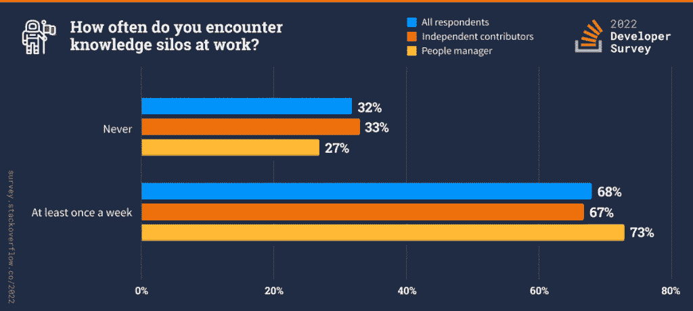

# 堆栈溢出:Rust 仍然是最受欢迎的，但 Clojure 支付最好

> 原文：<https://thenewstack.io/stack-overflow-rust-remains-most-favored-but-clojure-pays-the-most/>

2022 年度堆栈溢出开发者调查结果出来了！来自 180 多个国家/地区的 73，000 多名开发人员完成了本次调查，其中前五名是美国、印度、德国、英国和加拿大。

今年增加了新的问题，使得完成调查的时间稍微长了一点，因为受开发人员欢迎的问答网站 [Stack Overflow](https://stackoverflow.com/) 希望在不删除旧问题的情况下创建新的问题系列，以继续跟踪它已经跟踪的数据。一些较新的问题包括程序员选择如何学习和学习什么。

[大卫·吉普森](https://www.linkedin.com/in/davidgibsonp/)和瑞安·多诺冯在[最近的文章](https://stackoverflow.blog/2022/06/22/asked-and-answered-the-results-for-the-2022-developer-survey-are-here/)中分析了一些结果。开发者调查的完整结果可以在[这里](https://survey.stackoverflow.co/2022/#overview)找到。结果数据集将于今年晚些时候发布。

## 给我看看那笔钱

Clojure 是收入最高的语言，平均年薪中位数为 106644 美元。薪酬最高的技术是厨师，平均年薪中位数为 12 万美元。

然而，考虑到成本，厨师也被认为是最可怕的其他工具之一。Apache Spark、Apache Kafka 和 Hadoop 的年薪中位数分别为 87，948 美元、83，182 美元和 76，000 美元，构成了其他框架和库类别的前三名。

平均而言，2021 年至 2022 年间，工资中位数增长了约 23%，其中 Flow、COBOL、Couchbase 和 IBM Cloud/ Watson 的工资增幅最大。有主机托管经验的开发人员比只有云经验的开发人员收入更高。

## **远程工作**

在调查中，近 85%的组织[至少有一名远程员工。进一步说，  43%的组织是完全远程的，42%是混合的。自 2021 年以来，将自己列为独立承包商、自由职业者或个体户的专业开发人员的比例上升了约 5 个百分点，达到 16.6%，而相反，全职就业比例下降了。原文提出了这样一个问题，“远程工作的转变是否也引发了新一轮的创业浪潮？”](https://survey.stackoverflow.co/2022/#section-employment-employment-status)

## **科技排名**

连续第七年， [Rust 是最受欢迎的语言](https://survey.stackoverflow.co/2022/#section-most-loved-dreaded-and-wanted-programming-scripting-and-markup-languages)，87%的开发者表示他们想继续使用它。Rust 与 [Python](https://thenewstack.io/an-introduction-to-python-a-language-for-the-ages/) 并列为最受欢迎的技术(意味着开发人员目前没有使用该语言进行开发，但愿意使用),有 17.6%的受访者表示有兴趣使用它进行开发，然而， [Typescript](https://thenewstack.io/typescript-and-the-power-of-a-statically-typed-language/) 紧随其后，有 17%的受访者表示有兴趣。

Docker 和 Kubernetes 在最受欢迎(分别为 77%和 75%)和最受欢迎(分别为 37%和 24%)方面分列第一和第二位。至于最受欢迎的框架，新人 Phoenix (84%)击败了去年的新人赢家 Svelte (75%)，这对 Stack Overflow 团队来说是一个惊喜。最受欢迎的框架是 React，Node 排在第二位(分别为 23%和 16%)。

## **我们如何学习和学习什么**

学习材料的划分根据学习者的年龄而变化。在 18 岁以下年龄组中，只有 37%的受访者使用书籍/实体媒体，而在 45-54 岁年龄组中，84%的受访者使用书籍/实体媒体。这一数字在 20 到 30 岁的年龄组中稳步增长，并在较高年龄组中保持不变。

[堆栈溢出](https://stackoverflow.com/)是收藏夹。仅次于技术文档，分别有 88%和 86%的受访者使用这些资源。这表明，对于公司来说，拥有适当的、编写良好的文档和一个活跃的社区来提供可靠的堆栈溢出解决方案是多么重要。

Udemy 是在线课程的领导者，66%的受访者表示他们使用 Udemy 和 Coursera，但紧随其后，有 35%的受访者使用它们。

## **问题、答案和筒仓**

2022 年的调查引入了一个新的部分，内容是什么影响工作效率，它发生的频率，以及从他们的一天到超过 36，000 名开发人员回答需要多长时间。Stack Overflow 表示，它希望“帮助开发人员社区开始量化日常的、不可见的生产力摩擦的影响。”

以下是一些要点。

**知识仓库:**大多数开发人员每周都会经历某种程度的生产力下降。68%的受访者表示，他们每周都会遇到一个知识筒仓。对于人事经理来说，这个数字上升到 73%。

**问题:**约 63%的受访者每天花 30 多分钟寻找答案或解决方案，其中 25%的受访者每天花一个多小时。

**答案:**约 46%的受访者每天花 30 分钟以上回答问题，对于人事经理来说，这个数字要高得多。

## **紫色链接**

两年前，该调查引入了一个问题，即受访者在搜索答案时发现一个紫色链接或用户已经访问过的页面时的感受。他们会不会重访？数据专家对 62%的常规堆栈溢出用户的回答是肯定的(常规用户的定义是在三个月内访问堆栈溢出超过五次的人)。原始文章说，一位堆栈溢出数据科学家告诉作者，他每个月都会访问某个堆栈溢出问题/答案一次，以获得进一步的证明！

<svg xmlns:xlink="http://www.w3.org/1999/xlink" viewBox="0 0 68 31" version="1.1"><title>Group</title> <desc>Created with Sketch.</desc></svg>