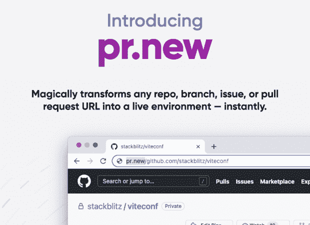
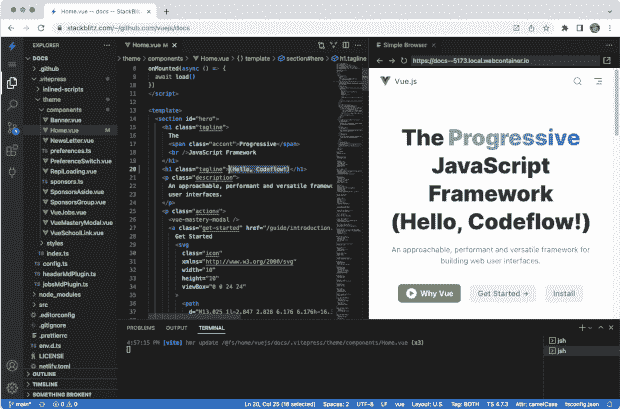

# StackBlitz 推出 Codeflow 并宣布 Figma 投资

> 原文：<https://thenewstack.io/stackblitz-launches-codeflow-and-announces-figma-investment/>

“StackBlitz 在很大程度上是 Figma 为设计所做的开发类比，”StackBlitz 的联合创始人兼首席执行官 Eric Simons 在一次采访中告诉我。今天，StackBlitz 宣布了一个新的 GitHub 集成产品 Codeflow，以及 Simons 所说的“来自 Figma 的战略投资”，这是在 [Figma 被 Adobe](https://thenewstack.io/adobe-buys-figma-what-does-this-mean-for-web-standards/) 以 200 亿美元的交易收购前几周开始的。

[StackBlitz](https://stackblitz.com/) 是一个[云 IDE](https://thenewstack.io/why-cloud-ides-are-shifting-to-a-platform-as-a-service-model/) ，旨在给开发者“即时开发体验”它有一个用微软开源 VS 代码构建的编辑器，但 StackBlitz 的核心是一项名为 WebContainers 的专有技术，该公司将其描述为“第一个基于 WebAssembly 的操作系统”。去年 5 月推出的[，WebContainers“允许你创建在几毫秒内启动的全栈 Node.js 环境。”西蒙斯说，这项专利刚刚获得美国专利商标局(USPTO)的批准，并于今天发布。](https://blog.stackblitz.com/posts/introducing-webcontainers/)

[Codeflow](https://stackblitz.com/codeflow) ，今天在 [ViteConf](https://viteconf.org/) 发布的新产品，将一键式 GitHub 集成添加到 StackBlitz IDE 中。它将使开发人员能够“即时无缝地创建和审查拉式请求”作为此次发布的一部分，PR.new 允许您在真实环境中即时打开任何 GitHub URL。

StackBlitz 的 pr.new，Codeflow 的一部分

有超过 200 万开发人员在使用它的产品，StackBlitz 是众多云 ide 中的一员，它们正在争夺作为基于浏览器的开发环境的首选工具的位置。但与网页设计领域的 Figma 不同，目前还没有一款网络工具脱颖而出——尽管 Simons 不这么认为。

“它实际上是在你的浏览器中批发运行桌面版的 VS 代码。以前没有人能够做到这一点，”他说，并补充说，StackBlitz 使用 WebContainers 实现了这一点。“其他[项目]已经让 VS 代码在浏览器中运行，比如 VS Code . dev[微软的在线 IDE，去年 10 月宣布[]，但你实际上不能运行需要操作系统或 Node.js 的桌面扩展，而且没有终端，等等。因此，[StackBlitz]实际上是真正的交易，完全在您的浏览器中。”](https://code.visualstudio.com/blogs/2021/10/20/vscode-dev)

## 在多火炉上烹饪

尽管 StackBlitz 是一个基于浏览器的 IDE，Simons 说开发人员仍然需要他们的本地主机来存储他们的数据并与主存储库同步。Codeflow 旨在让开发人员更容易使用这一工作流程。

“local 的问题是，你有一份正在处理的回购协议副本，”他说，“通常开发人员会开发一个功能[……]，但整个星期，他们都有一个产品经理说，嘿，我需要你安装一个紧急修复程序。如果他们需要这样做，他们必须将他们的更改保存在本地，拉下一个新的分支，安装依赖项，等等等等，发送出去，然后再转回来(继续工作)。因此，这有点像开发人员今天正在开发的单燃烧器炉灶。”

根据 Simons 的说法，Codeflow 为开发人员提供了一个“多燃烧器火炉”,他们可以在 StackBlitz 环境中做任何事情。

“你仍然有你的主燃烧器，你可以在那里烹饪你的牛排——你知道，你正在开发的大功能——但当有东西进来时，你可以在 GitHub 中有一个快速的方法，立即旋转环境，真的是立即。”

## 目标:类似 Figma 的协作

最终，StackBlitz 想要实现的东西与 Figma 在设计方面所做的非常相似:使开发能够协作进行，完全在线和实时进行。西蒙斯说，StackBlitz 已经花了几年时间来建立这一点。

“如果你看看 Figma 发生的事情，那是同样的事情——Dylan 和 Evan(创始人)花了数年时间建立这个渲染引擎，然后他们才能真正开始围绕它建立协作软件。同样的事情在这里。”

与 Figma 一样，它的目标是将用户群扩展到核心受众之外:在 StackBlitz 的案例中，是开发人员。低代码和无代码最近已经成为产品类别的趋势，主要是因为它们给了非开发人员一种创建商业应用程序的方式。StackBlitz 也想参与进来。

“StackBlitz 不仅仅是为使用 IDE 的开发人员设计的，它也是这种低代码或无代码未来的桥梁，”Simons 说。“但关键的基本要素是在浏览器中使用现有的工具链来完成这些工作。”

Simons 说，Codeflow 将有助于向低代码发展。

StackBlitz 在行动([点击此处](https://cdn.thenewstack.io/media/2022/10/7d05169d-codeflow_screenshot_large.jpeg)查看全尺寸图片)

“Codeflow 是公司新时代的曙光，”他说，并指出它目前处于测试阶段，将于 2023 年“在 Q1 的某个时候”正式推出。他又一次提到了菲格玛作为对比。“他们给设计带来的是其他人被卷入设计过程，这在以前是不可能的，因为商务人士不必下载 Photoshop，也不必有许可证来查看设计并对其进行评论，以及诸如此类的事情。”

在 StackBlitz 的例子中，他继续说，“你可以打开链接，整个操作系统启动一个完整的开发工具链，始终没有问题，对你来说完全透明，你只需输入文字，然后你的营销网站就会改变。这开启了一个相当广阔的未来，在那里你可以看到人们编写实际的产品代码，而他们甚至不知道如何编写产品代码。因此，我认为，无论是对开发人员还是非开发人员来说，这都将是协作的一大福音，对生产力软件来说也是如此。”

## 利用 Web 改进本地主机

埃里克·西蒙斯和他的联合创始人[阿尔伯特·派](https://twitter.com/iamalbertpai)(首席技术官)从小就认识，两人也是 Figma 的创始 CEO [迪伦·菲尔德](https://twitter.com/zoink)的朋友。西蒙斯告诉我，他在 2013 年的一次 Caltrain 上与菲尔德的对话，当时菲尔德告诉他，他正在构建“Photoshop，但更好的浏览器。”正如西蒙斯所说，他最初对菲尔德的想法持怀疑态度——“你能在浏览器中做到这一点吗，会有人想用它吗？”但当然，事实证明菲尔德是对的，他为 Adobe 带来了 200 亿美元的价值。

很明显，Simons 希望 StackBlitz 用开发人员 ide 实现类似的东西，但他也承认 localhost 在不久的将来不会去任何地方。

“你不需要删除你的本地环境，”他坚持说，“因为你的本地环境工作得很好。问题只是一份本地拷贝不足以让你完成工作。”

这就是 Codeflow 及其多燃烧器炉灶方法的用武之地。但从合作的角度来看，Simons 最终希望 StackBlitz 成为一个 URL，开发者(和其他人)“只需立即进入那里”，他们不必考虑开发应用程序的复杂性。“人们会自然而然地开始使用浏览器做这些事情，”他说。

<svg xmlns:xlink="http://www.w3.org/1999/xlink" viewBox="0 0 68 31" version="1.1"><title>Group</title> <desc>Created with Sketch.</desc></svg>