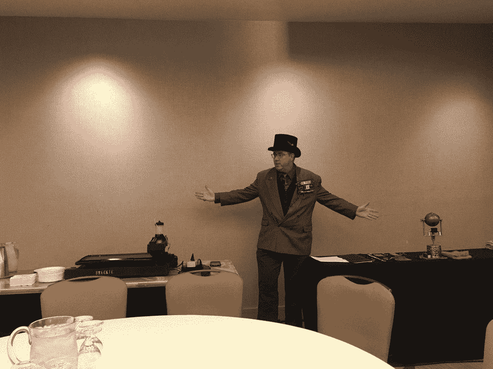

# 煎锅机器人斯塔基和它的蒸汽朋克伙伴来到了硅谷

> 原文：<https://thenewstack.io/stackie-pancakebot-steampunk-pals-hit-silicon-valley/>

Stackie，我们的[促销煎饼机器人](https://thenewstack.io/off-shelf-hacker-stackie-pancake-bot-tours-berlin/)本周出现在圣克拉拉的云铸造峰会上，参加我们的煎饼早餐播客。我们也有几个蒸汽朋克小工具，在过去现成的黑客专栏中有所介绍。今天，我想简要介绍一下我们展示的内容，并提供一些技巧，也许能帮助你下次在舞台上做“硬件演示”时避免麻烦

## 为演出准备零件

使用我们的 3D 煎饼机[煎饼机](http://www.pancakebot.com)可能是一个挑战。我们单位的箱子，我们称之为 Stackie，正好符合托运行李的尺寸限制，所以必须托运。我们总有机会带着行李箱到达你的目的地，但是没有斯塔基。

类似的事情经常发生。例如，柏林演出结束后，当我回到奥兰多时，斯塔基失踪了。还好是在进站的那一边。大约过了一个星期，一个开着普通白色货车的家伙神秘地停下来，把这个任性的机器人放在我家前门。我想斯塔基在离开德国时一定在啤酒花园玩得很开心，然后在都柏林和周围狂欢了很久。哦，斯塔基可能会讲的故事。

当音频/视频人员指着你兴奋地说“开始！”时，斯塔基会变得喜怒无常还是决定不工作？那也发生了。在峰会上，斯塔基只打印了前两三个煎饼的点，然后就进入了或多或少的工作状态。

由于有更多的设备需要运输、管理和操作，演示成功的风险被放大了一点。我非常欣赏成功的车库乐队。你要为观众表演，搬运所有的设备，确保一切正常。有时候，我觉得自己像个乐队管理员。

寻找刺激和几乎不变的运动？这是你的工作。

## 我需要两张桌子

斯塔基通常坐在房间前面的桌子上。需要有足够的空间来放置电源板、Stackie 本身、面糊制作操作空间以及盘子和餐巾的煎饼准备区。

我们用第二张桌子放我带来的蒸汽朋克设备。两张桌子之间有三英尺的间隙，所以我可以很容易地走到观众中间。我总是喜欢把东西拿出来给人看一些细节。我认为这增加了谈话主题的真实性和可信度。

站在两张桌子之间，看着外面的观众，小工具在我的左边，斯塔基在右边。在这种情况下，确保桌子的前后左右都有足够的空间。如果可能的话，在演出之前，也试着练习你绕着桌子走到观众中间的常规动作。

## 小工具列表

我喜欢使用幻灯片作为我在技术演讲中所涉及主题的视觉提示和时间标记。对于我在早餐会上的演示，我们决定不将硬件演示与幻灯片协调起来。好消息是，您可以通过硬件设备的排列获得相同的效果。

例如，这个演讲必须适合 10 分钟的时间，所以我把第一个设备放在最左边，然后再回到右边。最后两分钟左右将专注于 Stackie，所以移到右手边的桌子，提供了一个心理转变和微妙的指标，表明我们正在接近时间限制。

当然，在演示过程中，我坐在桌子上 Stackie 的左边，让我的智能手机运行着一个大的显示计时器。永远不要猜测你在演示中的时间线。用计时器排练，这样你就可以习惯在直播时使用计时器。然后在你的演讲中使用它。

我以一个非常简短的 Torq 博士的简历和对物理计算和蒸汽朋克的解释开始了演讲，这是我们许多现成的黑客故事的基础。

> 请记住，任何时候你实际运行一个设备演示，它总是有可能不能正常工作，甚至崩溃。

接下来，我讨论了 Arduino 和 Raspberry Pi 之间的区别。微控制器革命已经进行了十年，人们仍然对这两者感到困惑。Arduino 是基于固件的设备，而 Raspberry Pi 有操作系统。

当我展示我的[蒸汽朋克眼球](https://thenewstack.io/off-shelf-hacker-behold-steampunk-eyeball-complete-part-5/)时，我们开始加速。人们喜欢在演示中看到运动，我选择这个设备的一个原因是，当我在舞台上走动时，它会跟踪一个物体。一些观众称之为魔术。观众似乎喜欢眼球的复杂性和奇特性。

也许，在未来，我们必须建立一个更大的眼球，因为这个早餐大约有 100 人。我知道后面的桌子很难看到一个 12 英寸高的设备。当然，你知道这意味着什么:更大的箱子和更重的东西要运到一个展览上。这些就是权衡。

接下来，我覆盖了第一代 Arduino/1.8”彩色 LCD [蒸汽朋克会议徽章](https://thenewstack.io/hacking-hardware-the-never-ending-saga-of-steampunk-name-badge-development/)。我要展示的只是黄铜骨架和皮革背。这是可以的，因为它显示了我的徽章发展的不成熟，在它目前的发展阶段。

然后，我换上了我佩戴的两件式(第四代)徽章，它与我在演讲时穿的蒸汽朋克服装和大礼帽搭配得很好。这个设备又大又俗气，同时补充了蒸汽朋克的氛围和斯塔基·潘切克博特。当然，当我在舞台上走动时，观众可以看到。在展览的小组讨论部分结束时，一些与会者提出了关于第四代徽章的问题。

在总结 Stackie 之前，第五个(也是当前的)gen 徽章是我讨论的最后一个设备。我把这个设备放在演讲的最后，因为它是所有设备中最精致的，当它戴在会场上时，可能会吸引很多注意力。的确如此……人们记得煎饼早餐会上的徽章和蒸汽朋克装扮。自然，这提供了一个机会来提及新的堆栈，谈论网站和播客运营。

请记住，任何时候你实际运行一个设备演示，它总是有可能不能正常工作，甚至崩溃。你可能会考虑只演示那些稳定的小工具，并且有良好的引导记录，做它们应该做的事情。我和演讲者休息室里的演讲者聊过，他们整晚都在运行他们的产品。那是一条艰难的道路。诚然，事情会发生，调整有时是绝对必要的，因为“表演必须继续。”最好早点开始组织你的硬件演示，并且全神贯注于准备工作。

现在，你可以一窥会议硬件演示的有趣世界了。这很有趣，并提供了一个回到 [TNS 文章](https://www.thenewstack.io)的很好的连接。

嘿，斯塔基，下次别忘了我们。演出结束后，乐队成员也喜欢吃点心。

<svg xmlns:xlink="http://www.w3.org/1999/xlink" viewBox="0 0 68 31" version="1.1"><title>Group</title> <desc>Created with Sketch.</desc></svg>