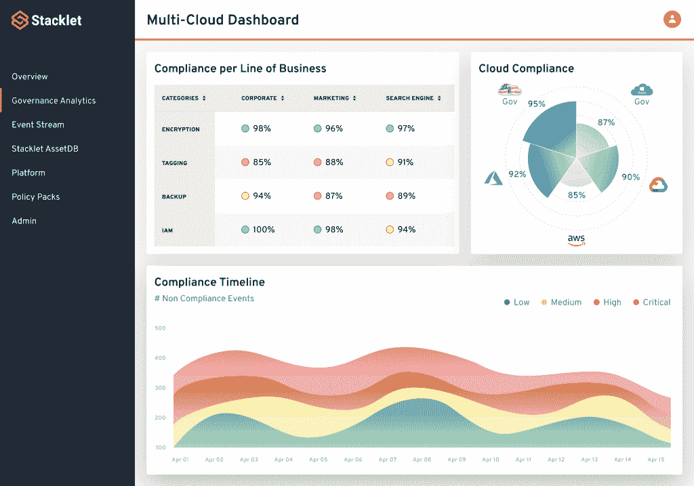
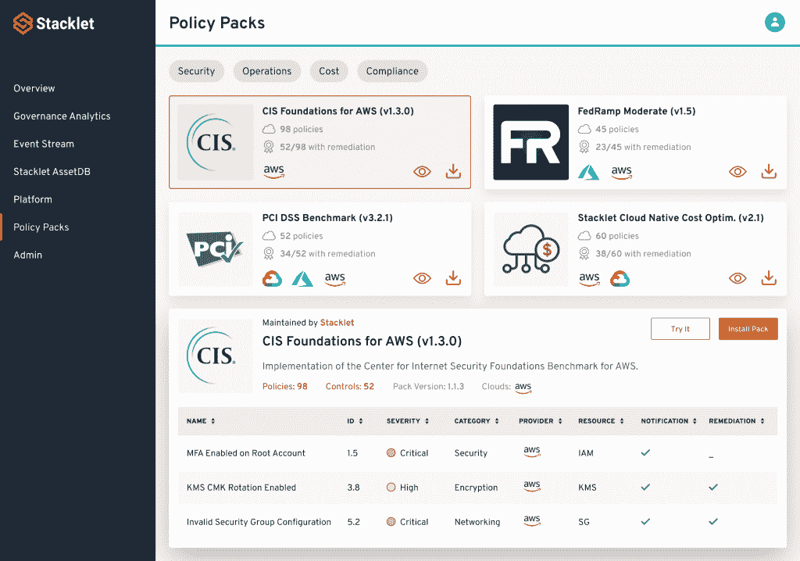

# Stacklet 平台为企业带来托管云托管服务

> 原文：<https://thenewstack.io/stacklet-platform-brings-managed-cloud-custodian-to-the-enterprise/>

随着 Stacklet 平台的推出，Stacklet 本周发布了其标志性产品，该公司在一份声明中表示，这是一个“行业首创的云治理代码平台”。

Stacklet 平台基于开源的[云托管](https://cloudcustodian.io/)，去年夏天成为[云原生计算基金会(CNCF)](https://www.cncf.io/) 沙盒级项目，并扩展了许多功能，包括管理、实时云资产可见性和开箱即用的策略包，以帮助企业快速入门。

“Stacklet 平台的关键价值支柱是采用开源中存在的这种经过验证的模型，但通过 DIY 进行体验，并产生一种受管理的发行版，允许客户非常快速地扩展它，”Stacklet 联合创始人兼首席执行官 [Travis Stanfield](https://www.linkedin.com/in/travis-stanfield-32944/) 说。“他们现在可以在成百上千个具有非常复杂的分层策略的云帐户中运行 it，在某些情况下，我们会提供现成的策略，在某些情况下，他们会根据自己的需求进行创作和定制。”

作为代码的治理是“作为代码”方法领域的一个相对较新的参与者，所有这些都为组织提供了一种方法，其中配置作为代码存储在 Git 存储库中，然后作为事实的中心来源。当变更被做出并提交到存储库时，这些变更就开始生效了。使用基础设施作为代码，这些更改是对基础设施进行的，而使用治理作为代码，这些更改应用于许多领域的配置。

与开源云托管平台一样，Stacklet 平台的组织使用 YAML 领域特定语言(DSL)来定义他们的治理，Stanfield 表示，Stacklet 根据几个特定领域将治理定义为代码:安全态势、云成本、政府监管合规性，以及“经典但痛苦的云操作，如标记、集中日志记录和备份，”该公司表示。

“我们的 YAML DSL 非常适合云资源。斯坦菲尔德在一封电子邮件中写道:“这本书可读性很强，不像通常与 Kubernetes 联系在一起的冗长的 YAML 那样冗长。”。“我们从企业公司看到的替代方案之一是创建查询云 API 的临时管理脚本。这些特别的脚本更难构建和维护，因此使用我们的 YAML DSL 可以提高开发人员的工作效率。”

Stacklet Platform 的代码治理方法适用的一些具体示例包括 NIST、CSF、PCI-DSS、HIPAA 和 CIS 基准等合规性框架，以及安全策略的实时实施，通过调整规模、垃圾收集和取消不需要的云资源的配置，以及通过上述标记、记录和备份来控制成本。Stacklet 首席技术官兼联合创始人 Kapil Thangavelu 表示，这些变化本身是通过三大受支持的云提供商的无服务器平台实现的。Thangavelu 也恰好是云托管背后的原始开发者之一。

“它直接与三大云平台无服务器基础设施集成，这样它就能够在各自的平台上实时评估和审计事件、API 调用，”他说。“因此，它直接与 AWS Lambda、谷歌云功能、Azure 功能集成，并使用这些功能作为基准功能来评估数百种资源。它将此作为一个集成点来提供实时、操作简单的基于事件的评估，但它是在特定云提供商的整个资源群中进行的，涵盖了从物联网到远程桌面、机器学习到数据库的数百种事物。”

除此之外，Stacklet 平台扩展云托管的方式之一是提供这些现成的策略包，Stanfield 说:“允许您从最佳实践开始，我们在 Stacklet 可以说我们测试过，我们支持，我们知道这些将帮助您加速。”

Thangavelu 表示，就资源类型和其他特征而言，策略包具有“丰富的元数据”，在安装期间，“会自动发现他们在云基础设施中的帐户，然后他们可以映射到这些帐户，作为他们希望在这些环境中实施的策略的帐户集合。”

虽然 Stacklet Platform 被称为云平台，但它目前是通过 Docker 容器安装的，并作为私有实例在内部运行，通过引导式设置在组织的各种云帐户上启动和运行。目前，定价是不公开的，Kubernetes 的支持程度相当于云托管本身提供的支持。

“Stacklet 的主要任务是帮助客户在云中得到良好的管理。这涉及云中的所有资产。Kubernetes 代表了企业使用云的一部分，因此，是的，使用 Kubernetes 的客户绝对会从 Stacklet 中获得很多价值，”Stanfield 写道。“开源项目(云托管)支持 Kubernetes。Stacklet 专注于客户的基础设施需求，Kubernetes 在其中发挥了作用，但目前还不是最强烈或最具体的要求。随着时间的推移，Stacklet 将根据我们从客户那里听到的信息，继续提供更丰富的 Kubernetes 功能。”

<svg xmlns:xlink="http://www.w3.org/1999/xlink" viewBox="0 0 68 31" version="1.1"><title>Group</title> <desc>Created with Sketch.</desc></svg>