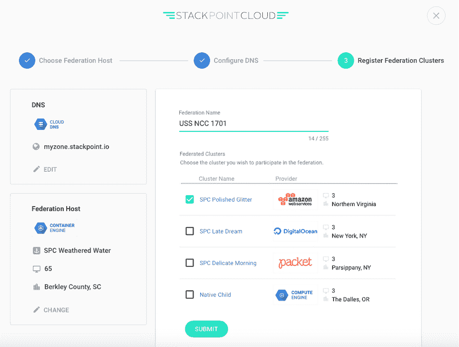

# StackPointCloud 的软件联合了多个 Kubernetes 部署

> 原文：<https://thenewstack.io/stackpointcloud-makes-kubernetes-setup-3-step-process/>

纽约初创公司 StackPointCloud 推出了一款软件，该公司承诺，该软件将使用 Kubernetes 联邦控制平面，简化不同云提供商之间的多个 Kubernetes 部署的聚合。

该过程允许用户跨[谷歌容器引擎](https://cloud.google.com/container-engine/) (GKE)、[谷歌计算引擎](https://cloud.google.com/compute/) (GCE)、[亚马逊网络服务](https://aws.amazon.com/) (AWS)、[微软 Azure](https://azure.microsoft.com/en-us/) 或[数字海洋](https://www.digitalocean.com/)联合集群。

StackPointCloud 首席执行官 [Matt Baldwin](https://twitter.com/baldwinmathew) 表示:“我们的目的是将 [Kubernetes](/category/kubernetes/) 生态系统整合到控制平面中，以便您可以在任何云提供商上构建 Kubernetes 集群，并能够部署像 [Sysdig](http://www.sysdig.org/) 和 [Fabric8](https://fabric8.io/) 这样的解决方案，并继续添加更多的第三方。

该软件还简化了部署 Kubernetes 集群的过程，将该过程简化为三个步骤。

该公司在本周于西雅图举行的 KubeCon 会议上宣布了这项新技术。

Kubernetes 联合控制平面([最初称为“Uber netes”](https://github.com/kubernetes/kubernetes/blob/release-1.3/docs/design/federated-services.md))提供了一个中央联合名称空间，使用 etcd 数据存储来跟踪跨多个部署运行的集群。对于希望在多个云提供商之间运行容器化操作的组织来说，这可能非常有用，这样可以实现负载平衡、故障转移，并且通常不会局限于一个云提供商。

“我们试图让它像部署数字海洋水滴一样简单，”鲍德温说。“我们试图消除许多潜在的复杂性。我们试图让建立 Kubernetes 变得尽可能简单。”

在自动设置中，用户只需选择一个联合主机，配置 DNS，然后注册联合群集。

“我们在幕后制定了许多最佳实践决策，并努力让它成为一个干净的界面。我们不希望用户感到困惑，这是 Kubernetes 项目的主要问题之一，即可用性和构建一致性，”Baldwin 说。

它预装了仪表板之类的东西——它通过 SSL 连接建立隧道，所以它总是安全的。它预先创建了 **kubeconfig** 文件，因此用户只需下载该文件，就可以开始使用 [kubectl](http://kubernetes.io/docs/user-guide/kubectl-overview/) 。还有一个 onboarding 文件，允许用户将 [Docker Compose](https://docs.docker.com/compose/) 文件拖放到 StackPointCloud 接口中；它检查文件以确保“其中没有任何不可靠的东西”，然后将其转换为一组 Kubernetes 清单，这些清单被重新打包为一个应用程序，用户可以将其发送到集群中。

## 专注于简单、选择

该公司于 5 月在柏林的 CoreOS Fest 上正式发布。

Baldwin 说，它建立在提供复杂架构的一键实现的理念上。然而，为了提供食物，它承担了合同工作——云提供商接洽它来提供各种 DevOps 工具和其他工作。现在它是一个 13 人的团队，其中 9 人仍在处理服务合同。

它从 0.11 开始与 Kubernetes 合作，并一直在迭代原型。更接近 CoreOS Fest，它开始在用于裸机部署的[可信平台模块](http://www.trustedcomputinggroup.org/trusted-platform-module-tpm-summary/) (TPM)上与 CoreOS 和[数据包](https://www.packet.net/)更紧密地合作。

鲍德温说:“我们都是关于高可用性、漂亮的界面和选择，所以用户不必被迫进入一个特定的堆栈。”

它在 9 月宣布了针对 Kubernetes 的 HAProxy，并正在努力将其重新纳入 Kubernetes 项目。

“我们可能会与他们合作，重构该项目中入口控制器的处理方式，使它们变得可插拔。用户通过我们的应用构建的每个集群都会自动配置生产负载平衡，因此我们会自动使用 HAProxy 对它们进行配置，”他说。

它还计划为其支持的每个云提供商贡献一个节点集群 autoscaler。

它还在集成开发平台 [fabric8](https://blog.fabric8.io/the-easiest-way-to-get-started-with-fabric8-on-the-public-cloud-is-now-stackpointcloud-2f2083d91bf4#.hria4ciat) 上与 Red Hat 合作。Baldwin 说，它自动化了整个过程，因此用户可以在大约 10 分钟内建立开发平台。虽然这是针对亚马逊的，但对其他云供应商的支持将在以后添加。

“我们正在修建许多通往库伯内特斯的‘高速公路’。我们希望开发许多入职工具。Docker Compose 是第一个。我们为其他人制定了计划，”鲍德温说。

它还致力于让人们能够将集群从亚马逊联合到谷歌，这样他们就可以选择将工作负载放在哪里。

“为了实现这种梦想场景，该项目还有很多工作要做:你所有的工作负载都在运行 Kubernetes，你可以在云提供商之间转移它们。有很多途径，像亚马逊的亚马逊关系数据库服务( [RDS](https://aws.amazon.com/rds/) )是很难摆脱的，但我们正在努力建立这种理想。他说:“如果你需要裸机，让你的一些工作负载在数据包上运行，而其余的工作负载在数字海洋上运行——诸如此类。”。

该公司将在 12 月宣布其他产品。它致力于完成生命周期的更多部分，例如如何处理升级和维护版本的挑战。随着更多提供商的加入，it 将不得不处理版本和兼容性问题。

“我们还希望为那些希望脱离 ECS 或 Rackspace 的容器解决方案的人建立入门故事。我们认为 Kubernetes 更民主——它可以在任何地方运行。因此，如果你有一个解决方案，但你厌倦了，你如何轻松地迁移到 Kubernetes？”

CoreOS、DigitalOcean、Docker 和 Red Hat 是新堆栈的赞助商。

专题图片:[漩涡我回家](https://www.flickr.com/photos/cobrasick/5297980956/in/photolist-95axaf-82onWW-dKjH2t-5fz6oN-7mf2Cx-DaE83X-eJcCFR-bJW9VK-6kybR3-H9c6v-8FpiXg-5gMy66-8Hm6Ub-eXCETW-8BEYoz-4AYuNM-8GU2nr-jPrrgj-5LoB2f-99AYfr-3vqPog-9k6v9u-DFn157-bwPxRG-rfxmM-7BKotW-enAmT-h8oMh5-bLWxXi-5LDfz6-46iNA-enAmU-qBPYnZ-apxbgZ-seFFZ-eXCEsu-h8o3dN-6dHASH-4nZKrJ-bd2Yx-LaB1V-FMd41-nrLy6u-eJ2aaJ-7ZdmeP-aLSvb4-aKPDae-cK4ENq-dnz9nr-cK4GNf)作者[尼克费希尔](https://www.flickr.com/photos/cobrasick/)，授权**CC BY-SA 2.0**。

<svg xmlns:xlink="http://www.w3.org/1999/xlink" viewBox="0 0 68 31" version="1.1"><title>Group</title> <desc>Created with Sketch.</desc></svg>