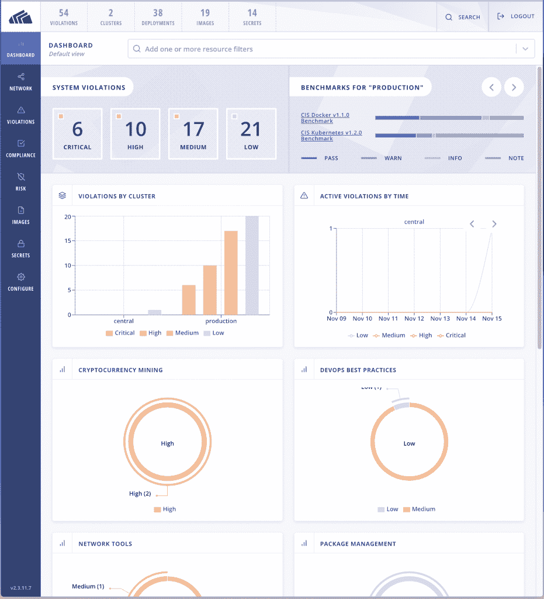
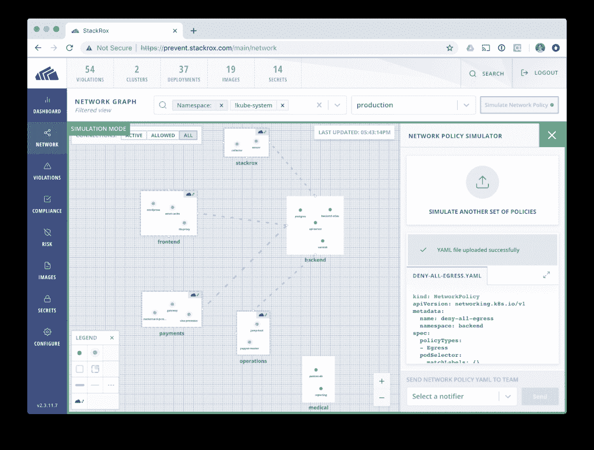
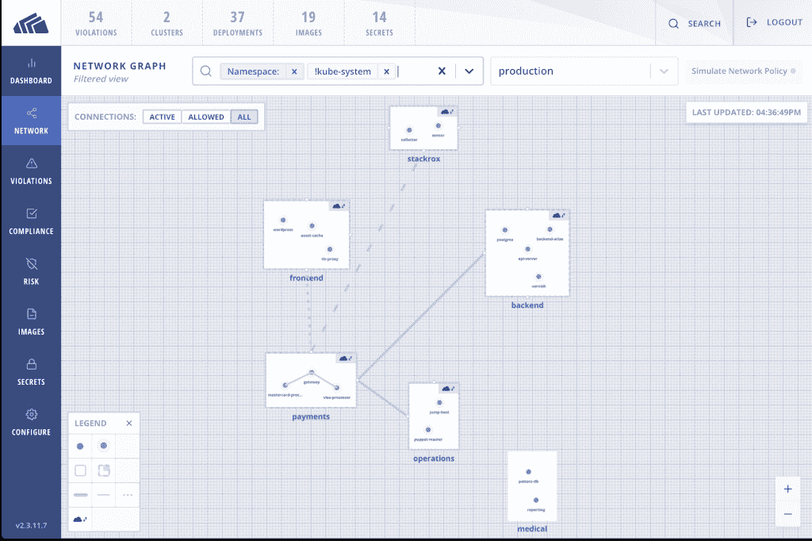

# StackRox 增加了 Kubernetes 特有的安全功能

> 原文：<https://thenewstack.io/stackrox-adds-kubernetes-specific-security-capabilities/>

当我们最后一次在容器安全公司 [StackRox](https://www.stackrox.com/) 登记时，它专注于覆盖从构建到运行时的[整个生命周期，并有一个反馈循环来更好地在过程的早期添加安全信息。](https://thenewstack.io/stackrox-adds-feedback-loop-orchestrator-security/)

现在，它在 [Kubernetes](https://www.stackrox.com/kubernetes-security/) 上加倍努力，并在编排平台已经提供的安全功能之上构建。

StackRox 产品副总裁 [Wei Lien Dang](https://www.linkedin.com/in/weiliendang/) 表示:“Kubernetes 内置了大量强大的功能，该平台旨在实现巨大的可扩展性，因此我们真的利用了该框架来提供一些创新的安全功能，这些功能与 Kubernetes 的特定功能保持一致。

一篇解释这一重点的博客文章[称，支持一系列的 orchestrator 迫使该公司提供“orchestrator 功能的最低公分母”,这意味着它无法充分支持一些客户环境。](https://www.stackrox.com/post/2019/01/stackrox-is-all-in-on-kubernetes-and-it-makes-your-container-security-better/)

v2.4 版本中增加的增强功能:

*   **以部署为中心的可见性** —它关注的不是用于启动容器的图像及其来源，而是围绕该部署的元数据和上下文。它为安全和开发团队提供了跨命名空间和集群的所有部署和 pod 的单一视图，以解决可能导致环境暴露的错误配置。

“StackRox 正在做的是给安全提供相同的观点，与 DevOps 合作的共同语言，以解决他们的应用程序的安全问题，”Dang 说。

“我们已经看到 Kubernetes 出现了新的漏洞——上个月发现了一个[漏洞。漏洞是存在的，我们为客户提供的是更好的环境，可以根据任何给定时间可能出现的特定条件或情况，在他们的环境中利用特定漏洞。”](/critical-vulnerability-allows-kubernetes-node-hacking/)

*   **多因素风险分析**考虑标签、权限、网络可达性和运行流程等信息。它会考虑诸如应用程序是否在生产中运行，是否暴露在互联网上，以及是否使用秘密等问题。

“并不是所有的信息都可以在编排平台上获得，”他说。“Kubernetes 有内置的秘密，所以我们可以在其他平台没有内置功能的情况下与之结合。

Kubernetes 通过 API 公开信息，StackRox 希望以此为基础。

【T2

“我们不打算复制机密管理功能；我们希望利用 Kubernetes 已经内置的信息来帮助客户更有效地管理他们的秘密，”他说。

*   **网络策略管理**使用 Kubernetes 中的原生控制来确保网络层的分段可扩展、一致并可跨环境移植。StackRox 增加了一个网络图，使客户能够直观地看到其允许的流量，一个针对特定应用程序的策略建议引擎，以及一个使用网络 YAML 文件的策略模拟器，使客户能够了解提议的更改将如何影响应用程序的安全风险。

Dang 说，推荐引擎指出了对已配置网络策略的潜在改变，以根据部署的实际需要来缩小允许的访问范围。

StackRox 容器安全平台被部署为使用 Kubernetes YAML 文件或舵图的容器。它支持自我管理的集群；亚马逊 EKS、Azure AKS、谷歌 GKE 等托管服务；以及 Kubernetes 发行版，如 Red Hat OpenShift 和 Docker Enterprise Edition。

虽然该公司以后可能会专注于其他技术，但 Dang 谈到其 Kubernetes 重点时说:“这是我们的发展方向，因为这是公司在业务流程方面的发展方向。”

最近的多项调查显示，Kubernetes 的企业采用率上升，New Stack 的 Lawrence Hecht 将其归因于三个因素:1)更多的组织在生产中使用容器；2) Kubernetes 已经成为领先的编排平台；3)组织选择在云原生航程中更早采用 Kubernetes。

在上个月的 New Stack Makers 播客中，Rancher 联合创始人 [Shannon Williams](https://www.linkedin.com/in/smw355/) 讨论了最近的 Kubernetes 漏洞( [CVE-2018-1002105](https://github.com/kubernetes/kubernetes/issues/71411) )以及堵塞 Kubernetes 安全漏洞的工作:

[虽然很难看，但牧场主反击了](https://thenewstack.simplecast.com/episodes/it-was-ugly-but-rancher-fought-back)

专题图片:[三只猫雕塑](https://www.flickr.com/photos/pedrosimoes7/9698576783/in/photolist-fM2JZ6-p6y47H-4NizCV-e2vreq-934f7p-5Lnhj4-oLBHGY-pCxxHw-m7m6qB-4bmds9-pfzibm-qhS1js-fJoUri-gnTAEC-nevWK2-d63vbN-k3kb6T-2tceC-bpYk7D-pBi8DD-88YbwP-9d2KpJ-i4urYC-99MgP4-dWHxGP-8aMtDr-CGj1j9-8aC3Hc-oLE82Y-5A4Zaz-98WAVS-Pxbv3Q-6AGmnP-d8D2H-qPJjkK-dLTcG6-qQhVvv-qBFzYz-dj65RB-aTZsWc-dzACa7-ddJvg3-rA48qJ-dmsHJx-b4RGhr-bvDmTe-2gpsmi-joQRUk-8YFKs2-bkEBYg)[佩德罗·里贝罗·西莫斯](https://www.flickr.com/photos/pedrosimoes7/)。根据 CC BY-SA 2.0 获得许可。

<svg xmlns:xlink="http://www.w3.org/1999/xlink" viewBox="0 0 68 31" version="1.1"><title>Group</title> <desc>Created with Sketch.</desc></svg>