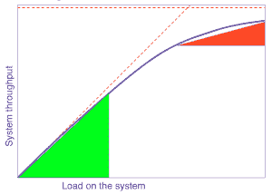
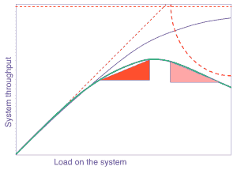

# 从堆栈中:将可伸缩性法则应用到管理中

> 原文：<https://thenewstack.io/stacks-apply-laws-scalability-management/>

虽然许多人认为术语“可伸缩性”是一个模糊的术语，但事实上，由于计算机科学研究员 Neil J. Gunther 的工作，它可以被数学定义。

回到[1993 年](http://www.perfdynamics.com/Papers/njgCMG93.pdf)，Gunther 开始制定最终成为“[通用可伸缩性定律](http://www.perfdynamics.com/Manifesto/USLscalability.html)”的公式，该公式描述了如何将资源争用和不一致性纳入系统可伸缩性的测量中。

非常粗略地说，USL 对系统的线性进行建模，通过对需要完成的工作进行排队(争用)，以及对已经完成的工作进行理解(不一致)，来考虑发生的延迟。不足为奇的是，USL 经常和阿姆达尔定律在同一个句子中被点名。

资源争用如何抑制线性可伸缩性。

因为 USL 没有拓扑依赖性，所以它被用来描述一系列并行系统，包括微处理器、集群、负载平衡器和大数据系统。像任何具有广泛适用性的公式一样，USL 认为它也有助于描述不太可量化的现象。

比如管理！

在去年四月发布的一封启发性信件中，阿德里安·科尔耶将 USL 的动力运用到了经营企业中。Colyer 在 SpringSource 被 VMware 收购之前担任首席技术官，然后担任应用程序首席技术官。如今，他是 ClusterHQ 和 Weaveworks 等公司的顾问。

在他的[晨报](http://blog.acolyer.org)博客中，Colyer 通常会检查计算机科学领域有趣的学术论文。然而，在这篇文章中，他探讨了 USL 在管理一家快速发展的公司方面可以提供的经验。

例如，争用减缓可伸缩性的观点也可以解释为什么对经理来说委派任务是重要的，而不是事事都插手。

> “作为一名领导者，你可能会享受在组织中处于领导地位的感觉。结果你真的是阿尔法(如果你不小心的话)。不是像‘顶狗’(或者猫，如果你喜欢的话)那样的阿尔法，而是像 USL 的阿尔法系数那样的阿尔法。”——阿德里安·科尔耶的极客幽默。

“当你授权不够的时候，随着组织的成长，你得到的回报会减少，”科尔耶写道。“以接近 100%的利用率工作会让依赖于你的一切慢如蜗牛。”

不一致性如何抑制线性可伸缩性？来自尼尔·巩特尔。

USL 的非相干方程式也提供了一些经验。用通俗的话来说，不一致“衡量的是就什么是正确的事情达成一致的成本。”加入决策过程的人越多，你收集到的不一致就越多。超过某一点，增加更多的人甚至会导致负回报。

根据这种想法，Colyer 总结道:“随着组织的成长，努力将需要参与任何决策的利益相关者的数量保持在最低水平。”

将科学定义扩展到非科学领域在定义上总是有风险的，正如任何一个对过度使用“熵”这个词感到畏缩的物理学家可以证明的那样。尽管如此，USL 的教训还是有教育意义的。

我们最初是由位于巴尔的摩县的马里兰大学的计算机科学和电子工程教授[蒂姆·费宁](http://www.csee.umbc.edu/~finin/)向科尔耶透露的。

费宁写道，像 USL 这样的模型“可以揭示人们如何兼顾他们的任务，无论是作为个人还是团队的一部分”。“我喜欢这个例子，因为很容易看出它如何应用到我们的日常生活中。当我有许多任务要跟踪时，我发现数学排队论中还有其他有用的例子。”

Weaveworks 是新堆栈的赞助商。

来自纽约市下东区 Vinny Vincenz Pizza 餐厅的专题图片。

<svg xmlns:xlink="http://www.w3.org/1999/xlink" viewBox="0 0 68 31" version="1.1"><title>Group</title> <desc>Created with Sketch.</desc></svg>