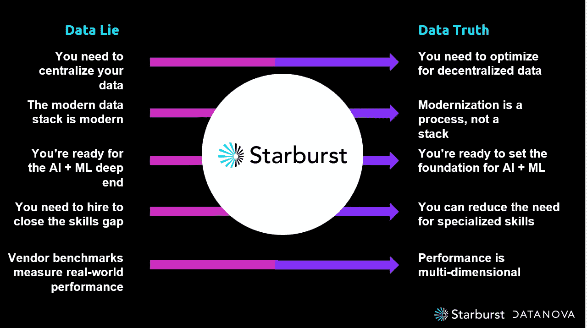

# Starburst 的首席执行官谴责大数据谎言；吹捧数据真相

> 原文：<https://thenewstack.io/starbursts-ceo-decries-big-data-lies-touts-data-truths/>

上周，在星爆数据公司的年度[数据新星](https://www.starburst.io/datanova/)活动上，首席执行官[贾斯汀·博格曼](https://www.linkedin.com/in/justinborgman/)发表了主题演讲，重点是他所谓的“5 个数据谎言”和相应的“5 个数据真相”博格曼利用谎言、真相和一些有趣的客户案例研究作为背景，宣布了 starbrust 平台的关键新功能，包括[starbrust Enterprise](https://www.starburst.io/platform/starburst-enterprise/)on-premises 和[starbrust Galaxy](https://www.starburst.io/platform/starburst-galaxy/)in the cloud。在这篇文章中，我将回顾和评论上述所有内容，并以一些关于博格曼的职业生涯、星爆的遗产以及他们如何为公司的观点和战略做出贡献的观察来结束。

## 数据中心？

据 Borgman 估计，第一个数据谎言是组织需要集中他们的数据的概念。Borgman 说，这样做速度慢，成本高，提供的数据视图有限，并且存在很大的供应商锁定风险。他补充说，即使这些问题都不存在，数据的完全集中也是不可能的。几年来，我一直认为业界需要停止将数据的分布式和分散性视为一种缺陷，并将其视为一种特性。考虑到数据需要靠近生成它的系统，而且有这么多这样的系统，我们永远无法真正赶上。

博格曼建议，组织“需要针对分散数据进行优化，而不是集中化”当然，Starburst 平台所基于的 [Trino](https://trino.io/) 技术完全是为了创建一个虚拟的联邦数据层，它集成了大量的数据源。即使一些数据需要被移动或复制到离分析它的系统更近的地方，能够合并本地和远程数据也是关键。为什么？因为创建移动所有数据的管道或从分析中排除任何必须保留的数据都是不可行的，并且这两种做法都不会促进真正的数据驱动文化。

## **星爆银河的数据产品解决方案**

除了物理位置之外，集中化与分散化的另一个问题是，数据的控制和管理是应该集中在一个组中，还是应该分布在处理该数据的业务单元中。流行的"[数据网格](https://martinfowler.com/articles/data-monolith-to-mesh.html)"方法支持分散的方法，其中每个业务领域负责创建自己的"[数据产品](https://martinfowler.com/articles/data-monolith-to-mesh.html#DataAndProductThinkingConvergence)

数据产品本质上是[数据集](https://thenewstack.io/processing-large-data-sets-in-fine-grained-parallel-streams-with-sql/)；在某些情况下，它们也可以是[API](https://thenewstack.io/apis-are-where-fun-happens/)或应用。但是，无论数据产品采取何种形式，它们都伴随着元数据和文档，以及由与数据最密切相关的实体提供的强大支持和宣传。分配这种跨职能的责任鼓励数据共享，并且应该增加对数据的信任，因为其管理者具有相关的知识。

为此，Starburst 宣布为 Starburst Galaxy 提供一个用于构建数据产品的[低代码](https://thenewstack.io/low-code-for-pro-coders/)解决方案和一个自动化数据目录，该目录具有搜索和发现功能，旨在创建数据的市场体验。根据 Starburst 的新闻稿，目录功能将有助于“使数据产品更容易找到和消费。”该解决方案建立在已经发布的数据/模式发现和数据特权功能以及作为内部 Starburst Enterprise 的一部分发布的早期数据产品解决方案之上。

## 现代数据家族

下一个谎言:现代数据堆栈是现代的。博格曼说不是。事实上，他断言今天的数据堆栈与几十年前的堆栈是一样的，只是被移到了云上。他反驳说，现代化必须来自一个过程，并在实施中表现出来，而不是正在实施的技术。博格曼在这里有一个观点，考虑到今天的云数据仓库与近二十年前开始流行并早在 20 世纪 80 年代推出的基于设备的内部产品没有什么特别的不同。

Borgman 告诉我一个 Starburst 的客户， [Priceline](https://press.priceline.com/our-story/) ，它已经开始采用数据网格方法，作为其利用存储在不同系统中的大量流和历史数据集的计划的一部分。Priceline 需要其分析解决方案来跨越其现有的 Oracle 内部数据仓库和许多谷歌云资产，包括一个[谷歌云存储](https://cloud.google.com/storage) (GCS)数据湖、 [BigQuery](https://cloud.google.com/bigquery) 和各种[云 SQL](https://cloud.google.com/sql) 实例。显然，这一新旧结合的客户使用案例展现了现代数据堆栈的细微差别。而且，由于 starbrust 的底层 Trino 引擎知道如何连接和查询多个数据源，starbrust 显然非常适合 Priceline。

## 人工智能就绪

博格曼断言，第三个谎言是，组织已经为“人工智能和人工智能的深层领域”做好了准备，即人工智能和机器学习的更高级或可操作化的实施。博格曼说，当公司开始首先建立他们的 ML 模型，然后倾向于底层数据时，他们正在以错误的方式进行。相反，博格曼认为，客户“需要在受益于昂贵的人工智能+技术人才之前建立适当的基础。”事实上，由波士顿咨询集团发起并由 Starburst 和 Red Hat 赞助的最新研究结果显示，“只有 54%的经理认为他们公司的人工智能计划创造了切实的商业价值。”

很公平，但是当公司准备好接纳这些人才的时候,《星爆》也会准备好。一项新的功能将允许数据科学家使用流行的 [Python 编程语言](https://www.python.org/)与 Starburst Enterprise 和 Starburst Galaxy 合作。事实上，starbrust 表示，无需重写代码，就可以将 [PySpark](https://spark.apache.org/docs/latest/api/python/index.html) 工作负载迁移到 starbrust&Trino。Starburst 认识到，即使在 Apache Spark 上构建他们的 ML 模型，客户也希望他们可能在那里创作的一些数据争论和功能工程代码能够直接在 Trino 上运行，以提高效率。显然，现在这将成为可能。

## 选秀节目

即使公司准备好雇用数据分析师和数据科学家，他们也可能觉得自己缺乏许多其他角色和技能。数据建模师、数据工程师、机器学习工程师等高端人才可能很难找到、吸引和负担得起。

这就引出了博格曼的第四个谎言，即组织“需要雇佣员工来弥补技能差距。”相反，博格曼认为平台应该减少对专业技能的需求。Starburst 的客户 [Genus](https://www.genusplc.com/about-us/at-a-glance/) (一家动物基因公司)和 [Glovo](https://about.glovoapp.com/) (一家服务于欧洲和非洲的食品配送提供商)都需要通过 BI 工具提供对其云数据湖的自助访问。Glovo 需要在数据网格和类别的背景下这样做，需要跨越[亚马逊网络服务](https://aws.amazon.com/?utm_content=inline-mention)和微软 Azure 的数据。两家公司都使用 Starburst 来满足他们的需求，并使商业用户可以访问数据湖。

## 启动你的引擎

Borgman 的第五个也是最后一个数据在于[供应商基准](https://thenewstack.io/cpu-benchmarks-for-cloud-providers-intel-vs-amd-vs-amazons-arm-based-graviton2/)衡量现实世界的性能。相反，Borgman 说，绩效是多维的，组织需要使用自己的工作负载整体地衡量洞察时间。

不过，多喝点果汁也无妨。为此，Starburst 宣布了一项名为 [Warp Speed](https://www.starburst.io/platform/features/warp-speed/) 的功能，它将其描述为“一种智能索引和缓存解决方案，将查询速度提高了 7 倍。”这是星际争霸银河的私人预览版，将于本月底在星际争霸企业版正式发售。

Starburst 解释说，由于成本原因，它的客户 [Doordash](https://about.doordash.com/) (著名的餐馆和商业送货服务)有几个工作负载需要从其数据仓库转移到基于亚马逊 S3 的数据湖中。与此同时，它需要*提高那些相同工作负载的*性能，而人们并不总是认为这可以通过数据湖来实现。尽管如此，Starburst 表示，Doordash 将工作负载转移到了 lake，使用 Starburst 作为查询引擎，并能够获得 10-15 倍的性能提升。

因此，即使一家数据仓库供应商——在本例中为[snow flake](https://www.snowflake.com/en/data-cloud/platform/)——可能会发布声称比数据湖解决方案更快的基准测试，在本例中，Starburst 表示它能够在湖中提供性能优势。Starburst 表示，Warp Speed“根据使用模式分析，自动识别和缓存最常用或最相关的数据”，这似乎可以解决 Borgman 关于性能和技能差距的谎言/真理争论。

## 老兵福利

博格曼和《星爆》提供的破除神话、案例研究和特色声明的组合提供了许多处理过程，但以这种方式捆绑东西也是一个很好的改变，比典型的新版本更有趣。《星爆》并不只是罗列新功能，而是在它们的价值以及它们如何解决行业中一些有问题的说辞的背景下展示它们。

鉴于来源，我印象深刻，但并不惊讶。Borgman 成立了一家名为 Hadapt 的公司，提供市场上第一批基于 Hadoop 的商业 SQL 解决方案。2014 年，Hadapt 被数据仓库先驱和巨头 [Teradata](https://www.teradata.com/About-Us/Our-History) 收购，在那里，Borgman 花了几年时间，观察该公司在应对不断变化的技术和不断变化的客户需求方面做对了什么，做错了什么。

在 Teradata 之后，Borgman 创建了 Starburst，并雇佣了一个团队在脸书创建了 [Presto](https://prestodb.io/) 查询引擎。该团队从这一 Presto 遗产中设计了 Trino 引擎，然后 Starburst 围绕该技术建立了企业发行版和云服务。博格曼从他自己的冒险、成功和错误以及他观察到的其他人身上学到了东西。如果《星爆》的平台是在这样的背景下开发的，那么在这样的背景下展示它的新特性也是有意义的。无论 Starburst 是否是您组织的正确平台，该公司的战略及其推理都为如何管理和查询数据并将其作为运营和竞争资产加以利用提供了宝贵的经验。

<svg xmlns:xlink="http://www.w3.org/1999/xlink" viewBox="0 0 68 31" version="1.1"><title>Group</title> <desc>Created with Sketch.</desc></svg>