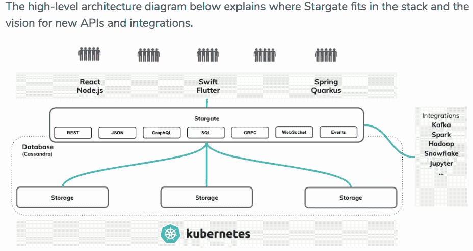

# 星际之门数据网关旨在缓解“阅读手册疲劳”

> 原文：<https://thenewstack.io/stargate-data-gateway-aims-to-ease-read-the-manual-fatigue/>

DataStax 的 [Stargate](https://stargate.io/) 开放框架数据网关，最近作为技术预览版发布，旨在使开发人员能够轻松地处理不同的数据格式和查询类型，无论是 JSON、GraphQL、SQL 还是其他什么。

当然，Stargate 是建立在 [Apache Cassandra](https://cassandra.apache.org/) 上的，Stargate 的旗舰 NoSQL 数据库。根据博客[的帖子](https://stargate.io/2020/09/14/init-stargate.html)介绍其 Cassandra 查询语言(CQL)和 REST API 的实现，它旨在缓解每个新项目的“阅读手册”疲劳。

然而，该团队设想很快有一天 Stargate 的用户不需要知道 CQL，并致力于一个更不可知论的框架，使社区成员能够创建扩展模块。

“我们希望前进的方向是完全抽象[远离]那些 Cassandra 特有的概念，这样应用程序开发人员的唯一思维就是他们的应用程序和应用程序对象。这意味着，他们告诉我们他们的书、他们的作者、他们的帖子是什么，我们把它们透明地映射到数据库中，具体来说，在这种情况下，它是 Cassandra，”DataStax 开源高级产品官 Chris Splinter 说。

该项目已经发布了一个 [GraphQL API](https://stargate.io/2020/10/05/hello-graphql.html) 和一个 [Documents API](https://stargate.io/2020/10/19/the-stargate-cassandra-documents-api.html) ，它允许大多数 Cassandra 发行版通过 REST API 与 JSON 一起工作。

## 与微服务配合良好

“开发人员实际上并不直接使用数据库。他们使用数据库 API。他们过去通常是通过驱动程序和 JDBC(Java 数据库连接)之类的东西来实现这一点，”DataStax 首席产品官 Ed Anuff 说。“但是，他们越来越不这样看待数据了。他们从‘我能使用 API 吗？我可以使用 REST API 吗？“我可以拥有为我的应用程序呈现数据的微服务吗？”"

他说，数据网关“获取你的数据库，并让它在微服务架构中发挥作用”。

开发人员“甚至在寻找新的 API 来做这件事。如果他们想实现真正的高性能、高吞吐量，他们会考虑 gRPC 之类的东西，或者他们会考虑 GraphQL。例如，如果他们想要构建前端应用程序，或者他们正在设计一些东西，比如构建 Node.js 应用程序。我们说，‘我们怎样才能把它带入卡珊德拉的世界？’这导致人们说，“你知道，实际上，你需要的是这种直接嵌入 Cassandra 的微服务网关，允许它与这些不同类型的访问机制进行对话，以处理不同类型的数据和不同类型的 API。”这就是星际之门的由来。"

这是该公司专注于让 Cassandra 更加云原生的一部分。今年早些时候，DataStax 为 Cassandra 发布了一个 [Kubernetes 运营商](https://thenewstack.io/datastax-open-sources-a-kubernetes-operator-to-ease-cassandra-management/)，并推出了 Cassandra 即服务 [Astra](https://thenewstack.io/datastax-creates-a-pain-reliever-for-cassandra-management/) 。Stargate 从关注解决 Cassandra 的 API 和微服务问题发展而来。

“我们说，‘让我们确保从第一天起，这就在 GitHub 上发布，我们与开发者合作，我们与社区互动，’”Anuff 说。

斯普林特说，它的核心租户是作为一流公民进行创新。“我们特意将这种体系结构从一开始就设计成可插拔的。我们希望确保任何人都可以进来，将他们的扩展或功能添加到 Stargate 作为一个框架。”

“我们从中获得灵感的另一件大事是卡珊德拉协调员的概念。Cassandra 协调器负责将所有请求路由到 Cassandra 环中的存储节点，”Splinter 说，并补充说这是一种可靠的方法，建立在 Cassandra 从一开始就有的[发电机](https://cassandra.apache.org/doc/latest/architecture/dynamo.html)路由概念的基础上。

“我们不想在这里重新发明轮子。实际上，我们所做的是模块化代码库，这样我们就可以添加新的访问模式和数据类型。这为您提供的最终产品实际上是一种架构，其中您将计算和存储分开，允许您独立扩展这两个单元，这是高效利用云基础架构的一种非常常见的模式。”

## **云原生设计**

Matt Asay 最近[写道](https://www.techrepublic.com/article/time-series-databases-are-hot-but-will-this-spin-on-open-source-be-cool/)“今天开发人员有各种各样的[数据库]选项可供选择，无论是文档、键值、列、关系还是多模型，”他指出可能选项太多了。例如，数据库引擎[列出了](https://db-engines.com/en/ranking) 359 个不同的数据库。

“Stargate 的目标是通过你能想到的任何 API 使你的数据对你可用，而不考虑后台数据存储，”那篇介绍性的博客文章说。

星际之门数据网关部署在客户端应用程序和数据库之间。当 Stargate 被部署时，它作为协调节点加入 Cassandra 集群，但不存储任何数据。

星际之门被分成三大类模块:

*   **API 扩展**:负责定义 API，处理请求并将其转换为数据库查询，将请求分派给持久服务，并向客户端返回和提供响应。这些扩展同时使用身份验证扩展和持久性扩展。
*   持久化扩展:实现协调层来执行 API 服务传递给底层数据存储实例的请求。
*   **认证扩展**:负责对 Stargate 的 API 进行访问控制。

当一个请求被发送到 Stargate 时，API 服务处理它，将其翻译成一个数据库查询，并将其分派给持久性服务。然后，持久性服务使用 Cassandra 的内部 QueryHandler 将请求发送给该行的存储副本。博客文章称，持久性服务处理请求，并在收到来自请求一致性级别指定的存储副本数量的确认后，对客户端做出响应。

“如果你使用类似 Istio 的东西——这是谷歌和 Kubernetes 生态系统中的其他人用于他们的微服务网关的东西——我们正在做的 Stargate 将在这种类型的架构中完美地在家，”Anuff 说，并补充说，在这种情况下，它将暴露 Cassandra 的微服务，可以在你的服务网格内消费。

“Stargate 的最终目标是在前端拥有可插拔的 API，在后端拥有可插拔的存储引擎，所有的发电机魔法都发生在中间，”它说。

展望未来，该项目旨在关注更多类型数据的 API，包括 gRPC 和流。

它不是唯一的 API 数据网关——微软、谷歌和其他公司都有自己的版本。

斯普林特说:“我们真的从一开始就瞄准了云原生设计。”“尽管之前的一些抽象层位于 Postgres、MySQL 等之上，但它们来自上一代，因此不一定是从那里开始的。但是，我们在这里确实采取了一种生于云端的方法。

“就我所看到的其他数据网关而言，我已经看到了单独的 REST 层或单独的 GraphQL 层，但 Stargate 真正独特的一点是它为开发人员提供了选择，”他说。它们可以与 REST、GraphQL 或未来的 gRPC 一起使用。“因此，正是这个单一的框架可以托管许多不同的协议，这是我个人从未见过的，它位于任何其他产品之上。”

<svg xmlns:xlink="http://www.w3.org/1999/xlink" viewBox="0 0 68 31" version="1.1"><title>Group</title> <desc>Created with Sketch.</desc></svg>