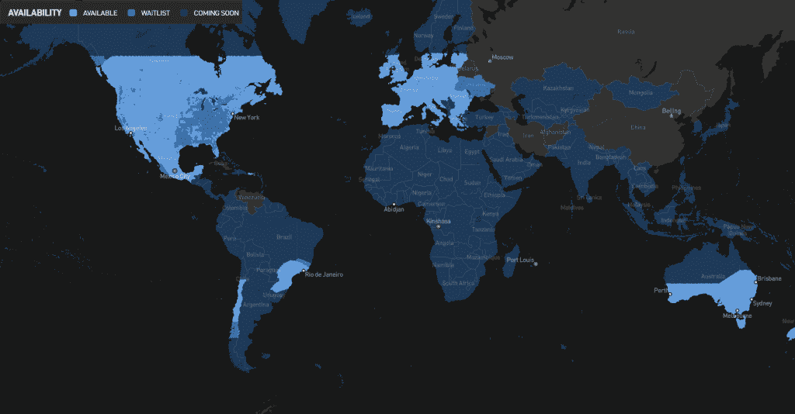
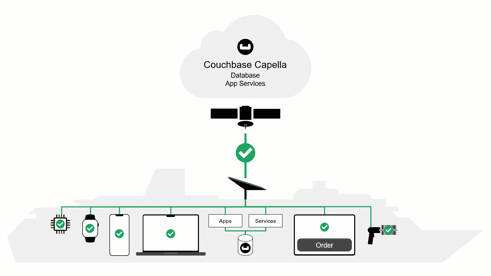

# Starlink 和 couch base——向明星加速创新

> 原文：<https://thenewstack.io/starlink-and-couchbase-accelerating-innovation-to-the-stars/>

如果说数据是企业应用的命脉，那么网络就是动脉。

 [韦恩·卡特

韦恩是 Couchbase 的工程副总裁。在 Couchbase 之前，Wayne 在 Oracle 工作了七年，担任架构师，负责推动 CRM 和 SaaS 产品线的移动创新。他有 10 项专利和正在申请的专利。](https://www.linkedin.com/in/waynecarter/) 

网络之所以如此重要，是因为它们通过将组织与客户、员工和合作伙伴联系起来、提高效率、推动自动化、推动参与和提高生产力，来实现业务、人员和任务关键型流程。网络是将现代应用程序结合在一起的粘合剂。

但是应用程序的可用性和速度取决于支撑它们的网络。实现高水平的可靠性和速度是成功的关键。网络中断和速度缓慢是每天的现实，导致停机时间[代价高昂，有时还会带来灾难性的后果](https://www.emarketer.com/content/2022-predictions-internet-network-outages-will-continue-worse-before-they-better)。信不信由你，全球仍有很大一部分地区没有任何网络接入，不仅是在偏远地区，甚至是在主要的大都市地区。因此，网络一直在发展，以增加覆盖范围和速度——从有线到无线，到 5G，现在到新兴的下一代天体网络，如 [Starlink](https://www.starlink.com/) 。

## **与星共舞**

Starlink 是 SpaceX 的最新创新。这是一个卫星网络，有望将快速、可靠的互联网带到以前没有互联网的地方。来自 Starlink.com:

“Starlink 非常适合连接不可靠或完全不可用的地区。全球各地的人们正在使用 Starlink 获得教育、医疗服务，甚至在自然灾害期间获得通信支持。”

Starlink 被誉为宽带互联网的下一次发展。但是卫星网络并不新鲜，HughesNet 和 Viasat 已经提供卫星互联网很多年了。那么 Starlink 有什么不同呢？首先，它提供了比传统卫星网络更好的覆盖范围和更低的延迟:

### **全球覆盖**

*   标准的卫星互联网仅由地球静止轨道上的几颗巨型卫星提供动力，这些卫星保持在赤道上方的固定位置，与地球的自转相匹配。由于其“固定在天空中”的性质，地球静止卫星只能服务于特定的区域。例如，HughesNet 卫星宽带由[木星 1 号和木星 2 号卫星](https://www.hughes.com/what-we-offer/satellite-assets/jupiter-fleet#satellites)提供动力，并且仅在毗连的美国、波多黎各和阿拉斯加可用。
*   相比之下，Starlink 卫星相对较小，部署在高容量星座中，以最大限度地覆盖全球。目前有超过 2200 颗 Starlink 卫星在轨道上运行，并计划在不久的将来将这一数字增加一倍。Starlink 的最终目标是将 42，000 颗卫星送入轨道，这些卫星分布在不同高度和倾角的不同轨道“外壳”中，基本上覆盖了地球的互联网连接。

浅蓝色的 Starlink 覆盖区域。资料来源:https://www.starlink.com/map

### **更低的轨道，更低的延迟**

*   一颗地球同步卫星在距地球表面约 22，000 英里的轨道上运行。这一距离带来了显著的延迟(超过 600 毫秒)，大约比地面网络慢 10 倍，使得标准卫星宽带不适用于视频会议、多人在线视频游戏或实时业务系统等延迟敏感型应用。
*   相比之下，Starlink 卫星星座位于距地球表面约 340 英里的低地球轨道(LEO ),比地球静止卫星近得多。这意味着 Starlink 网络信号的传输距离更短，因此速度更快，信号衰减更少。Starlink 提供大约 43 毫秒的延迟，足以支持传统地球静止卫星网络无法支持的应用类型。

## **下一代天体网络在哪里有所作为？**

当然，Starlink 非常适合在没有其他连接选项的偏远地区接入高速互联网。 [Starlink RV](https://www.starlink.com/rv) 出现在 [YouTube 荒野探索者和露营频道](https://www.youtube.com/results?search_query=camping+with+starlink+RV)上，在远处山顶露营的主持人高兴地展示他们的 Starlink 碟形天线，并在相机上测试上传和下载速度。Starlink 拥有 50 至 250 Mbps 的下载速度和 10 至 20 Mbps 的上传速度，YouTube 测试人员倾向于始终如一地证明这些速度。

对这些探索者的好处是，它允许他们离开网格，仍然上传巨大的媒体文件到他们的社交网络。很容易将这些优势推广到更有影响力的人类关键用例，例如为灾区的紧急救援人员或没有连接的偏远村庄的移动医疗诊所提供重要的互联网。

但是 Starlink 的真正好处对于大企业来说开始变得明显，他们将这项技术视为游戏规则的改变者。例如，PC 杂志报道说，夏威夷航空公司最近与 SpaceX 公司签署了一项协议，从明年开始将 Starlink 用于机上互联网。另据报道，游轮巨头[皇家加勒比](https://www.businessinsider.com/elon-musk-starlink-gets-fcc-green-light-broadband-moving-vehicles-2022-7)，Couchbase 的客户，获得了 FCC 的批准，在其游轮上使用 Starlink 为乘客和船员提供高速互联网。在他们[给 FCC](https://www.scribd.com/document/577819365/Letter-to-FCC-Fina) 的信中，该公司称:

"*由于我们运营的地理分散性，以及在任何给定时间与我们一起在船上的成千上万名游客和船员的带宽需求，我们面临着与岸上酒店行业相同的挑战:我们的业务和游客需要始终保持连接，他们希望获得与岸上相同的连接和连接支持体验。这些挑战需要市场上的下一代解决方案。*”

航空公司和邮轮公司已经设想通过采用 Starlink 为他们的业务带来巨大的利益。这项技术有望提供更好的乘客体验，从而推动更多业务，最终带来更多收入。

Starlink 的广泛商业应用只是时间问题。现在，FCC 已经批准其在移动车辆上的使用，旅游行业的其他行业将会跟进，货运物流、公共交通、能源和公用事业以及用户、车辆甚至整个环境移动的任何其他行业都将跟进，并前往传统网络不可靠、昂贵或不存在的地方。

## **所有网络都有问题**

找到合适的网络本身不会让应用程序 100%可用和实时快速。所有网络都必须应对某些变量——信号衰减、线路状况、机械故障，甚至像云层覆盖这样简单的事情都会影响速度和可用性。所有网络都存在这些问题，无论是有线、无线、5G 还是下一代天体网络，因此，即使一个比另一个快，也没有一个能免受中断和减速的影响。

但正如皇家加勒比所说，“*为了我们的业务和客人，运营需要始终保持连接。*“这句话代表了为越来越多的应用程序提供服务的需求，这些应用程序不能承受运行缓慢或停机时间。

那么，由于网络固有的问题，你如何构建始终连接的应用程序呢？

唯一的解决方案是将您的系统移到网络的近端，并将它们与支持高可用性、最终一致性和同步性的数据库相耦合。

自从我们在 2013 年推出 Couchbase Mobile 以来，拥有内存速度、SQL 熟悉度和 JSON 灵活性的现代 NoSQL 数据库 Couchbase 一直是专为不断发展的网络而构建的。

## **回到未来**

回顾过去，在 Couchbase，我们了解了网络连接的演进特性及其对业务系统的影响，并能够提供数据库功能，从而扩大了通用网络架构的优势:

*   我们引入了嵌入式数据库，使系统能够在没有连接的地区运行。
*   我们引入了强大的数据同步功能，以应对无线连接的中断和延迟。
*   最近，我们推出了对使用 5G 和多址边缘计算(MEC)的边缘计算架构的支持。
*   现在我们期待未来和天体网络。

## **边缘就绪**

正如我们为早期的网络发展提供数据库创新一样，Couchbase 也准备好最大化 Starlink 等新兴技术的优势。这是因为 Couchbase 本身支持[边缘计算](https://blog.couchbase.com/edge-computing-architecture-introduction/)，这是一种通过将计算和数据处理移动到更接近交互点的位置来克服固有网络问题的架构方法。Couchbase 提供:

*   [Couchbase 五车二](https://www.couchbase.com/products/capella):完全托管的云数据库即服务(DBaaS)。
*   [五车二应用服务](https://www.couchbase.com/products/capella/app-services):针对移动和边缘应用的文件存储、双向同步、认证和访问控制的全面托管服务。
*   [Couchbase Lite](https://www.couchbase.com/products/lite) :嵌入式移动数据库。

在这些功能中，五车二应用服务可以说是绑定的成分，它使用网络来同步后端数据库和边缘设备之间的数据，从而提供了分区容错的关键组件。借助应用服务，在连接允许的情况下，数据更改可以在整个应用生态系统中共享，而在网络中断期间，由于嵌入式数据库的存在，应用可以继续运行。

让我们通过一个游轮示例来看看 Couchbase 如何利用 Starlink。

## **把所有东西绑在一起**

这个动画(图 a)描述了一艘游轮如何使用 Starlink 和 Couchbase 为游客和船员提供始终快速可用的应用程序。

图 A:装有由 Couchbase 五车二和 Starlink Network 提供支持的应用程序的游轮

在游轮上，我们可以看到各种设备，包括手机、平板电脑、可穿戴设备和物联网设备。这些代表乘客做的事情，如订购食物，购买商品，增加旅游设施和访问客户服务。他们还代表船员盘点库存，交易购买和进行检查。

游客和船员使用的应用程序和服务在船上托管，由本地 Couchbase 数据库支持，该数据库位于船的中心。

在云中图表的顶部，我们看到 Couchbase 五车二，它提供 DBaaS 作为中央车队数据中心，以及应用服务，为车载应用提供同步和用户安全。

Couchbase 使用天体网络将所有这些联系在一起，通过 Starlink 在船和云之间自动同步。

当网络连接变慢或因任何原因中断时，船上运行的应用程序完全不受影响，并继续让游客高兴并保持船员的工作效率。

当然，这种结构并不是邮轮独有的。它很容易重复，可以应用于各种各样的用例，例如航空公司，可以在飞行中提供随时可用的乘客和机组人员应用程序:

…或者能源和公用事业领域，在这些领域，海上石油平台等远程环境中的应用程序可以保证其关键应用程序永远不会变慢或出现故障:

在边缘计算架构中使用 Couchbase 和 Starlink，任何组织——尤其是那些位于远程位置或移动的组织——都可以提供始终在线且始终快速的应用。

## **合适的材料**

随着下一代天体网络、无处不在的计算和分布式数据库的出现，任何组织现在都可以在以前不可能的地方构建高度可用的应用和业务。

Couchbase 通过减少延迟和提高使用 Starlink 的系统的可靠性，扩大了 Starlink 等新网络技术的优势。

这一领域正在迅速发展。我迫不及待地想看看 Starlink 和 Couchbase 五车二的新作品。

免费试用 Couchbase 五车二:【https://cloud.couchbase.com/sign-up 

<svg xmlns:xlink="http://www.w3.org/1999/xlink" viewBox="0 0 68 31" version="1.1"><title>Group</title> <desc>Created with Sketch.</desc></svg>