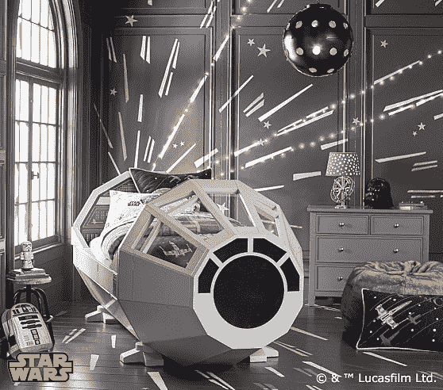
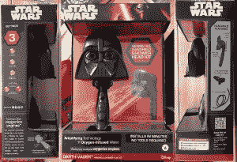

# 《星球大战》发起了一场新的营销大爆炸

> 原文：<https://thenewstack.io/stars-wars-launches-new-mega-explosion-marketing/>

星球大战无处不在。这就像原力:它无处不在，无法逃脱。随着 12 月 18 日上映的《星球大战:原力唤醒——该系列 10 年来的第一部新电影——的倒计时开始，似乎热情的促销活动出现在任何地方和每个地方的*。巨大的搭售量实际上可能使这成为人类历史上最大的营销活动，就像一些伟大的营销酒吧一样，搭售似乎变得越来越奇怪。*

Oxygenics 公司推出了一款[形状像达斯维达](https://toyland.gizmodo.com/star-wars-showerheads-let-you-bathe-in-vaders-tears-1736549984)的淋浴喷头。凯珠宝商有自己的《星球大战》珠宝系列，吊坠的形状像 C-3PO 和达斯·维德的头，还有纯金的 R2-D2。你生活中的极客可能会喜欢星球大战品牌的鸭子带。至少从 2012 年开始，Playskool 就一直在销售一款外形酷似达斯·维德的土豆头先生。

但是这部新电影也利用了 1977 年第一部《星球大战》上映时还不存在的营销形式。上个月，Waze 应用程序开始让用户能够听到 C-3PO 提供的驾驶方向。威瑞森成为了官方许可的运营商，向其客户承诺“更好网络的力量”,并向他们提供独家的《T21 星球大战》版本的谷歌纸板浏览器。惠普甚至推出了一款特别版笔记本电脑“其设计灵感来自银河帝国”

这场营销大爆炸始于大约八个月前。吉尼斯世界纪录已经承认《星球大战》是有史以来在搭配销售方面排名第一的电影。6 月，他们的记录保持者引用了 2012 年该系列总价值 195.1 亿英镑的估计，然后宣布*星球大战*也刚刚打破了另一项记录。

4 月 16 日，这部电影的两分钟预告片成为 YouTube 上 24 小时内观看次数最多的电影预告片。一天之内，它被观看了 3000 多万次——从那以后，它又被观看了 4000 多万次。但即使是预告片也以更多的营销结束，以链接到《星球大战前线》视频游戏的形式，以及更多关于[星球大战庆典现场](http://www.starwars.com/news/watch-star-wars-celebration-anaheim-live-on-starwars-com-powered-by-verizon)的视频，这是一个 5 月在阿纳海姆举行的粉丝节(“由威瑞森提供支持！”).

这家华特·迪士尼公司在 2012 年收购了卢卡斯影业，他们显然在运用营销技巧。《连线》*[指出](http://www.wired.com/2015/11/how-disney-is-making-sure-youll-never-be-able-to-escape-star-wars/) *【原力觉醒】*也出现在几部备受瞩目的电视节目中。《连线》 *Wired* 指出:“在迪士尼旗下的美国广播公司(ABC)上，早安美国的主播们展示了新的星球大战玩具，并装扮成星球大战角色”。他补充说，迪士尼还在 10 月份发布了一段视频，其中皮克斯的*里里外外的*角色[观看了*星球大战*预告片](http://www.wired.com/2015/10/inside-out-star-wars-crossover/)。在美国音乐奖上——也是在美国广播公司——73 岁的哈里森·福特介绍了一个对约翰·威廉姆斯音乐的特别致敬，在一个伴奏乐队加入之前，一个无伴奏合唱团 Pentatonix 表演了一段只有人声的《星球大战》旋律的混合曲目。在 NBC 电视台，导演 J. J. Abrams 介绍了《周六夜现场》的一个片段，在这个片段中，该节目的演员扮演了为这部电影试镜的各种名人，其中有两个新电影的真正明星，黛茜·雷德利和约翰·博耶加。*

 *

但它也出现在其他特许经营中。Pottery Barn 正在出售一张售价 3999 美元的床，形状像千年隼的驾驶舱——以及一个更便宜的《星球大战》系列床罩。赛百味[在他们的儿童餐中提供闪光光剑](http://subwaykids.com/kids/kids-mealbag.html)。《星球大战》的镜头和音乐被官方授权用于一系列关于汽车的广告——[道奇](https://youtu.be/7ESP8bPldl0)、[克莱斯勒](https://youtu.be/xOI03NSJ-WY)、[菲亚特](https://youtu.be/s4W7F-ap0IM)、[吉普叛徒](https://youtu.be/fRQthTlEn70)和[公羊卡车](https://youtu.be/juYtd3YfMVk)。甚至还有阿迪达斯的*星球大战*鞋。

星球大战也入侵了我们的食物供应。《洛杉矶时报》尽职尽责地在他们的“每日美食”美食博客的一系列标题中报道了这一进展:

是的，卡夫的通心粉和奶酪晚餐现在有了[星球大战形状](http://www.kraftmacandcheese.com/Products/BlueBox/star-wars)。“所有你最喜欢的《星球大战》角色都从一个遥远的星系来到你的餐桌前。而且它们现在不含人工香料、防腐剂或合成色素，”文件上写道。

达斯·维德淋浴喷头。

但是，随着所有的促销搭售，营销巨头也在为更大的利益而努力。“代码小时”是一个鼓励更多人从事编程的非营利组织，由于新宣布的与《星球大战》和《《我的世界》》的合作,“T21”变得更酷了。“星球大战:变革的力量”[将自己](http://forceforchange.starwars.com/)描述为“迪士尼和卢卡斯影业的慈善倡议……致力于为世界上一些最大的挑战寻找创造性的解决方案。”

导演 J. J .艾布拉姆斯最近与粉丝分享了一段特别的感谢视频，讲述了他们与联合国儿童基金会合作改善世界各地儿童生活的情况。“变革力量”还通过在易贝拍卖电影纪念品筹集资金，并通过招募马克·哈米尔来提高知名度。他提醒影迷们，只要向奥马兹捐一点钱，他们就有机会赢得新电影《星球大战》首映式的门票。他通过[伪装成一名冲锋队员](http://forceforchange.starwars.com/mark-hamill-goes-undercover-as-a-stormtrooper-for-force-for-change/)走在好莱坞大道上做到了这一点。

至少这是一个为正义而战的冲锋队。

<svg xmlns:xlink="http://www.w3.org/1999/xlink" viewBox="0 0 68 31" version="1.1"><title>Group</title> <desc>Created with Sketch.</desc></svg>*