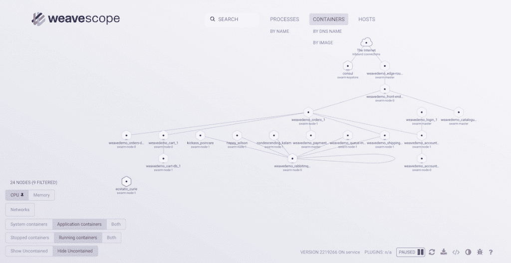

# 介绍“袜子店”:云本地参考应用

> 原文：<https://thenewstack.io/start-socks-towards-cloud-native-reference-application/>

 [阿德里安·穆亚特

阿德里安从 Docker 的早期就开始接触容器，并撰写了《使用 Docker:使用容器开发和部署软件》一书*。他目前是 Container Solutions 的首席科学家，这是一家泛欧洲公司，专注于微服务和容器的咨询和产品开发。他是码头船长项目的成员。*](http://container-solutions.com/) 

可以肯定地说，云原生社区非常活跃，包含了各种各样的观点和技术。任何想要为他们的下一个应用研究微服务架构的人都会遇到大量的选择。有一个容器运行时的选择，如 Docker、 **rkt** 和**_ hyper**；一个编排框架的选择，比如 [Kubernetes](/category/kubernetes/) 、 [Swarm](https://www.mirantis.com/software/docker/kubernetes/) 、Mesos 和[Nomad](https://www.nomadproject.io/)；选择网络层，如 [Calico](https://thenewstack.io/project-calico-now-fully-supports-kubernetes/) 、Weave 和[Contiv](https://github.com/contiv)；以及支持服务和框架的选择，如 [Kong](https://getkong.org/) 和 [GoKit](https://github.com/go-kit) 。

虽然丰富的选择意味着存在适合大多数情况的解决方案，但这也使新来者的生活变得困难，他们可能会感到困惑和困惑。组织可能会花费大量精力来评估潜在解决方案的成熟度、效率以及对其用例的适用性。

我这里使用的“原生云”是广义的，指的是任何以现代方式编写软件并利用云平台或技术的人。这旨在涵盖诸如[微服务](/category/microservices/)和 12 因素应用之类的架构，以及诸如容器和动态编排平台之类的技术。

退一步说，我们似乎曾经来过这里。JavaScript 有一个同样多样化和活跃的社区；似乎每周都有一个新的框架诞生，一个旧的框架死去([这个博客创造了术语 YAFS](https://medium.com/tastejs-blog/yet-another-framework-syndrome-yafs-cf5f694ee070#.ovakw812k)——这是另一种框架综合症——针对这种现象)。回到 21 世纪初，Java 开发处于类似的位置——除了 J2EE，还有 JBoss、Spring 和 Oracle Application Server。就 Java 和 Javascript 而言，参考应用程序为实现和框架之间的比较提供了一个有用的工具，允许用户快速发现平台之间的差异并做出明智的决定。

在 JavaScript 的世界中，我们有 [todomvc](http://todomvc.com) ，它在各种 JavaScript 框架中重新创建了一个简单的 ToDo 应用程序。这是一个简单的应用程序，易于理解，适合少量代码，但包含足够的复杂性，以突出风格和表现力的差异。几个框架使用不同的库、集成或编译器有多种实现——例如， [AngularJS 示例](http://todomvc.com/examples/angularjs/#/)包含带有 [Require 的版本。JS](http://requirejs.org/) 、 [TypeScript](https://www.typescriptlang.org/) 和 [Google 云平台](https://cloud.google.com/)。甚至在核心的 todomvc 网站之外，开发人员已经将应用程序移植到其他语言上用于演示目的，例如: [Om](https://swannodette.github.io/todomvc/labs/architecture-examples/om-undo/index.html) 和 [Swift](https://github.com/cyrilchandelier/TodoSwift) 。

对于 Java，我们有由 Sun Microsystems 开发的 [Pet Store](http://www.oracle.com/technetwork/java/index-136650.html) ，作为其 blueprints 系列的一部分，使用推荐的最佳实践和模式(以及展示最新的 J2EE 库)来概括一个惯用的 JavaEE 应用程序。该应用程序本身重建了一个出售各种奇异宠物的在线商店。宠物店现在已经完全过时了，但是在它的时代，它是开始使用 J2EE 的有用资源，后来成为开始使用其他框架的试金石；春天，JBoss 和。Net 都使用修改后的宠物店作为一个熟悉的例子来快速吸引用户。

## 袜子店介绍

那么，怎样才算是一份好的推荐信呢？它需要足够小，以便快速理解和容易移植，但也要足够大，以便展示该技术的各个方面，并让开发人员感受到该框架及其倡导的编程风格。

你好世界

*Hello World* 是学习一门新语言的第一步，可以被认为是所有参考应用程序的鼻祖。Rosettacode.org 的编程 chrestomathy 网站**更进一步，使用小任务(例如创建一个 Sierpinski 三角形)来比较编程语言。类似地，由 Debian 管理的**计算机语言基准游戏**，使用玩具程序进行基准比较。然而，这两个项目中的例子缺乏对现实生活中的应用程序建模所需的深度，并且不总是偏好惯用代码(特别是基准代码，将偏好性能而不是最佳实践)。)**

它应该强调最佳实践，并始终使用惯用代码。虽然性能不应该被忽略，但它不应该是目标，除非应用程序的目的是形成性能基准的基础。应用程序应该有助于在各种环境中重用；理想情况下，可以对比使用不同平台、设计模式、库、框架和架构方法的实现，同时保持用户的熟悉程度。

然而，考虑到这一点，一定要注意不要拿苹果和橘子做比较。例如，微软利用 Pet Store 来证明 C#比 Java 性能更好，但是由于 Java 实现是以可移植性而不是效率为出发点编写的，这就造成了不公平的比较。

[Weaveworks](https://www.weave.works/) ，在 [Container Solutions](https://container-solutions.com/) 的帮助下，开发了“ [Sock Shop](https://github.com/weaveworks/microservices-demo/) ”，一个购买袜子(有洞)的模拟网上商店。它与旧的宠物店应用有着明确的血统，甚至在这里和那里有一些 Java 代码，但它在其他方面是一个完全不同的野兽，被设计为以容器和微服务为核心的云原生应用。“袜子店”最初的使命是突出[编织网](https://www.weave.works/products/weave-net/)和[范围](https://www.weave.works/products/weave-scope/#)产品所支持的不同部署平台，包括亚马逊 ECS、Mesos 和 Kubernetes。随着 Docker Swarm、Mesosphere 的 DC/OS 和 Hashicorp 的 Nomad 的新版本的开发，这个列表还在增加。

应用本身由用 [Go](/tag/golang/) (用 GoKit)、Java(用 Spring Boot)和 [Node.js](/tag/node.js/) 编写的多个微服务组成，这些微服务还利用了 RabbitMQ、Mongo 和 Nginx 等支持服务。所有的服务都在独立的 Docker 容器中运行。服务通过 HTTP 使用 REST 进行通信。它的设计从一开始就考虑了当前的微服务和云原生最佳实践。简而言之，它似乎是构成云原生参考应用程序基础的绝佳候选。

如果能发现如何用不同的技术替换或重构“袜子商店”的这些部分，以及这对整个应用程序有什么影响，那就太好了。如果它使用 RPC 调用和 protobufs 进行通信，网络开销会怎么样？集成监控和警报框架有多容易？用 rkt 或者 VMs 代替 Docker 怎么样？

如果您有一个想要实施或建议的想法，请前往[微服务-演示 GitHub 库](https://github.com/weaveworks/microservices-demo)并提交 PR 或功能请求。

Docker 、 [Mesosphere](https://d2iq.com/) 和 [Weaveworks](https://www.weave.works/) 是新堆栈的赞助商。

通过 Pixabay 的特征图像。

<svg xmlns:xlink="http://www.w3.org/1999/xlink" viewBox="0 0 68 31" version="1.1"><title>Group</title> <desc>Created with Sketch.</desc></svg>